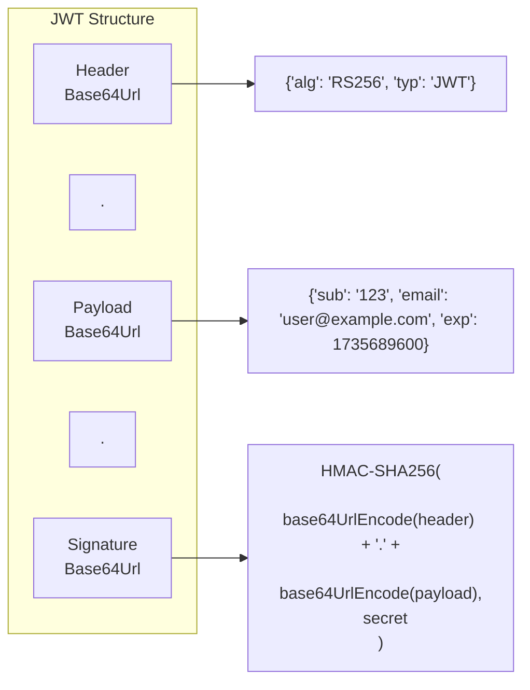

# JWTs are self-contained tokens that carry claims (

```mermaid
flowchart LR
    subgraph JWT [JWT Structure]
        Header[Header<br/>Base64Url]
        Dot1[.]
        Payload[Payload<br/>Base64Url]
        Dot2[.]
        Signature[Signature<br/>Base64Url]
    end
    
    Header --> HContent["{'alg': 'RS256', 'typ': 'JWT'}"]
    Payload --> PContent["{'sub': '123', 'email': 'user@example.com', 'exp': 1735689600}"]
    Signature --> SContent["HMAC-SHA256(<br/>  base64UrlEncode(header) + '.' +<br/>  base64UrlEncode(payload),<br/>  secret<br/>)"]
```
