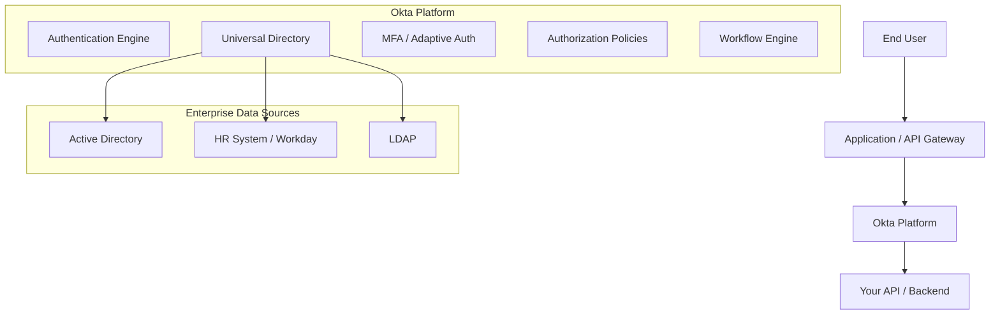

# **Architecture diagram:**

```mermaid
flowchart TD
    User[End User] --> App[Application / API Gateway]
    App --> Okta[Okta Platform]
    
    subgraph Okta_Platform [Okta Platform]
        direction TB
        Auth[Authentication Engine]
        Directory[Universal Directory]
        MFA[MFA / Adaptive Auth]
        Policies[Authorization Policies]
        Workflows[Workflow Engine]
    end
    
    subgraph Enterprise_Data [Enterprise Data Sources]
        AD[Active Directory]
        HR[HR System / Workday]
        LDAP[LDAP]
    end
    
    Directory --> AD
    Directory --> HR
    Directory --> LDAP
    
    Okta --> API[Your API / Backend]
```
