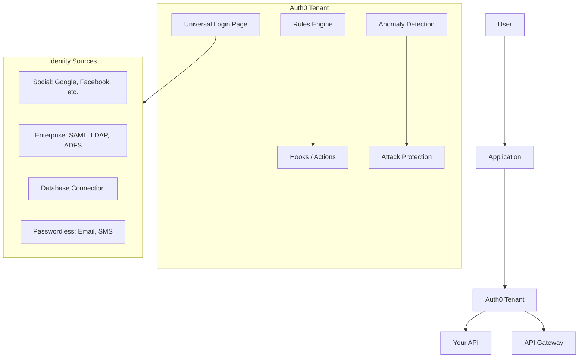

# **Architecture diagram:**

```mermaid
flowchart TD
    User[User] --> App[Application]
    App --> Auth0[Auth0 Tenant]
    
    subgraph Auth0_Tenant [Auth0 Tenant]
        direction TB
        Login[Universal Login Page]
        Rules[Rules Engine]
        Hooks[Hooks / Actions]
        Anomaly[Anomaly Detection]
        Attack[Attack Protection]
    end
    
    subgraph Connections [Identity Sources]
        Social[Social: Google, Facebook, etc.]
        Enterprise[Enterprise: SAML, LDAP, ADFS]
        Database[Database Connection]
        Passwordless[Passwordless: Email, SMS]
    end
    
    Login --> Connections
    Rules --> Hooks
    Anomaly --> Attack
    
    Auth0 --> API[Your API]
    Auth0 --> Gateway[API Gateway]
```
