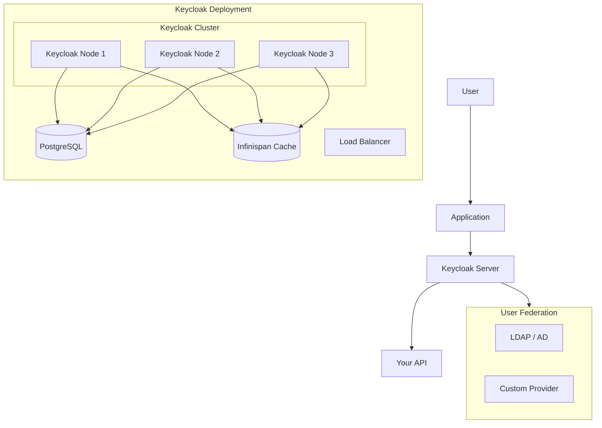

# **Architecture diagram:**

```mermaid
flowchart TD
    User[User] --> App[Application]
    App --> Keycloak[Keycloak Server]
    
    subgraph Keycloak_Deployment [Keycloak Deployment]
        direction TB
        LoadBalancer[Load Balancer]
        
        subgraph Cluster [Keycloak Cluster]
            Node1[Keycloak Node 1]
            Node2[Keycloak Node 2]
            Node3[Keycloak Node 3]
        end
        
        DB[(PostgreSQL)]
        Cache[(Infinispan Cache)]
    end
    
    subgraph Federation [User Federation]
        LDAP[LDAP / AD]
        Custom[Custom Provider]
    end
    
    Node1 --> DB
    Node2 --> DB
    Node3 --> DB
    
    Node1 --> Cache
    Node2 --> Cache
    Node3 --> Cache
    
    Keycloak --> Federation
    Keycloak --> API[Your API]
```
