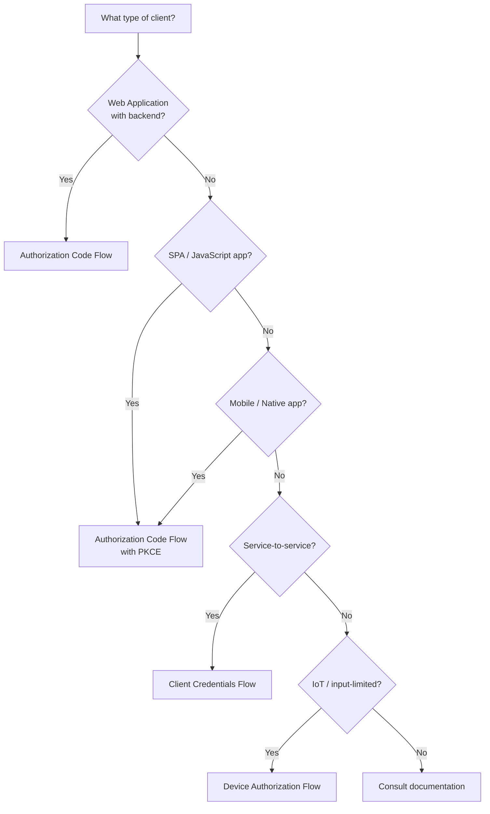

# Choosing the wrong OAuth flow is a common security

```mermaid
flowchart TD
    Start[What type of client?] --> Web{Web Application<br/>with backend?}
    Web -->|Yes| AuthCode[Authorization Code Flow]
    Web -->|No| SPA{SPA / JavaScript app?}
    
    SPA -->|Yes| PKCE[Authorization Code Flow<br/>with PKCE]
    SPA -->|No| Mobile{Mobile / Native app?}
    
    Mobile -->|Yes| PKCE
    Mobile -->|No| M2M{Service-to-service?}
    
    M2M -->|Yes| ClientCreds[Client Credentials Flow]
    M2M -->|No| Device{IoT / input-limited?}
    
    Device -->|Yes| DeviceFlow[Device Authorization Flow]
    Device -->|No| Legacy[Consult documentation]
```
