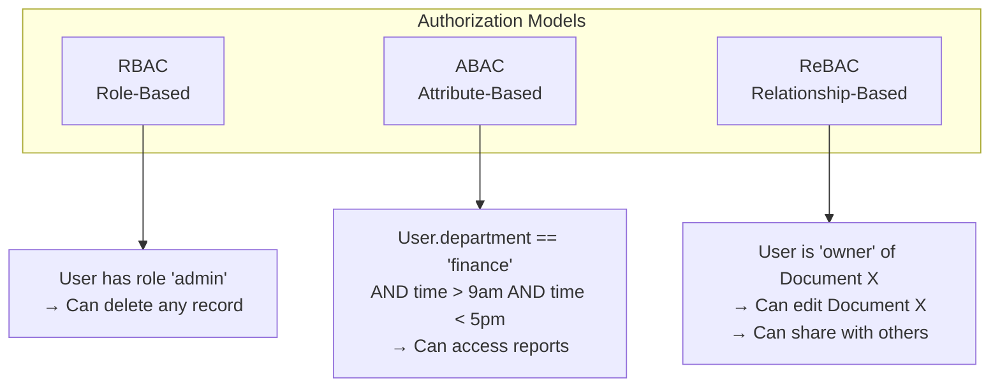

# Authentication tells you *who* the user is. Author

```mermaid
flowchart TD
    subgraph AuthZ_Models [Authorization Models]
        RBAC[RBAC<br/>Role-Based]
        ABAC[ABAC<br/>Attribute-Based]
        ReBAC[ReBAC<br/>Relationship-Based]
    end
    
    RBAC --> Ex1["User has role 'admin'<br/>→ Can delete any record"]
    ABAC --> Ex2["User.department == 'finance'<br/>AND time > 9am AND time < 5pm<br/>→ Can access reports"]
    ReBAC --> Ex3["User is 'owner' of Document X<br/>→ Can edit Document X<br/>→ Can share with others"]
```
