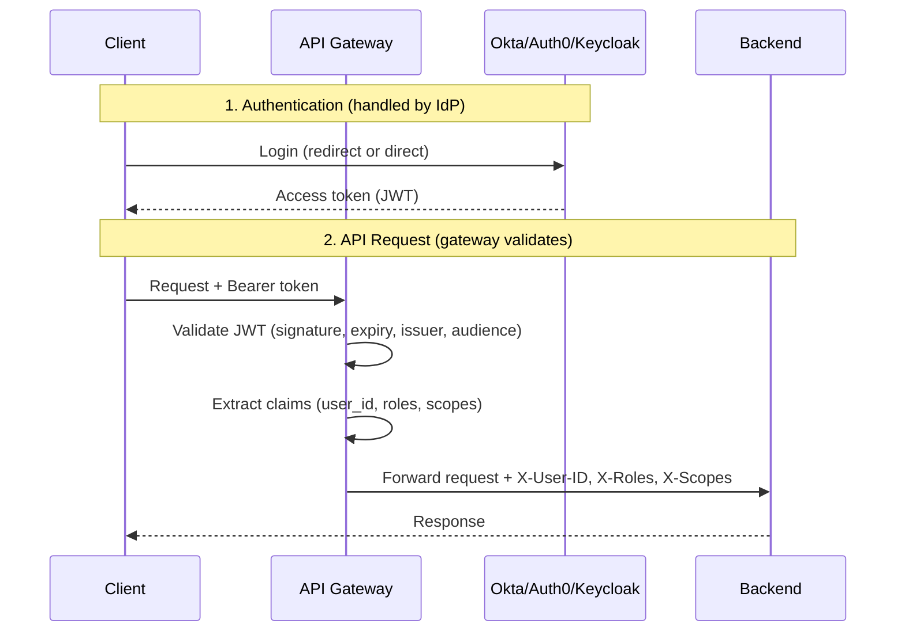

# Your identity provider and API gateway must work t

```mermaid
sequenceDiagram
    participant Client
    participant Gateway as API Gateway
    participant IdP as Okta/Auth0/Keycloak
    participant Backend
    
    Note over Client,IdP: 1. Authentication (handled by IdP)
    Client->>IdP: Login (redirect or direct)
    IdP-->>Client: Access token (JWT)
    
    Note over Client,Backend: 2. API Request (gateway validates)
    Client->>Gateway: Request + Bearer token
    Gateway->>Gateway: Validate JWT (signature, expiry, issuer, audience)
    Gateway->>Gateway: Extract claims (user_id, roles, scopes)
    Gateway->>Backend: Forward request + X-User-ID, X-Roles, X-Scopes
    Backend-->>Client: Response
```
