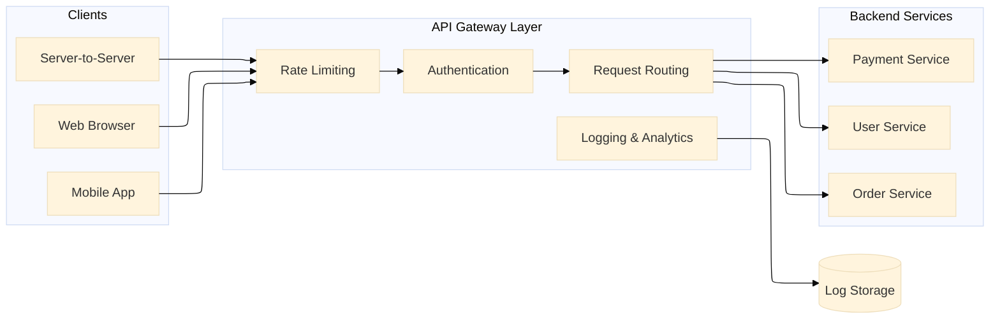

# Here is the basic architecture:

```mermaid
---
config:
  layout: elk
  theme: base
---
flowchart LR
    subgraph Clients
        Mobile[Mobile App]
        Web[Web Browser]
        Server[Server-to-Server]
    end
    
    subgraph "API Gateway Layer"
        direction TB
        RateLimit[Rate Limiting]
        Auth[Authentication]
        Routing[Request Routing]
        Logging[Logging & Analytics]
    end
    
    subgraph "Backend Services"
        Users[User Service]
        Orders[Order Service]
        Payments[Payment Service]
    end
    
    Mobile --> RateLimit
    Web --> RateLimit
    Server --> RateLimit
    
    RateLimit --> Auth
    Auth --> Routing
    
    Routing --> Users
    Routing --> Orders
    Routing --> Payments
    
    Logging --> Logs[(Log Storage)]
```
