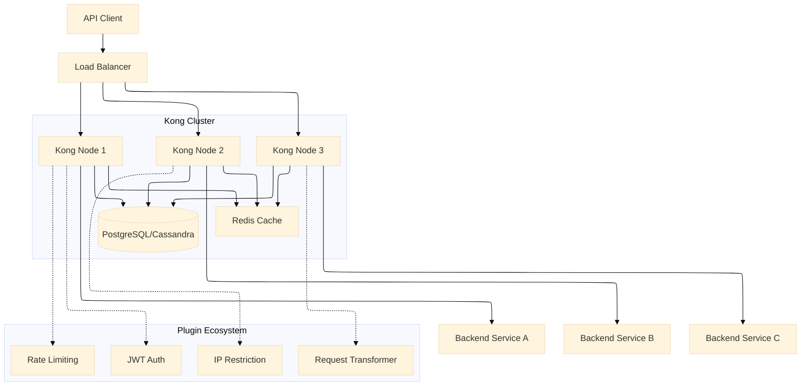

# **Architecture diagram:**

```mermaid

---
config:
  layout: elk
  theme: base
---
flowchart TD
    Client[API Client] --> LB[Load Balancer]
    LB --> Kong1[Kong Node 1]
    LB --> Kong2[Kong Node 2]
    LB --> Kong3[Kong Node 3]
    
    subgraph Kong_Cluster [Kong Cluster]
        Kong1 --> Cache1[Redis Cache]
        Kong2 --> Cache1
        Kong3 --> Cache1
        Kong1 --> DB[(PostgreSQL/Cassandra)]
        Kong2 --> DB
        Kong3 --> DB
    end
    
    Kong1 --> Service1[Backend Service A]
    Kong2 --> Service2[Backend Service B]
    Kong3 --> Service3[Backend Service C]
    
    subgraph Plugins [Plugin Ecosystem]
        P1[Rate Limiting]
        P2[JWT Auth]
        P3[IP Restriction]
        P4[Request Transformer]
    end
    
    Kong1 -.-> P1
    Kong1 -.-> P2
    Kong2 -.-> P3
    Kong3 -.-> P4
```
