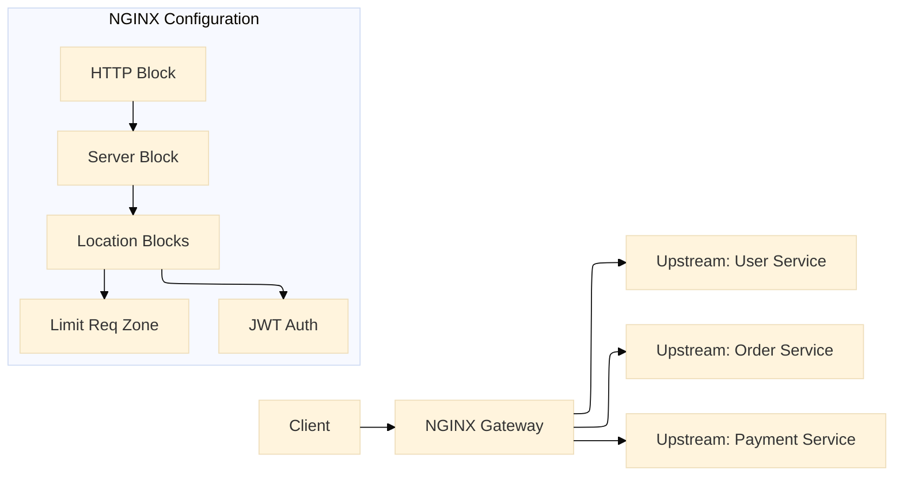

# **Architecture diagram:**

```mermaid
---
config:
  layout: elk
  theme: base
---
flowchart LR
    Client[Client] --> NGINX[NGINX Gateway]
    
    subgraph NGINX_Config [NGINX Configuration]
        direction TB
        HTTP[HTTP Block]
        Server[Server Block]
        Location[Location Blocks]
        Limit[Limit Req Zone]
        Auth[JWT Auth]
    end
    
    NGINX --> Upstream1[Upstream: User Service]
    NGINX --> Upstream2[Upstream: Order Service]
    NGINX --> Upstream3[Upstream: Payment Service]
    
    HTTP --> Server
    Server --> Location
    Location --> Limit
    Location --> Auth
```
