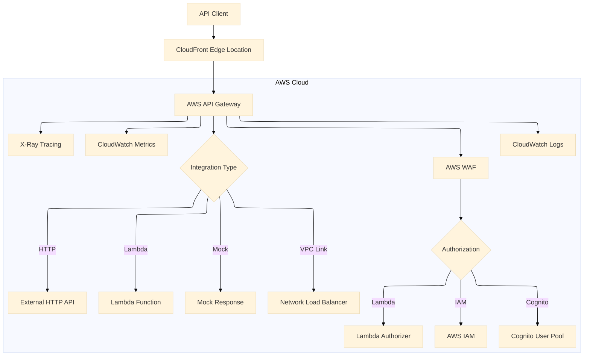

# **Architecture diagram:**

```mermaid
---
config:
  layout: elk
  theme: base
---
flowchart TD
    Client[API Client] --> Edge[CloudFront Edge Location]
    Edge --> APIGW[AWS API Gateway]
    
    subgraph AWS_Cloud [AWS Cloud]
        APIGW --> WAF[AWS WAF]
        WAF --> Auth{Authorization}
        
        Auth -->|IAM| IAM[AWS IAM]
        Auth -->|Cognito| Cognito[Cognito User Pool]
        Auth -->|Lambda| LambdaAuth[Lambda Authorizer]
        
        APIGW --> Integration{Integration Type}
        Integration -->|HTTP| HTTP[External HTTP API]
        Integration -->|Lambda| Lambda[Lambda Function]
        Integration -->|VPC Link| NLB[Network Load Balancer]
        Integration -->|Mock| Mock[Mock Response]
        
        APIGW --> Logs[CloudWatch Logs]
        APIGW --> Metrics[CloudWatch Metrics]
        APIGW --> XRay[X-Ray Tracing]
    end
```
