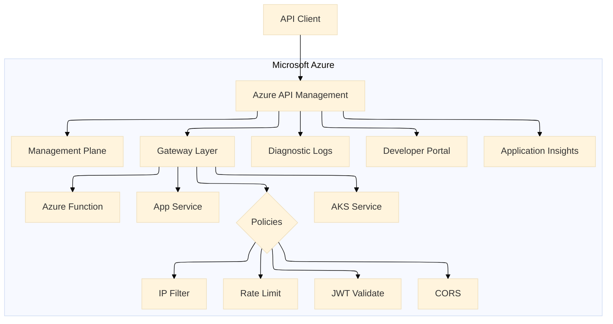

# **Architecture diagram:**

```mermaid
---
config:
  layout: elk
  theme: base
---
flowchart TD
    Client[API Client] --> APIM[Azure API Management]
    
    subgraph Azure [Microsoft Azure]
        APIM --> Gateway[Gateway Layer]
        APIM --> Portal[Developer Portal]
        APIM --> Management[Management Plane]
        
        Gateway --> Policies{Policies}
        Policies --> Rate[Rate Limit]
        Policies --> JWT[JWT Validate]
        Policies --> IP[IP Filter]
        Policies --> CORS[CORS]
        
        Gateway --> Backend1[Azure Function]
        Gateway --> Backend2[App Service]
        Gateway --> Backend3[AKS Service]
        
        APIM --> Monitor[Application Insights]
        APIM --> Logs[Diagnostic Logs]
    end
```
