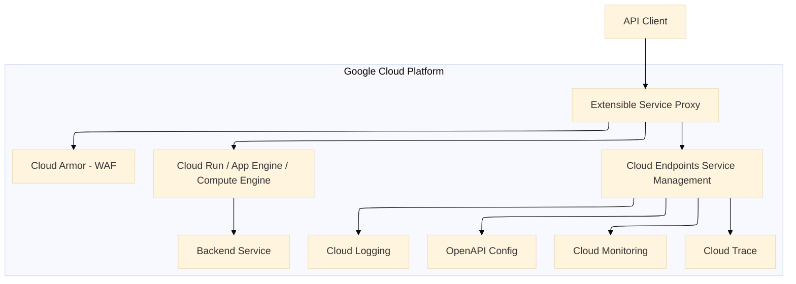

# **Architecture diagram:**

```mermaid
---
config:
  layout: elk
  theme: base
---
flowchart TD
    Client[API Client] --> ESP[Extensible Service Proxy]
    
    subgraph GCP [Google Cloud Platform]
        ESP --> Service[Cloud Run / App Engine / Compute Engine]
        ESP --> Endpoints[Cloud Endpoints Service Management]
        
        Endpoints --> Config[OpenAPI Config]
        Endpoints --> Logs[Cloud Logging]
        Endpoints --> Metrics[Cloud Monitoring]
        Endpoints --> Trace[Cloud Trace]
        
        Service --> Backend[Backend Service]
        
        ESP --> CloudArmor[Cloud Armor - WAF]
    end
```
