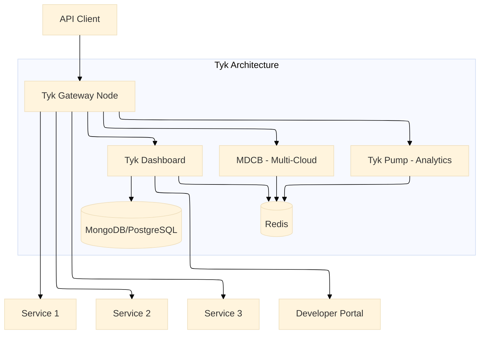

# **Architecture diagram:**

```mermaid
---
config:
  layout: elk
  theme: base
---
flowchart TD
    Client[API Client] --> Gateway[Tyk Gateway Node]
    
    subgraph Tyk_Architecture [Tyk Architecture]
        Gateway --> Dashboard[Tyk Dashboard]
        Gateway --> Pump[Tyk Pump - Analytics]
        Gateway --> MDCB[MDCB - Multi-Cloud]
        
        Dashboard --> Redis[(Redis)]
        Pump --> Redis
        MDCB --> Redis
        
        Dashboard --> DB[(MongoDB/PostgreSQL)]
    end
    
    Gateway --> Service1[Service 1]
    Gateway --> Service2[Service 2]
    Gateway --> Service3[Service 3]
    
    Dashboard --> Portal[Developer Portal]
```
