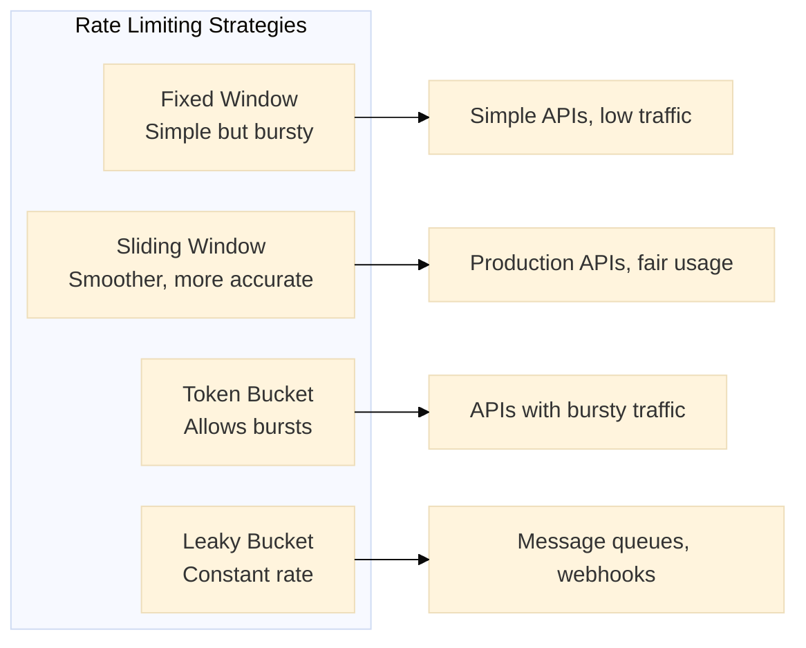

# **Rate limiting strategies compared:**

```mermaid
---
config:
  layout: elk
  theme: base
---
flowchart LR
    subgraph Strategies [Rate Limiting Strategies]
        Fixed[Fixed Window<br/>Simple but bursty]
        Sliding[Sliding Window<br/>Smoother, more accurate]
        Token[Token Bucket<br/>Allows bursts]
        Leaky[Leaky Bucket<br/>Constant rate]
    end
    
    Fixed --> Use1[Simple APIs, low traffic]
    Sliding --> Use2[Production APIs, fair usage]
    Token --> Use3[APIs with bursty traffic]
    Leaky --> Use4[Message queues, webhooks]
```
