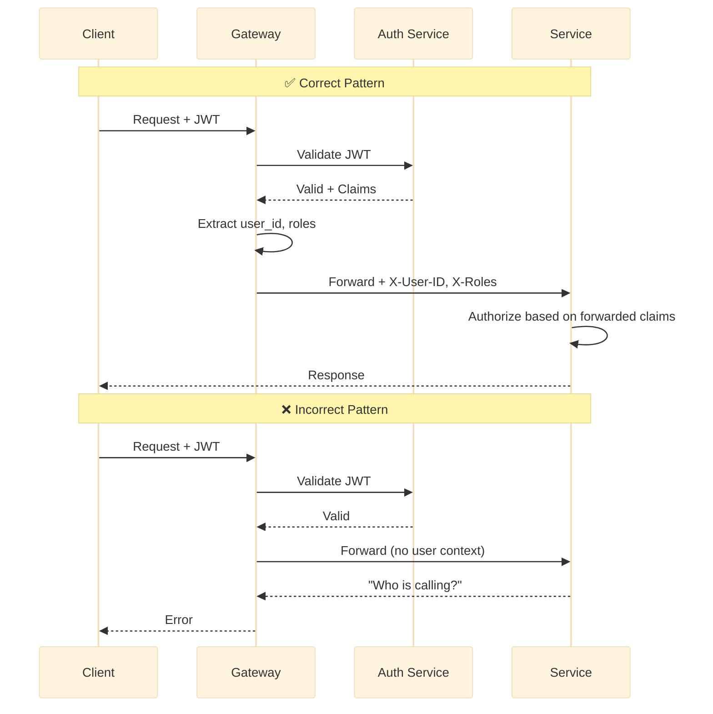

# One of the most common gateway mistakes is assumin

```mermaid
---
config:
  layout: elk
  theme: base
---
sequenceDiagram
    participant Client
    participant Gateway
    participant Auth as Auth Service
    participant Service
    
    Note over Client,Service: ✅ Correct Pattern
    
    Client->>Gateway: Request + JWT
    Gateway->>Auth: Validate JWT
    Auth-->>Gateway: Valid + Claims
    Gateway->>Gateway: Extract user_id, roles
    Gateway->>Service: Forward + X-User-ID, X-Roles
    Service->>Service: Authorize based on forwarded claims
    Service-->>Client: Response
    
    Note over Client,Service: ❌ Incorrect Pattern
    
    Client->>Gateway: Request + JWT
    Gateway->>Auth: Validate JWT
    Auth-->>Gateway: Valid
    Gateway->>Service: Forward (no user context)
    Service-->>Gateway: "Who is calling?"
    Gateway-->>Client: Error
```
