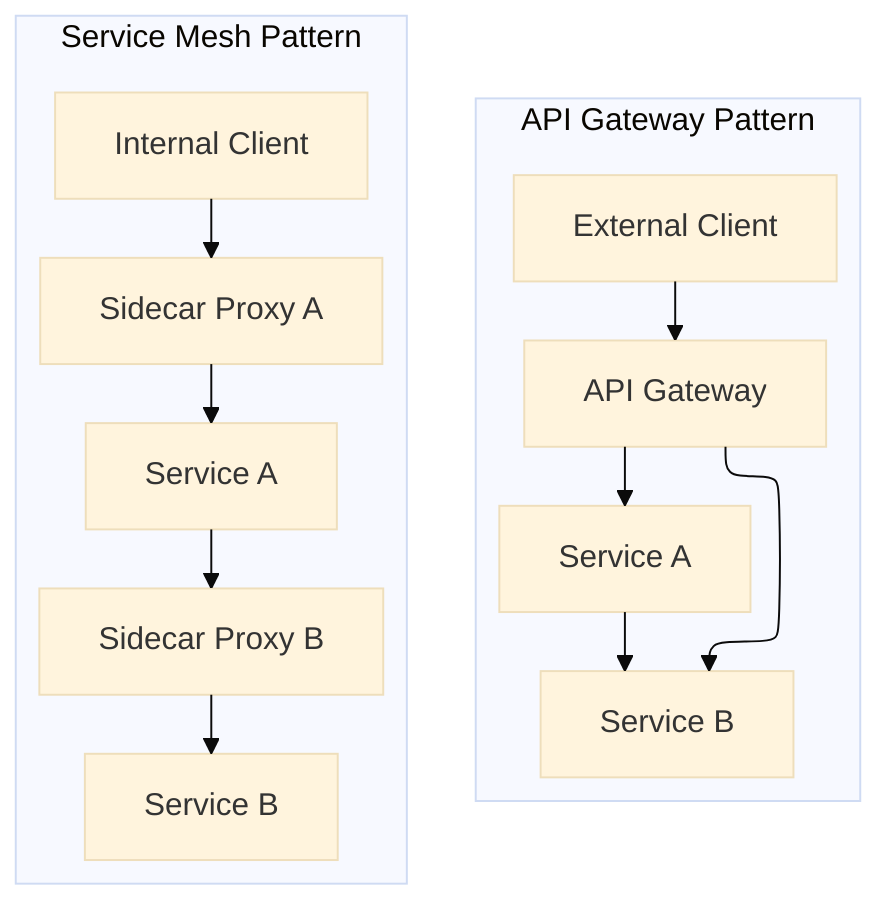

# This is a common source of confusion. Both sit bet

```mermaid
---
config:
  layout: elk
  theme: base
---
flowchart TD
    subgraph Gateway_Pattern [API Gateway Pattern]
        External[External Client] --> GW[API Gateway]
        GW --> ServiceA[Service A]
        GW --> ServiceB[Service B]
        ServiceA --> ServiceB
    end
    
    subgraph Mesh_Pattern [Service Mesh Pattern]
        Internal[Internal Client] --> SidecarA[Sidecar Proxy A]
        SidecarA --> ServiceA2[Service A]
        ServiceA2 --> SidecarB[Sidecar Proxy B]
        SidecarB --> ServiceB2[Service B]
    end
```
