# ASP.NET Core Filters Deep Dive: Building Maintainable Web APIs with .NET 10 and Reactive Extensions
## Build production-ready Web APIs with proper cross-cutting concern separation using the latest .NET 10 features

**The Structured Way to Handle Cross-Cutting Concerns for Cleaner, More Reactive APIs**

In the world of software architecture, "cross-cutting concerns" are the silent killers of clean code. Logging, authentication, validation, and exception handling—these tasks are essential, but they often clutter your core business logic, leading to bloated controllers and a maintenance nightmare.

For years, ASP.NET Core has provided an elegant solution to this problem: **Filters**. They allow you to intercept and modify the request-processing pipeline, keeping your controllers lean and focused.

With the release of **.NET 10**, the filter architecture has become even more powerful and flexible, now with first-class support for **Minimal APIs**. In this story, we'll explore each filter type in detail while demonstrating four key benefits:
- ✅ **Separation of Concerns**
- ✅ **Cleaner Controllers/Endpoints**
- ✅ **Reusable Logic across Endpoints**
- ✅ **Consistent Logging and Error Handling**

We'll also break away from traditional imperative examples and embrace **Reactive Programming** principles using `System.Reactive`, showing you how to build APIs that are not just clean, but also event-driven and resilient.

---

## The Filter Pipeline: A Visual Overview

Before diving into code, let's visualize the order in which filters execute. Think of it as a Russian doll, where each filter wraps the next.

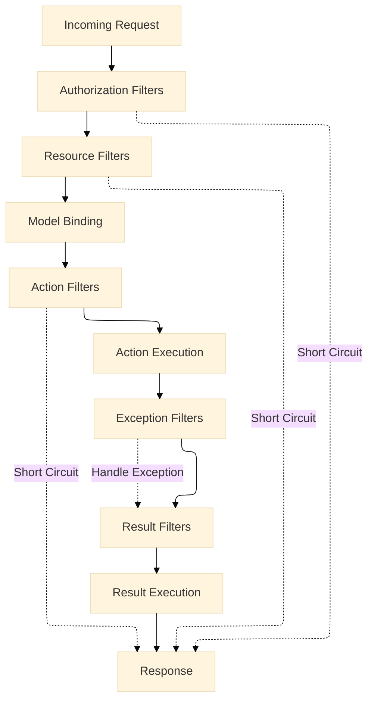

This structured pipeline is your toolkit for building maintainable APIs.

### Filter Execution Order with Multiple Filters

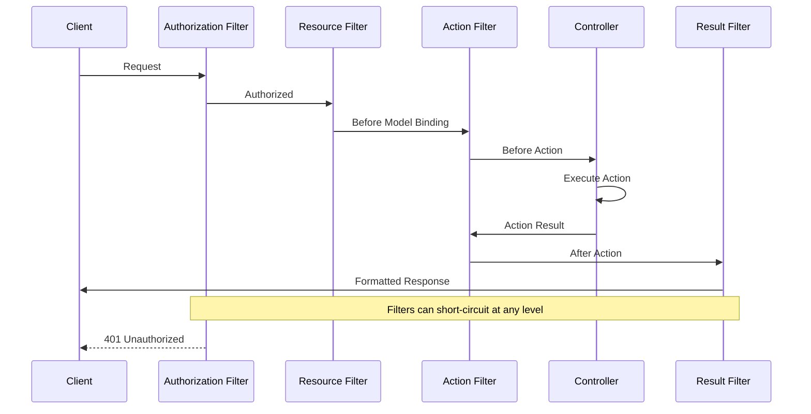

---

## 1. Authorization Filters: The Gatekeepers

**What They Do:**
Authorization Filters run first in the pipeline. Their sole purpose is to determine if the current request is authorized. If a filter determines the request is not authorized, it short-circuits the pipeline, returning a 401 (Unauthorized) or 403 (Forbidden) response immediately.

### Authorization Flow

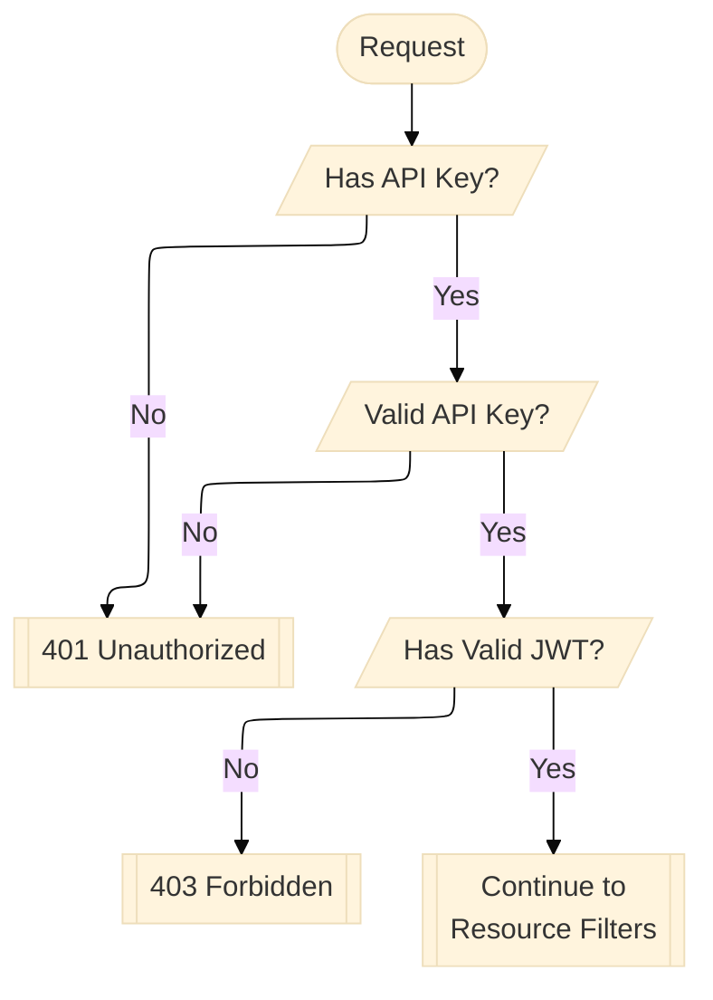

### The Four Benefits in Action:

- **Separation of Concerns:** Authentication logic is extracted from business logic
- **Cleaner Endpoints:** Controllers don't need to check API keys or roles
- **Reusable Logic:** Same filter can protect multiple endpoints
- **Consistent Security:** Every protected endpoint follows the same rules

### Code Example: API Key + Role-Based Authorization

Let's create a custom filter that checks for an API key (identifying the application) and then, based on that application, ensures a user has a specific role (from a JWT).

```csharp
using Microsoft.AspNetCore.Mvc.Filters;
using Microsoft.AspNetCore.Mvc;
using System.Reactive.Linq;
using System.Security.Claims;

// =====================================================
// FILTER IMPLEMENTATION - REUSABLE COMPONENT
// =====================================================

public class ApiKeyAndRoleFilter : IAuthorizationFilter
{
    private readonly string _role;
    private const string ApiKeyHeaderName = "X-API-KEY";

    public ApiKeyAndRoleFilter(string role)
    {
        _role = role;
    }

    public void OnAuthorization(AuthorizationFilterContext context)
    {
        // Check for API Key (identifies the application)
        if (!context.HttpContext.Request.Headers.TryGetValue(ApiKeyHeaderName, out var extractedApiKey))
        {
            // Consistent error response format
            context.Result = new UnauthorizedObjectResult(new 
            { 
                Error = "API Key missing",
                Timestamp = DateTime.UtcNow,
                RequestId = context.HttpContext.TraceIdentifier
            });
            return;
        }

        // Validate the API Key (in real apps, this would check against a secure store)
        var isValidApiKey = IsValidApiKey(extractedApiKey!);
        
        if (!isValidApiKey)
        {
            context.Result = new UnauthorizedObjectResult(new 
            { 
                Error = "Invalid API Key",
                Timestamp = DateTime.UtcNow,
                RequestId = context.HttpContext.TraceIdentifier
            });
            return;
        }

        // Check user's role from JWT (authenticates the user)
        var user = context.HttpContext.User;
        if (!user.Identity?.IsAuthenticated ?? false || !user.IsInRole(_role))
        {
            context.Result = new ForbidResult("User lacks required role");
            return;
        }
    }

    private bool IsValidApiKey(string apiKey)
    {
        // In production, this would validate against a database or secure configuration
        return apiKey == "abcd1234-56ejk1" || apiKey.StartsWith("valid-");
    }
}

// =====================================================
// CONTROLLER-BASED API - CLEAN AND FOCUSED
// =====================================================

[ApiController]
[Route("api/[controller]")]
public class OrdersController : ControllerBase
{
    // NO AUTHENTICATION CODE HERE!
    // Just pure business logic - Separation of Concerns achieved!
    
    [HttpGet]
    [ServiceFilter(typeof(ApiKeyAndRoleFilter))] // Reusable across endpoints
    public IActionResult GetOrders()
    {
        // Clean controller - only business logic
        var orders = new[] 
        { 
            new { Id = 1, Product = "Laptop", Status = "Shipped" },
            new { Id = 2, Product = "Mouse", Status = "Processing" }
        };
        
        // Consistent response format
        return Ok(new 
        { 
            Data = orders,
            Count = orders.Length,
            Timestamp = DateTime.UtcNow
        });
    }
    
    [HttpGet("{id}")]
    [ServiceFilter(typeof(ApiKeyAndRoleFilter))] // Same filter, different endpoint
    public IActionResult GetOrder(int id)
    {
        // Still clean, still focused
        var order = new { Id = id, Product = "Laptop", Status = "Shipped" };
        return Ok(order);
    }
}

// =====================================================
// MINIMAL API APPROACH (.NET 10+)
// =====================================================

// In Program.cs or a separate endpoint definition file
public static class OrderEndpoints
{
    public static void MapOrderEndpoints(this IEndpointRouteBuilder app)
    {
        // Group with common configuration
        var orderGroup = app.MapGroup("/api/minimal/orders")
            .AddEndpointFilter<ApiKeyAndRoleFilter>(); // .NET 10 syntax for filters in Minimal APIs
        
        // Clean, focused endpoints
        orderGroup.MapGet("/", () =>
        {
            // No auth code here either!
            var orders = new[] 
            { 
                new { Id = 1, Product = "Laptop", Status = "Shipped" },
                new { Id = 2, Product = "Mouse", Status = "Processing" }
            };
            
            return Results.Ok(new 
            { 
                Data = orders,
                Count = orders.Length,
                Timestamp = DateTime.UtcNow
            });
        });
        
        orderGroup.MapGet("/{id}", (int id) =>
        {
            var order = new { Id = id, Product = "Laptop", Status = "Shipped" };
            return Results.Ok(order);
        });
    }
}
```

**What's New in .NET 10?**
The `.AddEndpointFilter<TApiKeyAndRoleFilter>()` syntax brings the same filter pattern to Minimal APIs that controller developers have enjoyed for years. In previous versions (.NET 6-9), you had to implement `IEndpointFilter` separately, creating inconsistency between API styles.

---

## 2. Resource Filters: The Caching & Monitoring Interceptors

**What They Do:**
Resource Filters execute *before* and *after* model binding. This is the perfect place for operations that need to inspect or modify the raw request/response, such as caching or performance monitoring.

### Resource Filter Pipeline Position

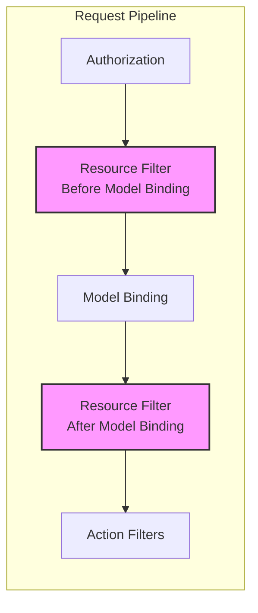

### The Four Benefits in Action:

- **Separation of Concerns:** Performance monitoring is extracted from business logic
- **Cleaner Endpoints:** Controllers don't contain timing code
- **Reusable Logic:** Same monitoring logic across all endpoints
- **Consistent Metrics:** Every request is measured the same way

### Code Example: Reactive Performance Monitoring

```csharp
using Microsoft.AspNetCore.Mvc.Filters;
using Microsoft.AspNetCore.Mvc.Filters;
using System.Diagnostics;
using System.Reactive.Subjects;

// =====================================================
// REACTIVE STREAM FOR DECOUPLED MONITORING
// =====================================================

public static class PerformanceMetrics
{
    // Hot observable for real-time monitoring
    public static Subject<(string Path, long ElapsedMs, int StatusCode)> RequestTimings { get; } = new();
    
    // Derived streams for different metrics
    public static IObservable<double> AverageResponseTimeLast5Minutes =>
        RequestTimings
            .Buffer(TimeSpan.FromMinutes(5))
            .Select(batch => batch.Average(t => t.ElapsedMs))
            .Replay(1)
            .RefCount();
}

// =====================================================
// RESOURCE FILTER - REUSABLE MONITORING COMPONENT
// =====================================================

public class ReactivePerformanceMonitorFilter : IResourceFilter, IAsyncResourceFilter
{
    private readonly Stopwatch _stopwatch;
    private readonly ILogger<ReactivePerformanceMonitorFilter> _logger;

    public ReactivePerformanceMonitorFilter(ILogger<ReactivePerformanceMonitorFilter> logger)
    {
        _stopwatch = new Stopwatch();
        _logger = logger;
    }

    public void OnResourceExecuting(ResourceExecutingContext context)
    {
        _stopwatch.Start();
        
        // Add correlation ID for tracking across services
        var correlationId = Guid.NewGuid().ToString();
        context.HttpContext.Items["CorrelationId"] = correlationId;
        context.HttpContext.Response.Headers["X-Correlation-ID"] = correlationId;
    }

    public void OnResourceExecuted(ResourceExecutedContext context)
    {
        _stopwatch.Stop();
        
        var path = context.HttpContext.Request.Path;
        var statusCode = context.HttpContext.Response.StatusCode;
        var correlationId = context.HttpContext.Items["CorrelationId"] as string;
        
        // Push metrics to reactive stream
        PerformanceMetrics.RequestTimings.OnNext((path, _stopwatch.ElapsedMilliseconds, statusCode));
        
        // Log for immediate visibility
        _logger.LogInformation(
            "Request {Path} completed with {StatusCode} in {ElapsedMs}ms [Correlation: {CorrelationId}]",
            path, statusCode, _stopwatch.ElapsedMilliseconds, correlationId);
    }

    // Async version for non-blocking operations
    public async Task OnResourceExecutionAsync(ResourceExecutingContext context, ResourceExecutionDelegate next)
    {
        OnResourceExecuting(context);
        
        try
        {
            await next();
        }
        finally
        {
            OnResourceExecuted(await CreateExecutedContext(context));
        }
    }
    
    private Task<ResourceExecutedContext> CreateExecutedContext(ResourceExecutingContext context)
    {
        // Helper to convert contexts (simplified for example)
        return Task.FromResult(new ResourceExecutedContext(context.ActionContext, context.Filters));
    }
}

// =====================================================
// BACKGROUND SERVICE FOR REACTIVE PROCESSING
// =====================================================

public class PerformanceAlertingService : BackgroundService
{
    private readonly ILogger<PerformanceAlertingService> _logger;

    public PerformanceAlertingService(ILogger<PerformanceAlertingService> logger)
    {
        _logger = logger;
    }

    protected override async Task ExecuteAsync(CancellationToken stoppingToken)
    {
        // Subscribe to slow requests (> 1000ms)
        PerformanceMetrics.RequestTimings
            .Where(t => t.ElapsedMs > 1000)
            .Subscribe(timing =>
            {
                _logger.LogWarning(
                    "SLOW REQUEST DETECTED: {Path} took {ElapsedMs}ms - Investigate performance",
                    timing.Path, timing.ElapsedMs);
            });

        // Monitor error rate
        PerformanceMetrics.RequestTimings
            .Buffer(TimeSpan.FromMinutes(1))
            .Subscribe(batch =>
            {
                var errorCount = batch.Count(t => t.StatusCode >= 500);
                if (errorCount > 10)
                {
                    _logger.LogCritical("High error rate detected: {ErrorCount} errors in last minute", errorCount);
                }
            });

        // Keep the service running
        while (!stoppingToken.IsCancellationRequested)
        {
            await Task.Delay(1000, stoppingToken);
        }
    }
}

// =====================================================
// CONTROLLER USAGE
// =====================================================

[ApiController]
[Route("api/[controller]")]
[ServiceFilter(typeof(ReactivePerformanceMonitorFilter))] // Applied to all actions
public class ProductsController : ControllerBase
{
    [HttpGet]
    public IActionResult GetProducts()
    {
        // Pure business logic - no performance monitoring code!
        var products = new[]
        {
            new { Id = 1, Name = "Laptop", Price = 1200 },
            new { Id = 2, Name = "Mouse", Price = 25 }
        };
        
        // Simulate some work
        Thread.Sleep(100); // In real apps, this would be database calls
        
        return Ok(products);
    }
    
    [HttpGet("slow")]
    public IActionResult GetSlowReport()
    {
        // Even this "slow" endpoint gets automatically monitored
        Thread.Sleep(2000); // Simulate slow operation
        return Ok(new { Report = "Monthly Sales", Generated = DateTime.UtcNow });
    }
}

// =====================================================
// MINIMAL API USAGE (.NET 10)
// =====================================================

var builder = WebApplication.CreateBuilder();
builder.Services.AddSingleton<PerformanceAlertingService>();
builder.Services.AddScoped<ReactivePerformanceMonitorFilter>();

var app = builder.Build();

// Apply filter to specific group
var apiGroup = app.MapGroup("/api/v1")
    .AddEndpointFilter<ReactivePerformanceMonitorFilter>(); // Reusable!

apiGroup.MapGet("/products", () =>
{
    var products = new[] { new { Id = 1, Name = "Laptop" } };
    return Results.Ok(products);
});

apiGroup.MapGet("/categories", () =>
{
    var categories = new[] { new { Id = 1, Name = "Electronics" } };
    return Results.Ok(categories);
});

// Start the alerting service
app.Services.GetRequiredService<PerformanceAlertingService>();

app.Run();
```

---

## 3. Action Filters: The Workhorses (Logging & Validation)

**What They Do:**
Action Filters wrap the execution of your controller action. You can modify the arguments passed to the action or examine the result it returns.

### Action Filter Flow with Validation

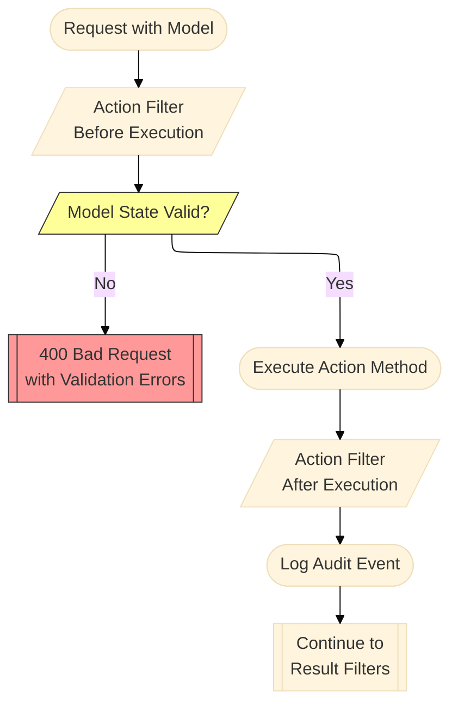

### The Four Benefits in Action:

- **Separation of Concerns:** Input validation is separate from business logic
- **Cleaner Endpoints:** No validation clutter in action methods
- **Reusable Logic:** Same validation rules across different endpoints
- **Consistent Responses:** Uniform error format for validation failures

### Code Example: Reactive Validation and Audit Logging

```csharp
using Microsoft.AspNetCore.Mvc.Filters;
using System.ComponentModel.DataAnnotations;
using System.Reactive.Subjects;
using System.Text.Json;

// =====================================================
// AUDIT STREAM FOR DECOUPLED LOGGING
// =====================================================

public static class AuditLogStream
{
    public static Subject<AuditEvent> AuditEvents { get; } = new();
}

public record AuditEvent(
    string Action,
    string User,
    object Arguments,
    object Result,
    DateTime Timestamp,
    string IpAddress,
    string CorrelationId);

// =====================================================
// CUSTOM VALIDATION ATTRIBUTE
// =====================================================

public class ValidOrderAttribute : ValidationAttribute
{
    protected override ValidationResult? IsValid(object? value, ValidationContext validationContext)
    {
        if (value is OrderDto order)
        {
            if (order.Quantity <= 0)
            {
                return new ValidationResult("Quantity must be greater than zero");
            }
            
            if (order.Price <= 0)
            {
                return new ValidationResult("Price must be greater than zero");
            }
            
            if (string.IsNullOrWhiteSpace(order.ProductName))
            {
                return new ValidationResult("Product name is required");
            }
        }
        
        return ValidationResult.Success;
    }
}

// =====================================================
// ACTION FILTER FOR VALIDATION & AUDIT
// =====================================================

public class ReactiveValidationAndAuditFilter : IAsyncActionFilter
{
    private readonly ILogger<ReactiveValidationAndAuditFilter> _logger;

    public ReactiveValidationAndAuditFilter(ILogger<ReactiveValidationAndAuditFilter> logger)
    {
        _logger = logger;
    }

    public async Task OnActionExecutionAsync(ActionExecutingContext context, ActionExecutionDelegate next)
    {
        // ===== BEFORE ACTION EXECUTION =====
        // Validate model state
        if (!context.ModelState.IsValid)
        {
            var errors = context.ModelState
                .Where(e => e.Value?.Errors.Count > 0)
                .ToDictionary(
                    e => e.Key,
                    e => e.Value?.Errors.Select(x => x.ErrorMessage).ToArray()
                );
            
            // Consistent validation error response
            context.Result = new BadRequestObjectResult(new
            {
                Error = "Validation failed",
                Details = errors,
                Timestamp = DateTime.UtcNow,
                CorrelationId = context.HttpContext.Items["CorrelationId"]
            });
            
            // Log validation failure to audit stream
            AuditLogStream.AuditEvents.OnNext(new AuditEvent(
                Action: context.ActionDescriptor.DisplayName!,
                User: context.HttpContext.User.Identity?.Name ?? "Anonymous",
                Arguments: context.ActionArguments,
                Result: new { Error = "Validation failed", Errors = errors },
                Timestamp: DateTime.UtcNow,
                IpAddress: context.HttpContext.Connection.RemoteIpAddress?.ToString() ?? "Unknown",
                CorrelationId: context.HttpContext.Items["CorrelationId"] as string ?? "N/A"
            ));
            
            return;
        }
        
        // ===== EXECUTE ACTION =====
        var executedContext = await next();
        
        // ===== AFTER ACTION EXECUTION =====
        // Audit successful execution
        if (executedContext.Exception == null)
        {
            AuditLogStream.AuditEvents.OnNext(new AuditEvent(
                Action: context.ActionDescriptor.DisplayName!,
                User: context.HttpContext.User.Identity?.Name ?? "Anonymous",
                Arguments: context.ActionArguments,
                Result: executedContext.Result!,
                Timestamp: DateTime.UtcNow,
                IpAddress: context.HttpContext.Connection.RemoteIpAddress?.ToString() ?? "Unknown",
                CorrelationId: context.HttpContext.Items["CorrelationId"] as string ?? "N/A"
            ));
            
            _logger.LogInformation(
                "Action {Action} completed successfully for user {User}",
                context.ActionDescriptor.DisplayName,
                context.HttpContext.User.Identity?.Name ?? "Anonymous");
        }
    }
}

// =====================================================
// DTO WITH VALIDATION
// =====================================================

public record OrderDto
{
    [Required]
    [StringLength(100)]
    public string ProductName { get; init; } = string.Empty;
    
    [Range(1, 1000)]
    public int Quantity { get; init; }
    
    [Range(0.01, 10000)]
    public decimal Price { get; init; }
    
    [EmailAddress]
    public string? CustomerEmail { get; init; }
}

// =====================================================
// CONTROLLER WITH CLEAN ACTIONS
// =====================================================

[ApiController]
[Route("api/[controller]")]
[ServiceFilter(typeof(ReactiveValidationAndAuditFilter))] // One filter handles validation for all actions
public class OrdersV2Controller : ControllerBase
{
    private static readonly List<OrderDto> _orders = new();
    
    [HttpPost]
    public IActionResult CreateOrder([FromBody][ValidOrder] OrderDto order)
    {
        // NO VALIDATION CODE HERE!
        // NO LOGGING CODE HERE!
        // Just pure business logic
        
        _orders.Add(order);
        
        return Created($"/api/orders/{_orders.Count}", new
        {
            Message = "Order created successfully",
            OrderId = _orders.Count,
            Order = order
        });
    }
    
    [HttpPut("{id}")]
    public IActionResult UpdateOrder(int id, [FromBody][ValidOrder] OrderDto order)
    {
        // Still clean - validation handled by filter
        if (id <= 0 || id > _orders.Count)
        {
            return NotFound(new { Error = "Order not found" });
        }
        
        _orders[id - 1] = order;
        
        return Ok(new
        {
            Message = "Order updated successfully",
            Order = order
        });
    }
}

// =====================================================
// MINIMAL API WITH FILTERS (.NET 10)
// =====================================================

public static class OrderV2Endpoints
{
    public static void MapOrderV2Endpoints(this IEndpointRouteBuilder app)
    {
        var group = app.MapGroup("/api/v2/orders")
            .AddEndpointFilter<ReactiveValidationAndAuditFilter>(); // Same filter, different API style!
        
        group.MapPost("/", (OrderDto order) =>
        {
            // Pure business logic
            return Results.Created($"/api/v2/orders/1", new
            {
                Message = "Order created",
                Order = order
            });
        })
        .WithName("CreateOrderV2")
        .WithOpenApi();
        
        group.MapGet("/", () =>
        {
            var orders = new[]
            {
                new { Id = 1, Product = "Laptop", Status = "New" },
                new { Id = 2, Product = "Mouse", Status = "Processing" }
            };
            
            return Results.Ok(orders);
        });
    }
}

// =====================================================
// AUDIT CONSUMER SERVICE
// =====================================================

public class AuditConsumerService : BackgroundService
{
    private readonly ILogger<AuditConsumerService> _logger;

    public AuditConsumerService(ILogger<AuditConsumerService> logger)
    {
        _logger = logger;
    }

    protected override Task ExecuteAsync(CancellationToken stoppingToken)
    {
        return Task.Run(() =>
        {
            // Subscribe to audit events for real-time processing
            AuditLogStream.AuditEvents.Subscribe(auditEvent =>
            {
                // In production, this would write to a secure audit store
                _logger.LogInformation(
                    "AUDIT: [{Timestamp}] {User} performed {Action} from {Ip} [Correlation: {CorrelationId}]",
                    auditEvent.Timestamp,
                    auditEvent.User,
                    auditEvent.Action,
                    auditEvent.IpAddress,
                    auditEvent.CorrelationId
                );
                
                // Could also write to database, send to SIEM, etc.
                File.AppendAllText(
                    "audit.log",
                    $"{JsonSerializer.Serialize(auditEvent)}\n"
                );
            });
            
            // Monitor for suspicious activity
            AuditLogStream.AuditEvents
                .Buffer(TimeSpan.FromMinutes(5))
                .Subscribe(batch =>
                {
                    var suspicious = batch
                        .GroupBy(a => a.User)
                        .Where(g => g.Count() > 100) // More than 100 actions in 5 minutes
                        .Select(g => g.Key);
                    
                    foreach (var user in suspicious)
                    {
                        _logger.LogWarning("SUSPICIOUS ACTIVITY: User {User} performed {Count} actions in last 5 minutes", 
                            user, batch.Count(a => a.User == user));
                    }
                });
        }, stoppingToken);
    }
}
```

---

## 4. Exception Filters: The Global Error Handlers

**What They Do:**
Exception Filters handle unhandled exceptions that occur during action execution, model binding, or other filters. This is the ideal place to log errors and return standardized error responses to the client.

### Exception Handling Flow

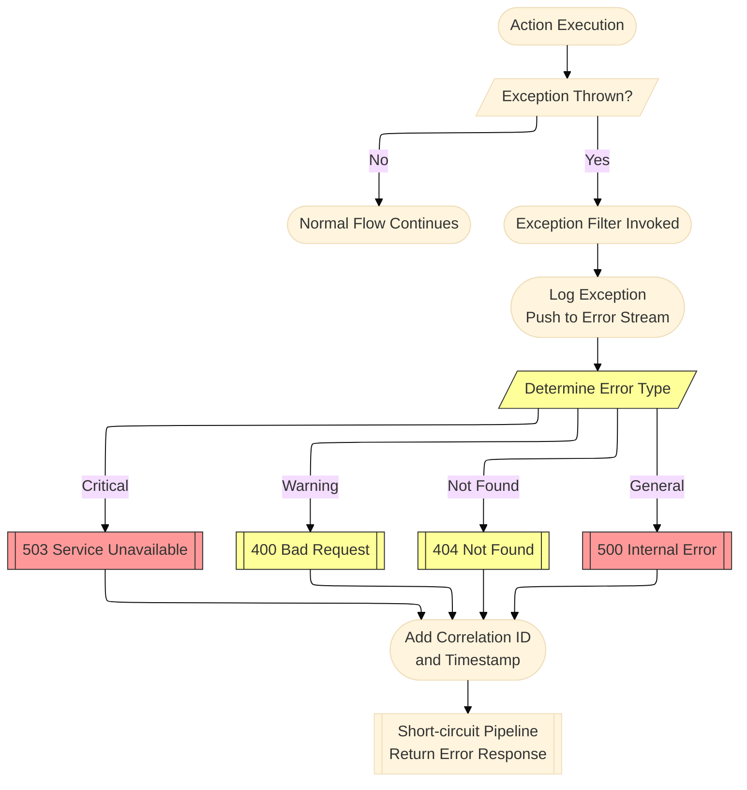

### The Four Benefits in Action:

- **Separation of Concerns:** Error handling is extracted from business logic
- **Cleaner Endpoints:** No try-catch blocks cluttering the code
- **Reusable Logic:** Same error handling across all endpoints
- **Consistent Errors:** Every exception produces a standardized response

### Code Example: Reactive Error Handling with Notifications

```csharp
using Microsoft.AspNetCore.Mvc.Filters;
using Microsoft.AspNetCore.Mvc;
using System.Reactive.Subjects;
using System.Reactive.Concurrency;

// =====================================================
// ERROR STREAM FOR REACTIVE PROCESSING
// =====================================================

public static class GlobalErrorStream
{
    // Hot observable for error events
    public static Subject<ErrorContext> Errors { get; } = new();
    
    // Derived streams for different severity levels
    public static IObservable<ErrorContext> CriticalErrors => 
        Errors.Where(e => e.Exception is CriticalException || e.Exception?.StackTrace?.Contains("Database") == true);
    
    public static IObservable<ErrorContext> Warnings =>
        Errors.Where(e => e.Exception is WarningException);
}

public record ErrorContext(
    Exception Exception,
    string Path,
    string Method,
    string User,
    DateTime Timestamp,
    string CorrelationId,
    object? RequestData = null);

// Custom exception types for better categorization
public class CriticalException : Exception
{
    public CriticalException(string message) : base(message) { }
    public CriticalException(string message, Exception inner) : base(message, inner) { }
}

public class WarningException : Exception
{
    public WarningException(string message) : base(message) { }
}

// =====================================================
// EXCEPTION FILTER - REUSABLE ERROR HANDLER
// =====================================================

public class ReactiveGlobalExceptionFilter : IExceptionFilter, IAsyncExceptionFilter
{
    private readonly ILogger<ReactiveGlobalExceptionFilter> _logger;
    private readonly IWebHostEnvironment _env;

    public ReactiveGlobalExceptionFilter(
        ILogger<ReactiveGlobalExceptionFilter> logger,
        IWebHostEnvironment env)
    {
        _logger = logger;
        _env = env;
    }

    public void OnException(ExceptionContext context)
    {
        // Push to reactive stream
        PushToErrorStream(context);
        
        // Create standardized response
        var response = CreateErrorResponse(context);
        
        // Set the result (short-circuit the pipeline)
        context.Result = new ObjectResult(response)
        {
            StatusCode = GetStatusCode(context.Exception)
        };
        
        context.ExceptionHandled = true;
    }

    public Task OnExceptionAsync(ExceptionContext context)
    {
        OnException(context);
        return Task.CompletedTask;
    }

    private void PushToErrorStream(ExceptionContext context)
    {
        var errorContext = new ErrorContext(
            Exception: context.Exception,
            Path: context.HttpContext.Request.Path,
            Method: context.HttpContext.Request.Method,
            User: context.HttpContext.User.Identity?.Name ?? "Anonymous",
            Timestamp: DateTime.UtcNow,
            CorrelationId: context.HttpContext.Items["CorrelationId"] as string ?? Guid.NewGuid().ToString(),
            RequestData: GetRequestData(context.HttpContext.Request)
        );
        
        GlobalErrorStream.Errors.OnNext(errorContext);
    }

    private object CreateErrorResponse(ExceptionContext context)
    {
        var correlationId = context.HttpContext.Items["CorrelationId"] as string ?? 
                           context.HttpContext.TraceIdentifier;
        
        // Base response (safe for production)
        var response = new
        {
            Error = "An error occurred while processing your request.",
            Type = GetErrorType(context.Exception),
            CorrelationId = correlationId,
            Timestamp = DateTime.UtcNow
        };
        
        // Include details in development
        if (_env.IsDevelopment())
        {
            return new
            {
                Error = context.Exception.Message,
                Type = context.Exception.GetType().Name,
                StackTrace = context.Exception.StackTrace,
                CorrelationId = correlationId,
                Timestamp = DateTime.UtcNow,
                InnerException = context.Exception.InnerException?.Message
            };
        }
        
        return response;
    }

    private int GetStatusCode(Exception ex) => ex switch
    {
        UnauthorizedAccessException => 401,
        ArgumentException => 400,
        KeyNotFoundException => 404,
        CriticalException => 503, // Service Unavailable
        _ => 500
    };

    private string GetErrorType(Exception ex) => ex switch
    {
        CriticalException => "Critical",
        WarningException => "Warning",
        _ => "General"
    };

    private object? GetRequestData(HttpRequest request)
    {
        try
        {
            // Safely capture request data (avoid reading large bodies)
            return new
            {
                Query = request.QueryString.ToString(),
                Headers = request.Headers
                    .Where(h => !h.Key.Equals("Authorization", StringComparison.OrdinalIgnoreCase))
                    .ToDictionary(h => h.Key, h => h.Value.ToString()),
                ContentType = request.ContentType
            };
        }
        catch
        {
            return null; // Don't let request reading cause more errors
        }
    }
}

// =====================================================
// CONTROLLER - COMPLETELY FREE OF ERROR HANDLING CODE
// =====================================================

[ApiController]
[Route("api/[controller]")]
[ServiceFilter(typeof(ReactiveGlobalExceptionFilter))] // Global error handling
public class PaymentsController : ControllerBase
{
    private static readonly Dictionary<int, decimal> _payments = new();
    
    [HttpPost("process/{orderId}")]
    public IActionResult ProcessPayment(int orderId, [FromBody] PaymentRequest request)
    {
        // NO TRY-CATCH BLOCKS!
        // NO ERROR HANDLING CODE!
        // Just business logic - if it throws, filter handles it
        
        if (orderId <= 0)
        {
            throw new ArgumentException("Invalid order ID", nameof(orderId));
        }
        
        if (request.Amount <= 0)
        {
            throw new ArgumentException("Payment amount must be positive");
        }
        
        // Simulate database operation that might fail
        if (!SimulatePaymentProcessing(orderId, request.Amount))
        {
            throw new CriticalException("Payment gateway unavailable", 
                new Exception("Connection timeout"));
        }
        
        _payments[orderId] = request.Amount;
        
        return Ok(new
        {
            Message = "Payment processed successfully",
            TransactionId = Guid.NewGuid(),
            Amount = request.Amount
        });
    }
    
    [HttpGet("risky")]
    public IActionResult RiskyOperation()
    {
        // This will throw and be caught by the filter
        throw new WarningException("This operation is temporarily degraded");
    }
    
    private bool SimulatePaymentProcessing(int orderId, decimal amount)
    {
        // Simulate random failures
        return Random.Shared.Next(0, 10) > 2; // 20% failure rate
    }
}

public record PaymentRequest(decimal Amount, string Currency, string PaymentMethod);

// =====================================================
// MINIMAL API WITH EXCEPTION FILTER (.NET 10)
// =====================================================

var builder = WebApplication.CreateBuilder();
builder.Services.AddScoped<ReactiveGlobalExceptionFilter>();

var app = builder.Build();

// Apply filter to a group
var paymentGroup = app.MapGroup("/api/payments")
    .AddEndpointFilter<ReactiveGlobalExceptionFilter>(); // Same filter!

paymentGroup.MapPost("/process/{orderId}", (int orderId, PaymentRequest request) =>
{
    // No error handling - let filter manage it
    if (request.Amount > 10000)
    {
        throw new CriticalException("Large payments require manual approval");
    }
    
    return Results.Ok(new { Status = "Processed", OrderId = orderId });
});

paymentGroup.MapGet("/status/{transactionId}", (string transactionId) =>
{
    // This might throw if transaction not found
    if (transactionId.Length < 10)
    {
        throw new KeyNotFoundException($"Transaction {transactionId} not found");
    }
    
    return Results.Ok(new { Status = "Completed" });
});

// =====================================================
// ERROR MONITORING SERVICE
// =====================================================

public class ErrorMonitoringService : BackgroundService
{
    private readonly ILogger<ErrorMonitoringService> _logger;

    public ErrorMonitoringService(ILogger<ErrorMonitoringService> logger)
    {
        _logger = logger;
    }

    protected override Task ExecuteAsync(CancellationToken stoppingToken)
    {
        return Task.Run(() =>
        {
            // Real-time error logging
            GlobalErrorStream.Errors.Subscribe(error =>
            {
                _logger.LogError(
                    error.Exception,
                    "ERROR: [{Timestamp}] {Path} - {Message} [Correlation: {CorrelationId}]",
                    error.Timestamp,
                    error.Path,
                    error.Exception.Message,
                    error.CorrelationId
                );
            });
            
            // Alert on critical errors
            GlobalErrorStream.CriticalErrors
                .SubscribeOn(TaskPoolScheduler.Default)
                .Subscribe(criticalError =>
                {
                    _logger.LogCritical(
                        criticalError.Exception,
                        "CRITICAL: Immediate attention required! {Path} - {Message}",
                        criticalError.Path,
                        criticalError.Exception.Message
                    );
                    
                    // Send SMS/PagerDuty/Teams notification
                    SendAlert(criticalError);
                });
            
            // Error rate monitoring
            GlobalErrorStream.Errors
                .Buffer(TimeSpan.FromMinutes(5))
                .Subscribe(batch =>
                {
                    if (batch.Count > 50)
                    {
                        _logger.LogWarning("High error rate detected: {Count} errors in last 5 minutes", batch.Count);
                    }
                    
                    // Group by error type
                    var byType = batch.GroupBy(e => e.Exception.GetType().Name)
                                      .Select(g => new { Type = g.Key, Count = g.Count() });
                    
                    foreach (var item in byType)
                    {
                        _logger.LogInformation("Error summary: {Type} - {Count} occurrences", item.Type, item.Count);
                    }
                });
        }, stoppingToken);
    }
    
    private void SendAlert(ErrorContext criticalError)
    {
        // Implementation for SMS, PagerDuty, Teams, etc.
        Console.WriteLine($"🚨 ALERT: Critical error at {criticalError.Path}");
    }
}
```

---

## 5. Result Filters: The Response Formatters

**What They Do:**
Result Filters execute *before* and *after* the action result is processed. This is useful when you need to add headers to the response, modify the response body, or compress the output.

### Response Transformation Flow

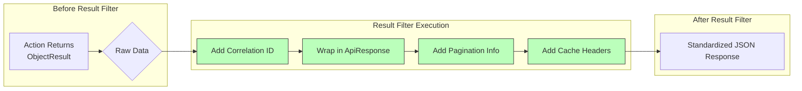

### The Four Benefits in Action:

- **Separation of Concerns:** Response formatting is separated from business logic
- **Cleaner Endpoints:** Controllers return simple objects, not formatted responses
- **Reusable Logic:** Same response envelope across all endpoints
- **Consistent API:** Every response follows the same structure

### Code Example: Standardized API Responses with Caching

```csharp
using Microsoft.AspNetCore.Mvc.Filters;
using Microsoft.AspNetCore.Mvc;
using System.Text.Json;
using Microsoft.Net.Http.Headers;

// =====================================================
// STANDARD API RESPONSE ENVELOPE
// =====================================================

public class ApiResponse<T>
{
    public T? Data { get; set; }
    public string? Message { get; set; }
    public bool Success { get; set; }
    public DateTime Timestamp { get; set; }
    public string? CorrelationId { get; set; }
    public PaginationInfo? Pagination { get; set; }
    public Dictionary<string, string[]>? Errors { get; set; }
}

public class PaginationInfo
{
    public int Page { get; set; }
    public int PageSize { get; set; }
    public int TotalCount { get; set; }
    public int TotalPages { get; set; }
    public bool HasPrevious => Page > 1;
    public bool HasNext => Page < TotalPages;
}

// =====================================================
// RESULT FILTER FOR STANDARDIZED RESPONSES
// =====================================================

public class StandardizedResponseFilter : IResultFilter
{
    private readonly ILogger<StandardizedResponseFilter> _logger;

    public StandardizedResponseFilter(ILogger<StandardizedResponseFilter> logger)
    {
        _logger = logger;
    }

    public void OnResultExecuting(ResultExecutingContext context)
    {
        // Skip for certain result types
        if (context.Result is EmptyResult || 
            context.Result is FileResult || 
            context.Result is PhysicalFileResult)
        {
            return;
        }

        // Handle ObjectResult (most common)
        if (context.Result is ObjectResult objectResult)
        {
            var correlationId = context.HttpContext.Items["CorrelationId"] as string ?? 
                               context.HttpContext.TraceIdentifier;
            
            // Create standardized envelope
            var envelope = CreateEnvelope(objectResult.Value, context, correlationId);
            
            // Replace the result
            objectResult.Value = envelope;
            
            // Ensure status code is preserved
            if (objectResult.StatusCode == null)
            {
                objectResult.StatusCode = context.HttpContext.Response.StatusCode == 200 ? 
                    200 : context.HttpContext.Response.StatusCode;
            }
        }
        
        // Add standard headers
        context.HttpContext.Response.Headers["X-API-Version"] = "1.0";
        context.HttpContext.Response.Headers["X-Correlation-ID"] = 
            context.HttpContext.Items["CorrelationId"] as string ?? context.HttpContext.TraceIdentifier;
    }

    public void OnResultExecuted(ResultExecutedContext context)
    {
        // Log response size for monitoring
        if (context.HttpContext.Response.ContentLength.HasValue)
        {
            _logger.LogDebug("Response size: {Size} bytes", context.HttpContext.Response.ContentLength);
        }
    }

    private ApiResponse<object> CreateEnvelope(object? originalValue, ResultExecutingContext context, string correlationId)
    {
        var response = new ApiResponse<object>
        {
            Data = originalValue,
            Success = context.HttpContext.Response.StatusCode < 400,
            Timestamp = DateTime.UtcNow,
            CorrelationId = correlationId
        };
        
        // Add message based on status code
        response.Message = context.HttpContext.Response.StatusCode switch
        {
            200 => "Request completed successfully",
            201 => "Resource created successfully",
            400 => "Bad request - please check your input",
            401 => "Authentication required",
            403 => "You don't have permission to access this resource",
            404 => "Resource not found",
            500 => "Internal server error",
            _ => null
        };
        
        // Add pagination info if present in HttpContext items
        if (context.HttpContext.Items.TryGetValue("Pagination", out var pagination))
        {
            response.Pagination = pagination as PaginationInfo;
        }
        
        return response;
    }
}

// =====================================================
// CACHING RESULT FILTER
// =====================================================

public class CacheControlFilter : IResultFilter
{
    private readonly int _durationSeconds;

    public CacheControlFilter(int durationSeconds = 60)
    {
        _durationSeconds = durationSeconds;
    }

    public void OnResultExecuting(ResultExecutingContext context)
    {
        // Skip for non-GET requests
        if (!string.Equals(context.HttpContext.Request.Method, "GET", StringComparison.OrdinalIgnoreCase))
        {
            return;
        }

        var response = context.HttpContext.Response;
        
        // Add cache headers
        response.Headers[HeaderNames.CacheControl] = $"public, max-age={_durationSeconds}";
        response.Headers[HeaderNames.Expires] = DateTime.UtcNow.AddSeconds(_durationSeconds).ToString("R");
        response.Headers[HeaderNames.Vary] = "Accept-Encoding";
    }

    public void OnResultExecuted(ResultExecutedContext context)
    {
        // Nothing to do after execution
    }
}

// =====================================================
// CONTROLLER - CLEAN AND FOCUSED
// =====================================================

[ApiController]
[Route("api/[controller]")]
[ServiceFilter(typeof(StandardizedResponseFilter))] // Applied to all actions
public class CatalogController : ControllerBase
{
    private static readonly List<Product> _products = new()
    {
        new Product { Id = 1, Name = "Laptop", Price = 1200, Category = "Electronics" },
        new Product { Id = 2, Name = "Mouse", Price = 25, Category = "Accessories" },
        new Product { Id = 3, Name = "Keyboard", Price = 75, Category = "Accessories" },
        new Product { Id = 4, Name = "Monitor", Price = 300, Category = "Electronics" }
    };

    [HttpGet]
    [ServiceFilter(typeof(CacheControlFilter))] // Can combine multiple filters
    public IActionResult GetProducts([FromQuery] int page = 1, [FromQuery] int pageSize = 10)
    {
        // Just return the data - filter will wrap it
        var pagedProducts = _products
            .Skip((page - 1) * pageSize)
            .Take(pageSize)
            .ToList();
        
        // Add pagination info to context (will be picked up by response filter)
        HttpContext.Items["Pagination"] = new PaginationInfo
        {
            Page = page,
            PageSize = pageSize,
            TotalCount = _products.Count,
            TotalPages = (int)Math.Ceiling(_products.Count / (double)pageSize)
        };
        
        return Ok(pagedProducts); // Returns ApiResponse<List<Product>>
    }

    [HttpGet("{id}")]
    public IActionResult GetProduct(int id)
    {
        var product = _products.FirstOrDefault(p => p.Id == id);
        
        if (product == null)
        {
            return NotFound(); // Filter will wrap with ApiResponse and add message
        }
        
        return Ok(product); // Returns ApiResponse<Product>
    }

    [HttpPost]
    public IActionResult CreateProduct([FromBody] Product product)
    {
        // Simulate creation
        product.Id = _products.Max(p => p.Id) + 1;
        _products.Add(product);
        
        return CreatedAtAction(nameof(GetProduct), new { id = product.Id }, product);
        // Returns ApiResponse<Product> with 201 status
    }
}

public class Product
{
    public int Id { get; set; }
    public string Name { get; set; } = string.Empty;
    public decimal Price { get; set; }
    public string Category { get; set; } = string.Empty;
}

// =====================================================
// MINIMAL API WITH RESPONSE FILTERS (.NET 10)
// =====================================================

var builder = WebApplication.CreateBuilder();
builder.Services.AddScoped<StandardizedResponseFilter>();
builder.Services.AddScoped<CacheControlFilter>();

var app = builder.Build();

// Apply filters to groups
var apiV1 = app.MapGroup("/api/v1/catalog")
    .AddEndpointFilter<StandardizedResponseFilter>() // First wrap in standard envelope
    .AddEndpointFilter<CacheControlFilter>();        // Then add caching

apiV1.MapGet("/products", (int? page, int? pageSize) =>
{
    page ??= 1;
    pageSize ??= 10;
    
    var products = new[]
    {
        new { Id = 1, Name = "Tablet", Price = 500 },
        new { Id = 2, Name = "Case", Price = 20 }
    };
    
    // Return raw data - filter handles wrapping
    return Results.Ok(products);
});

apiV1.MapGet("/products/{id}", (int id) =>
{
    if (id == 999)
    {
        return Results.NotFound(); // Filter will wrap with standard format
    }
    
    var product = new { Id = id, Name = $"Product {id}", Price = 100 };
    return Results.Ok(product);
});

apiV1.MapPost("/products", (Product product) =>
{
    // Return 201 with location header
    return Results.Created($"/api/v1/catalog/products/{product.Id}", product);
});

// =====================================================
// EXAMPLE RESPONSES (What the client sees)
// =====================================================

/*
GET /api/v1/catalog/products/1

{
    "data": {
        "id": 1,
        "name": "Laptop",
        "price": 1200,
        "category": "Electronics"
    },
    "message": "Request completed successfully",
    "success": true,
    "timestamp": "2024-01-15T10:30:00Z",
    "correlationId": "abc-123-def",
    "pagination": null,
    "errors": null
}

GET /api/v1/catalog/products/999

{
    "data": null,
    "message": "Resource not found",
    "success": false,
    "timestamp": "2024-01-15T10:30:00Z",
    "correlationId": "xyz-789-uvw",
    "pagination": null,
    "errors": null
}

Headers:
X-API-Version: 1.0
X-Correlation-ID: abc-123-def
Cache-Control: public, max-age=60
*/

// =====================================================
// REACTIVE RESPONSE ANALYZER
// =====================================================

public class ResponseAnalyzerService : BackgroundService
{
    private readonly ILogger<ResponseAnalyzerService> _logger;

    public ResponseAnalyzerService(ILogger<ResponseAnalyzerService> logger)
    {
        _logger = logger;
    }

    protected override Task ExecuteAsync(CancellationToken stoppingToken)
    {
        // This would hook into response events in a real implementation
        // For now, it's a placeholder showing how you could analyze response patterns
        
        return Task.CompletedTask;
    }
}

app.Run();
```

---

## Putting It All Together: The Complete Picture

Now let's see how all these filters work together in a complete application:

### Complete Filter Pipeline Architecture

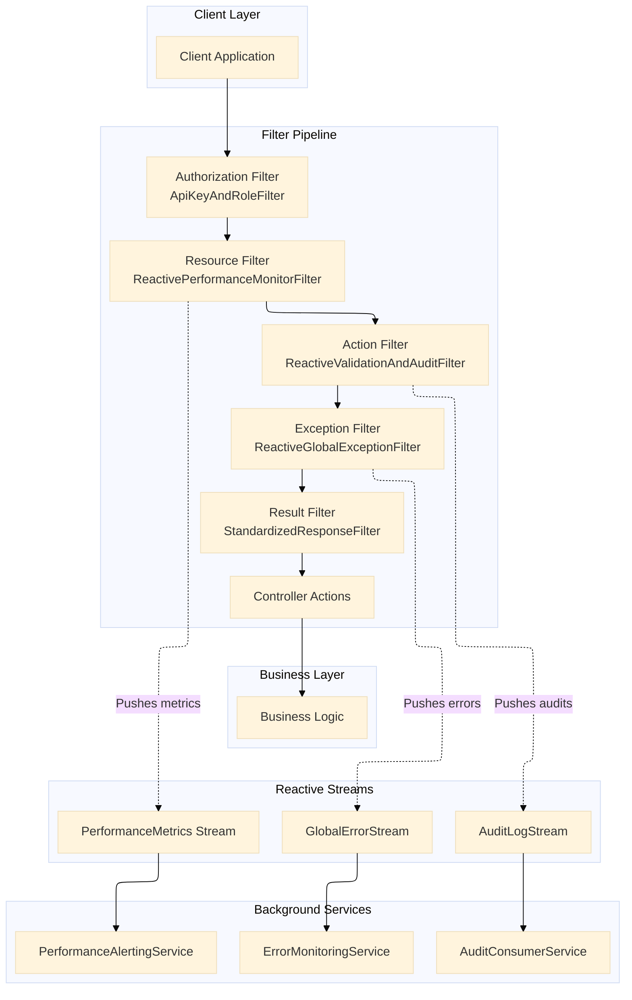

### Complete Program.cs with All Filters

```csharp
// =====================================================
// PROGRAM.CS - .NET 10 APPLICATION WITH ALL FILTERS
// =====================================================

var builder = WebApplication.CreateBuilder(args);

// Add services
builder.Services.AddControllers();
builder.Services.AddEndpointsApiExplorer();
builder.Services.AddSwaggerGen();

// Register all filters
builder.Services.AddScoped<ApiKeyAndRoleFilter>();
builder.Services.AddScoped<ReactivePerformanceMonitorFilter>();
builder.Services.AddScoped<ReactiveValidationAndAuditFilter>();
builder.Services.AddScoped<ReactiveGlobalExceptionFilter>();
builder.Services.AddScoped<StandardizedResponseFilter>();
builder.Services.AddScoped<CacheControlFilter>();

// Register background services
builder.Services.AddHostedService<PerformanceAlertingService>();
builder.Services.AddHostedService<AuditConsumerService>();
builder.Services.AddHostedService<ErrorMonitoringService>();

// Configure authentication
builder.Services.AddAuthentication(JwtBearerDefaults.AuthenticationScheme)
    .AddJwtBearer(options =>
    {
        options.Authority = "https://your-identity-server";
        options.Audience = "api";
    });

builder.Services.AddAuthorization(options =>
{
    options.AddPolicy("Admin", policy => policy.RequireRole("Admin"));
    options.AddPolicy("User", policy => policy.RequireRole("User"));
});

var app = builder.Build();

// Configure pipeline
if (app.Environment.IsDevelopment())
{
    app.UseSwagger();
    app.UseSwaggerUI();
}

app.UseHttpsRedirection();

// Important: Filters run in the middleware pipeline after these
app.UseAuthentication();
app.UseAuthorization();

// Map controller routes (filters applied via attributes)
app.MapControllers();

// Map minimal API routes with filters
app.MapGroup("/api/minimal/orders")
    .AddEndpointFilter<ApiKeyAndRoleFilter>()
    .AddEndpointFilter<ReactiveValidationAndAuditFilter>()
    .AddEndpointFilter<StandardizedResponseFilter>()
    .MapOrderEndpoints(); // Extension method from earlier

app.MapGroup("/api/minimal/payments")
    .AddEndpointFilter<ReactiveGlobalExceptionFilter>()
    .AddEndpointFilter<StandardizedResponseFilter>()
    .MapPaymentEndpoints();

app.Run();

// =====================================================
// SUMMARY: THE FOUR BENEFITS ACHIEVED
// =====================================================

/*
 * ✅ SEPARATION OF CONCERNS:
 *    - Authentication logic is in ApiKeyAndRoleFilter, not controllers
 *    - Validation logic is in ReactiveValidationAndAuditFilter, not actions
 *    - Error handling is in ReactiveGlobalExceptionFilter, not try-catch blocks
 *    - Response formatting is in StandardizedResponseFilter, not manual wrapping
 *    - Performance monitoring is in ReactivePerformanceMonitorFilter, not inline timing code
 * 
 * ✅ CLEANER CONTROLLERS/ENDPOINTS:
 *    - Controllers contain ONLY business logic
 *    - No authentication checks cluttering the code
 *    - No validation code in action methods
 *    - No try-catch blocks everywhere
 *    - No manual response formatting
 * 
 * ✅ REUSABLE LOGIC ACROSS ENDPOINTS:
 *    - Same authentication filter protects all endpoints
 *    - Same validation logic applies to all POST/PUT requests
 *    - Same error handler catches exceptions everywhere
 *    - Same response formatter standardizes all responses
 *    - Same performance monitor tracks all requests
 * 
 * ✅ CONSISTENT LOGGING AND ERROR HANDLING:
 *    - Every authenticated request is logged the same way
 *    - Every validation error has the same format
 *    - Every exception produces the same structured response
 *    - Every response has the same envelope structure
 *    - Every request is monitored with the same metrics
 */
```

---

## Filter Registration Comparison: .NET 10 vs Previous Versions

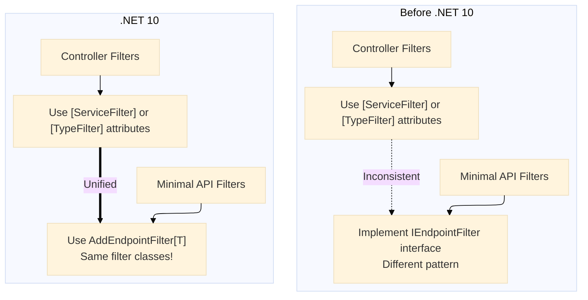

### What's Changed from Before .NET 10:

| Feature | Before .NET 10 | .NET 10 |
|---------|---------------|---------|
| **Minimal API Filters** | `IEndpointFilter` interface (different pattern) | `AddEndpointFilter<T>` with same filters as controllers |
| **Filter Registration** | Separate patterns for controllers vs. minimal | Unified registration system |
| **Async Support** | Good, but inconsistent | Fully unified `IAsyncActionFilter` etc. |
| **Dependency Injection** | Required `ServiceFilterAttribute` | Works seamlessly in both styles |
| **Reactive Integration** | Manual implementation | Built-in support with improved Activity APIs |

---

## Reactive Streams Architecture

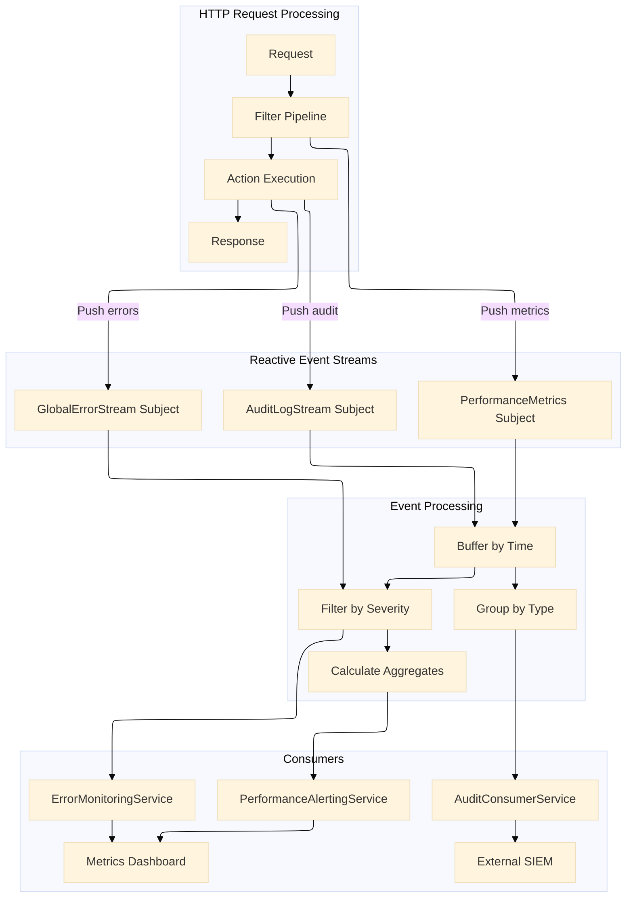

---

## Conclusion: The Power of a Structured, Reactive Pipeline

Are you using filters in your ASP.NET Core APIs? If not, you're missing out on one of the most powerful features of the framework. By leveraging the structured pipeline of Authorization, Resource, Action, Exception, and Result filters, you can achieve true separation of concerns.

### Key Takeaways:

1. **Separation of Concerns** - Each filter handles one specific cross-cutting concern, leaving your business logic pure and focused

2. **Cleaner Controllers** - Your action methods contain only the code that makes your application unique

3. **Reusable Logic** - Write once, apply everywhere. The same authentication filter can protect both traditional controllers and modern minimal APIs

4. **Consistent Behavior** - Every endpoint behaves predictably with standardized responses, error formats, and logging

With **.NET 10**, this pattern is more robust and unified than ever. The gap between controller-based APIs and minimal APIs has closed, allowing you to use the same filter patterns regardless of which style you prefer.

And by integrating **Reactive Programming** principles, you transform these interceptors from simple imperative blocks into the nervous system of your application, streaming events and decoupling your cross-cutting logic from your business logic.

### Your Action Plan:

1. **Start Small** - Add one filter (like logging) to a single endpoint
2. **Expand Gradually** - Add validation filters to your POST endpoints
3. **Go Global** - Implement global exception handling and response formatting
4. **Go Reactive** - Use `System.Reactive` to process streams of events from your filters
5. **Monitor & Improve** - Use the data from your reactive streams to optimize performance

### Final Architecture Overview

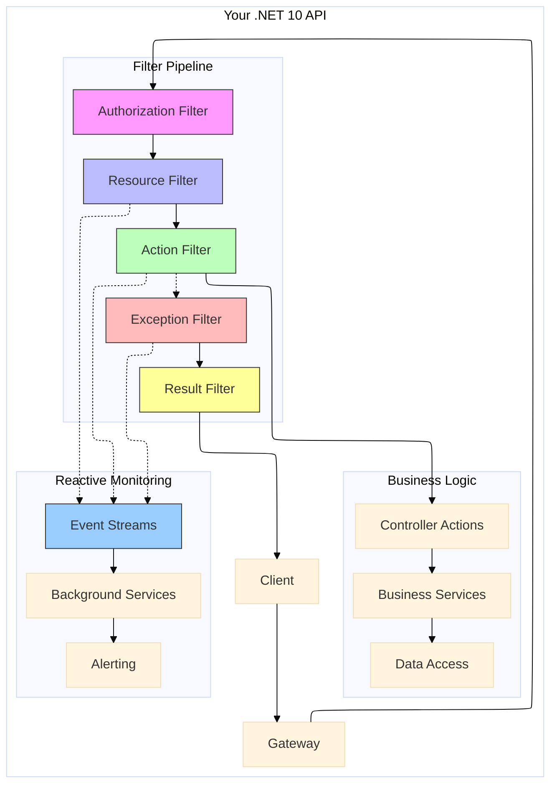

**Which filters are you most excited to implement in your next .NET 10 project? Let me know in the comments!**

---

*Follow me for more deep dives into ASP.NET Core, clean architecture, and reactive programming patterns.*

#dotnet #aspnetcore #webapi #softwarearchitecture #dotnet10 #reactiveprogramming #csharp #cleanarchitecture #programming #devcommunity