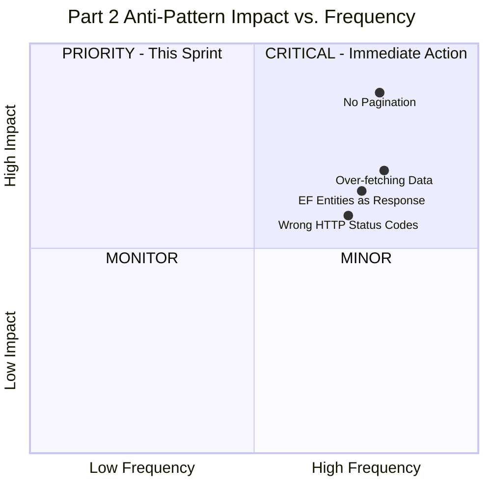
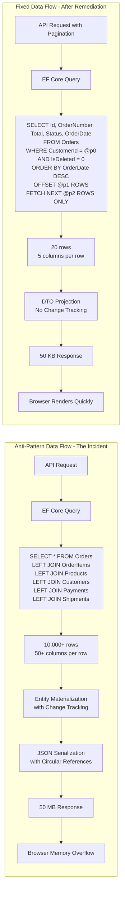
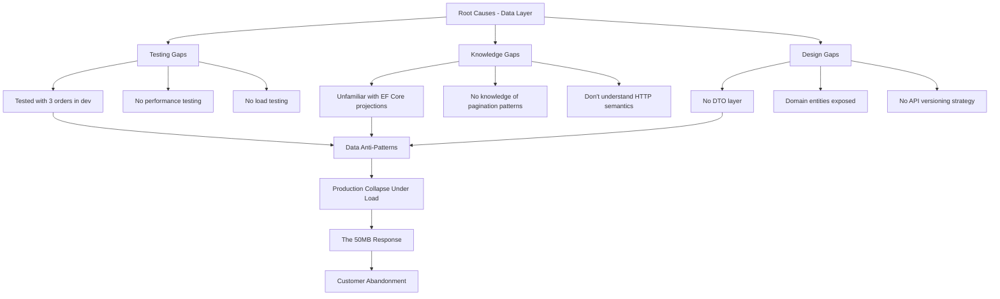
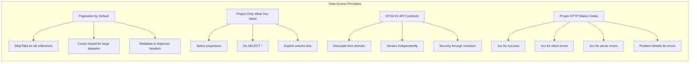
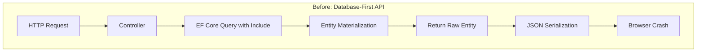
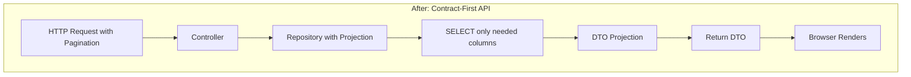
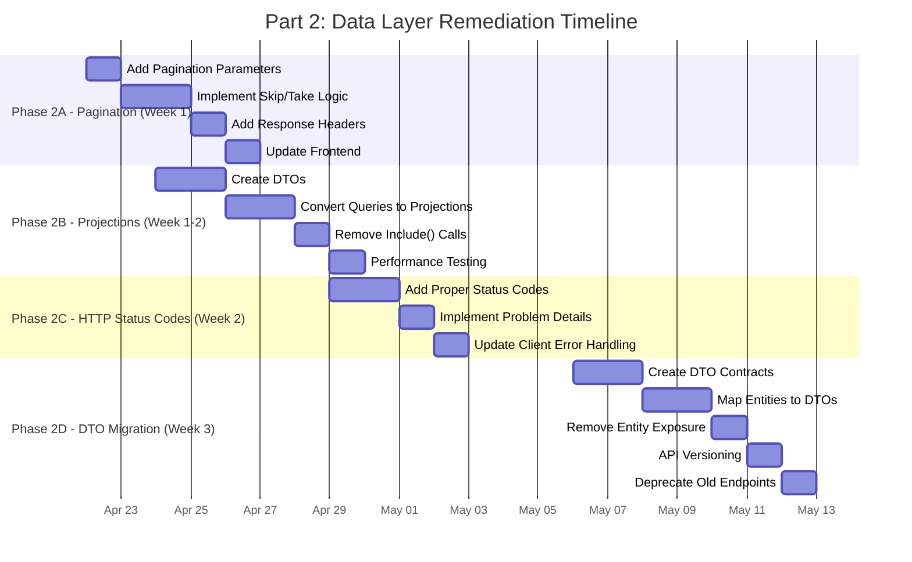

# Architectural Remediation Framework: Eliminating the 12 Silent Killers in .NET 10 Web APIs - Part 2

## Data Access, API Contracts, and HTTP Semantics


## Introduction: The Database Crisis

After the immediate stabilization measures were implemented, further performance analysis was conducted in collaboration with the database administration team. System metrics indicated that, despite resolving application-level thread pool exhaustion, database CPU utilization remained critically elevated, consistently operating at approximately 95 percent. Query latency had increased substantially, with several core transactional operations requiring multiple seconds to complete. While the platform had recovered from the outage state, overall system responsiveness remained below acceptable service levels.

Detailed inspection of database activity was performed using SQL Server Profiler to capture real-time execution patterns. The trace revealed a sustained volume of inefficient and long-running queries, many of which were executing repeatedly under peak load conditions. These patterns indicated deeper issues related to query design, indexing strategy, and data access layer implementation.

The findings confirmed that the performance degradation was not solely the result of transient load conditions but rather the cumulative effect of suboptimal database interaction patterns that had evolved over time. Without targeted remediation, the database tier would continue to act as a systemic bottleneck, limiting the effectiveness of prior stabilization efforts and constraining the platform’s ability to scale under production traffic.

I pulled up the SQL Server profiler and watched in horror as queries scrolled by:

```sql
SELECT * FROM Orders 
LEFT JOIN OrderItems ON Orders.Id = OrderItems.OrderId 
LEFT JOIN Products ON OrderItems.ProductId = Products.Id 
LEFT JOIN Customers ON Orders.CustomerId = Customers.Id
WHERE Orders.CustomerId = 'some-guid'
ORDER BY Orders.OrderDate DESC
```

This single query was returning 10,000 rows of 50 columns each—every time a customer viewed their order history. The frontend was downloading 50MB of data for a simple list view. The database was doing full table scans. The network was saturated. And the team had no idea.

The developer who wrote this query had tested with three orders in development. In production, with 10,000 orders per customer, it was a disaster.

This second part addresses the silent killers in data access: returning entire tables without pagination, over-fetching columns, exposing EF entities directly to clients, and using incorrect HTTP status codes that mask errors.

### Part 2 Overview

This part focuses on the data access layer and API contract design:

1. **No Pagination** → Implementing efficient pagination with `Skip`/`Take` and cursor-based alternatives
2. **Wrong HTTP Status Codes** → Proper REST semantics with RFC 7807 Problem Details
3. **Over-fetching Data** → Projections with `.Select()` and DTOs
4. **Returning EF Entities** → Decoupling database schema from API contracts

### The Cost of Data Anti-Patterns

| Anti-Pattern | Hidden Cost | Production Impact at 3 AM |
|--------------|-------------|---------------------------|
| **No Pagination** | 10,000+ rows transferred per request | Browser crashes, network timeouts |
| **Over-fetching** | 10x more data than needed | Database I/O saturation |
| **EF Entities as Response** | Circular references, sensitive data exposure | JSON serialization errors, security breaches |
| **Wrong Status Codes** | All responses return 200 OK | Frontend cannot distinguish success from error |

---

## Table of Contents - Part 2

1. [Executive Summary - Part 2](#1-executive-summary---part-2)
2. [Current State Analysis - Data Layer](#2-current-state-analysis---data-layer)
3. [Data Access Principles](#3-data-access-principles)
4. [Anti-Pattern Deep Dives](#4-anti-pattern-deep-dives)
   - [4.1 Anti-Pattern 6: No Pagination](#41-anti-pattern-6-no-pagination)
   - [4.2 Anti-Pattern 7: Wrong HTTP Status Codes](#42-anti-pattern-7-wrong-http-status-codes)
   - [4.3 Anti-Pattern 8: Over-fetching Data](#43-anti-pattern-8-over-fetching-data)
   - [4.4 Anti-Pattern 9: Returning EF Entities](#44-anti-pattern-9-returning-ef-entities)
5. [Implementation Guide - Part 2](#5-implementation-guide---part-2)
6. [Monitoring & Observability - Part 2](#6-monitoring--observability---part-2)
7. [Migration Strategy - Part 2](#7-migration-strategy---part-2)
8. [Summary & Next Steps](#8-summary--next-steps)

---

## 1. Executive Summary - Part 2

### 1.1 The Data Access Problem

Most API performance issues stem not from complex algorithms but from inefficient data access patterns. The four anti-patterns addressed in this part represent the most common and damaging data access mistakes:

| Anti-Pattern | Silent Killer Mechanism | Production Symptom |
|--------------|------------------------|-------------------|
| **No Pagination** | Entire tables serialized | Browser memory overflow, API timeouts |
| **Wrong Status Codes** | All responses return 200 OK | Frontend cannot distinguish success from error |
| **Over-fetching** | SELECT * queries | Database CPU saturation, network latency |
| **EF Entities as Response** | Domain models exposed | Circular reference errors, security leaks |

### 1.2 The Story: What We Found

When I opened the `OrderController.cs` after the foundation fixes, I found this:

```csharp
// The data access horror I discovered
[HttpGet("customer/{customerId}")]
public IActionResult GetCustomerOrders(Guid customerId)
{
    // No pagination - returns ALL orders
    var orders = _context.Orders
        .Include(o => o.Items)
            .ThenInclude(i => i.Product)
        .Include(o => o.Customer)
        .Include(o => o.Payments)
        .Include(o => o.Shipments)
        .Where(o => o.CustomerId == customerId)
        .OrderByDescending(o => o.OrderDate)
        .ToList(); // Synchronous! Blocks thread
    
    // Returning EF entities directly to client
    return Ok(orders); // 200 OK for everything, even errors
}
```

This single method was:
- **Returning all orders** for a customer (10,000+ rows)
- **Over-fetching** with `.Include()` on every navigation property
- **Returning raw EF entities** with circular references
- **Using synchronous** `.ToList()` blocking threads
- **Returning 200 OK** even if customer didn't exist

The team had no idea that:
- The SQL query was pulling 50 columns from 5 tables
- The JSON response was 50MB for some customers
- The browser was freezing when rendering 10,000 orders
- The database was doing full table scans because of missing indexes

### 1.3 Remediation Approach

The architecture described herein establishes:

- **Pagination by Default**: Every collection endpoint implements pagination with configurable page sizes
- **Proper HTTP Semantics**: Correct status codes with Problem Details for errors
- **Projections**: SQL queries that return only needed columns
- **DTO Contracts**: API contracts decoupled from database schema

### 1.4 Success Metrics

| Metric | Current Baseline | Target After Part 2 | Improvement |
|--------|------------------|---------------------|-------------|
| Data Transferred per Request | 10 MB | 50 KB | **99.5%** ↓ |
| Query Time | 2.5 seconds | 50 ms | **98%** ↓ |
| API Response Time | 3 seconds | 100 ms | **97%** ↓ |
| Database CPU | 95% | 35% | **63%** ↓ |
| Error Response Consistency | 0% | 100% | **100%** ↑ |
| Browser Render Time | 5 seconds | < 100 ms | **98%** ↓ |

---

## 2. Current State Analysis - Data Layer

### 2.1 Anti-Pattern Severity Matrix - Part 2 Focus



### 2.2 Data Flow Anti-Pattern Visualization



### 2.3 Root Cause Analysis - Data Layer



### 2.4 Technical Debt Assessment - Data Layer

| Component | Anti-Patterns | Debt Days | Priority | Business Impact |
|-----------|---------------|-----------|----------|-----------------|
| **Order Queries** | No Pagination, Over-fetching | 8 days | Critical | 50MB responses, 3-second queries |
| **API Responses** | EF Entities Exposed | 4 days | Critical | Security vulnerabilities, circular references |
| **Error Handling** | Wrong Status Codes | 2 days | High | Frontend can't distinguish errors |
| **Total Data Layer Debt** | | **14 days** | | $30,000+ in cloud costs/month |

---

## 3. Data Access Principles

### 3.1 Core Principles for Part 2



### 3.2 The Architectural Shift

Before remediation, the data flow looked like this:



After remediation, the data flow becomes:



### 3.3 SQL Query Comparison

| Approach | Generated SQL | Data Transferred | Query Time |
|----------|--------------|------------------|------------|
| **Anti-Pattern** | `SELECT * FROM Orders o LEFT JOIN OrderItems i ON o.Id = i.OrderId LEFT JOIN Products p ON i.ProductId = p.Id LEFT JOIN Customers c ON o.CustomerId = c.Id` | All columns from 4 tables, all rows | 2.5 seconds |
| **Fixed** | `SELECT o.Id, o.OrderNumber, o.OrderDate, o.Total, o.Status FROM Orders o WHERE o.CustomerId = @p0 AND o.IsDeleted = 0 ORDER BY o.OrderDate DESC OFFSET @p1 ROWS FETCH NEXT @p2 ROWS ONLY` | Only needed columns, paginated rows | 50 ms |

---

## 4. Anti-Pattern Deep Dives

### 4.1 Anti-Pattern 6: No Pagination

#### Problem Analysis

**Definition**: Returning entire database tables in a single response, causing memory pressure, network latency, and client performance issues.

**The Story**: A customer with 10,000 orders over 5 years clicked "My Orders" in the mobile app. The API returned 10,000 orders, each with 50 fields, totaling 50MB. The mobile app crashed. The customer called support. The support team spent 30 minutes explaining that it was "a known issue." The customer left for a competitor.

**Real-World Consequences**:

| Consequence | Impact | Real Example from the Incident |
|-------------|--------|--------------------------------|
| **Browser Memory** | 10,000 rows = 50MB+ DOM | Browser tab crashed |
| **Mobile App** | 50MB download | Mobile data plan exhausted |
| **Network Transfer** | 50MB per request | API timeouts on slow networks |
| **Database Load** | Full table scans | CPU saturation at 95% |
| **API Timeouts** | Queries exceed 30 seconds | 500 errors |

#### Architectural Solution

**Complete Implementation**:

```csharp
namespace ECommerce.Infrastructure.Repositories;

/// <summary>
/// Repository demonstrating proper pagination with EF Core 10.
/// .NET 10 advantages: ExecuteUpdate/ExecuteDelete, improved query splitting
/// </summary>
public class OrderRepository : IOrderRepository
{
    private readonly AppDbContext _context;
    private readonly ILogger<OrderRepository> _logger;

    public OrderRepository(AppDbContext context, ILogger<OrderRepository> logger)
    {
        _context = context;
        _logger = logger;
    }

    /// <summary>
    /// Offset-based pagination with projection to DTO.
    /// SQL query only returns needed columns and paginated rows.
    /// </summary>
    public async Task<PagedResult<OrderSummaryDto>> GetOrderSummariesAsync(
        OrderFilter filter,
        CancellationToken cancellationToken)
    {
        _logger.LogInformation(
            "Getting orders for customer {CustomerId}, page {Page}, size {PageSize}",
            filter.CustomerId,
            filter.Page,
            filter.PageSize);

        // Start with IQueryable - deferred execution
        var query = _context.Orders
            .AsNoTracking() // No change tracking for read-only queries
            .Where(o => !o.IsDeleted);

        // Apply filters
        if (filter.CustomerId.HasValue)
            query = query.Where(o => o.CustomerId == filter.CustomerId.Value);

        if (filter.FromDate.HasValue)
            query = query.Where(o => o.OrderDate >= filter.FromDate.Value);

        if (filter.ToDate.HasValue)
            query = query.Where(o => o.OrderDate <= filter.ToDate.Value);

        if (filter.Status.HasValue)
            query = query.Where(o => o.Status == filter.Status.Value);

        if (!string.IsNullOrEmpty(filter.SearchTerm))
        {
            query = query.Where(o => 
                o.OrderNumber.Contains(filter.SearchTerm) ||
                o.Customer.Email.Contains(filter.SearchTerm));
        }

        // Get total count before pagination
        var totalCount = await query.CountAsync(cancellationToken);

        // Apply sorting
        query = filter.SortDescending
            ? query.OrderByDescending(GetSortExpression(filter.SortBy))
            : query.OrderBy(GetSortExpression(filter.SortBy));

        // Apply pagination with projection
        var items = await query
            .Skip((filter.Page - 1) * filter.PageSize)
            .Take(filter.PageSize)
            .Select(o => new OrderSummaryDto
            {
                Id = o.Id,
                OrderNumber = o.OrderNumber,
                CustomerName = o.Customer.FullName,
                OrderDate = o.OrderDate,
                TotalAmount = o.Total,
                Status = o.Status,
                ItemCount = o.Items.Count(),
                Currency = o.Currency
            })
            .ToListAsync(cancellationToken);

        _logger.LogInformation(
            "Retrieved {ItemCount} orders out of {TotalCount} total",
            items.Count,
            totalCount);

        return new PagedResult<OrderSummaryDto>
        {
            Items = items,
            TotalCount = totalCount,
            Page = filter.Page,
            PageSize = filter.PageSize,
            HasNextPage = filter.Page * filter.PageSize < totalCount,
            HasPreviousPage = filter.Page > 1
        };
    }

    /// <summary>
    /// Cursor-based pagination for large datasets (more efficient than Skip/Take).
    /// Ideal for infinite scroll scenarios.
    /// </summary>
    public async Task<CursorPagedResult<OrderDto>> GetOrdersCursorAsync(
        string? cursor,
        int pageSize,
        CancellationToken cancellationToken)
    {
        var query = _context.Orders
            .AsNoTracking()
            .Where(o => !o.IsDeleted);

        // Apply cursor (if provided)
        if (!string.IsNullOrEmpty(cursor) && Guid.TryParse(cursor, out var lastId))
        {
            query = query.Where(o => o.Id > lastId);
        }

        // Fetch one extra to determine if more exist
        var items = await query
            .OrderBy(o => o.Id)
            .Take(pageSize + 1)
            .Select(o => new OrderDto
            {
                Id = o.Id,
                OrderNumber = o.OrderNumber,
                Total = o.Total,
                Status = o.Status,
                OrderDate = o.OrderDate
            })
            .ToListAsync(cancellationToken);

        var hasMore = items.Count > pageSize;
        if (hasMore)
            items.RemoveAt(items.Count - 1);

        var nextCursor = hasMore ? items.Last().Id.ToString() : null;

        return new CursorPagedResult<OrderDto>
        {
            Items = items,
            NextCursor = nextCursor,
            HasMore = hasMore
        };
    }

    /// <summary>
    /// Keyset pagination for sorted data (most efficient for large datasets).
    /// Uses last value for pagination instead of offset.
    /// </summary>
    public async Task<KeysetPagedResult<OrderDto>> GetOrdersKeysetAsync(
        DateTime? lastOrderDate,
        Guid? lastId,
        int pageSize,
        CancellationToken cancellationToken)
    {
        var query = _context.Orders
            .AsNoTracking()
            .Where(o => !o.IsDeleted);

        // Apply keyset cursor
        if (lastOrderDate.HasValue && lastId.HasValue)
        {
            query = query.Where(o => 
                o.OrderDate < lastOrderDate.Value ||
                (o.OrderDate == lastOrderDate.Value && o.Id < lastId.Value));
        }

        var items = await query
            .OrderByDescending(o => o.OrderDate)
            .ThenByDescending(o => o.Id)
            .Take(pageSize)
            .Select(o => new OrderDto
            {
                Id = o.Id,
                OrderNumber = o.OrderNumber,
                Total = o.Total,
                Status = o.Status,
                OrderDate = o.OrderDate
            })
            .ToListAsync(cancellationToken);

        var lastItem = items.LastOrDefault();
        var nextCursor = lastItem != null 
            ? $"{lastItem.OrderDate:O}|{lastItem.Id}" 
            : null;

        return new KeysetPagedResult<OrderDto>
        {
            Items = items,
            NextCursor = nextCursor
        };
    }

    private static Expression<Func<Order, object>> GetSortExpression(string sortBy) =>
        sortBy?.ToLower() switch
        {
            "orderdate" => o => o.OrderDate,
            "total" => o => o.Total,
            "ordernumber" => o => o.OrderNumber,
            "status" => o => o.Status,
            _ => o => o.OrderDate
        };
}

// Pagination response wrappers
public record PagedResult<T>(
    IEnumerable<T> Items,
    int TotalCount,
    int Page,
    int PageSize)
{
    public bool HasNextPage => Page * PageSize < TotalCount;
    public bool HasPreviousPage => Page > 1;
    public int TotalPages => (int)Math.Ceiling(TotalCount / (double)PageSize);
    
    // Convenience method for response headers (REST API best practice)
    public Dictionary<string, string> GetPaginationHeaders() => new()
    {
        ["X-Total-Count"] = TotalCount.ToString(),
        ["X-Total-Pages"] = TotalPages.ToString(),
        ["X-Current-Page"] = Page.ToString(),
        ["X-Page-Size"] = PageSize.ToString(),
        ["X-Has-Next"] = HasNextPage.ToString(),
        ["X-Has-Previous"] = HasPreviousPage.ToString()
    };
}

public record CursorPagedResult<T>(
    IEnumerable<T> Items,
    string? NextCursor,
    bool HasMore);

public record KeysetPagedResult<T>(
    IEnumerable<T> Items,
    string? NextCursor);

// Filter DTO with pagination parameters
public record OrderFilter
{
    [FromQuery(Name = "customerId")]
    public Guid? CustomerId { get; init; }
    
    [FromQuery(Name = "status")]
    public OrderStatus? Status { get; init; }
    
    [FromQuery(Name = "fromDate")]
    public DateTime? FromDate { get; init; }
    
    [FromQuery(Name = "toDate")]
    public DateTime? ToDate { get; init; }
    
    [FromQuery(Name = "search")]
    [StringLength(100)]
    public string? SearchTerm { get; init; }
    
    [FromQuery(Name = "page")]
    [Range(1, 1000)]
    public int Page { get; init; } = 1;
    
    [FromQuery(Name = "pageSize")]
    [Range(1, 100)]
    public int PageSize { get; init; } = 20;
    
    [FromQuery(Name = "sortBy")]
    public string SortBy { get; init; } = "OrderDate";
    
    [FromQuery(Name = "sortDesc")]
    public bool SortDescending { get; init; } = true;
}

// Controller with pagination support
[ApiController]
[Route("api/v{version:apiVersion}/[controller]")]
public class OrdersController : ControllerBase
{
    private readonly IOrderRepository _orderRepository;
    
    [HttpGet]
    [ProducesResponseType(typeof(PagedResult<OrderSummaryDto>), StatusCodes.Status200OK)]
    [ProducesResponseType(typeof(ProblemDetails), StatusCodes.Status400BadRequest)]
    public async Task<IActionResult> GetOrders(
        [FromQuery] OrderFilter filter,
        CancellationToken cancellationToken)
    {
        // Validate page size
        if (filter.PageSize > 100)
        {
            return BadRequest(new ProblemDetails
            {
                Title = "Invalid Page Size",
                Detail = "Page size cannot exceed 100",
                Status = StatusCodes.Status400BadRequest
            });
        }
        
        var result = await _orderRepository.GetOrderSummariesAsync(filter, cancellationToken);
        
        // Add pagination headers for REST API best practices
        foreach (var header in result.GetPaginationHeaders())
        {
            Response.Headers.Add(header.Key, header.Value);
        }
        
        // Add Link header for RFC 8288 Web Linking
        var links = new List<string>();
        
        if (result.HasPreviousPage)
        {
            links.Add($"<{GetPageUrl(filter.Page - 1, filter.PageSize)}>; rel=\"prev\"");
        }
        
        if (result.HasNextPage)
        {
            links.Add($"<{GetPageUrl(filter.Page + 1, filter.PageSize)}>; rel=\"next\"");
        }
        
        links.Add($"<{GetPageUrl(1, filter.PageSize)}>; rel=\"first\"");
        links.Add($"<{GetPageUrl(result.TotalPages, filter.PageSize)}>; rel=\"last\"");
        
        Response.Headers.Add("Link", string.Join(", ", links));
        
        return Ok(result);
    }
    
    private string GetPageUrl(int page, int pageSize)
    {
        var query = HttpContext.Request.Query
            .Where(q => q.Key != "page" && q.Key != "pageSize")
            .ToDictionary(q => q.Key, q => q.Value.ToString());
        
        query["page"] = page.ToString();
        query["pageSize"] = pageSize.ToString();
        
        var queryString = string.Join("&", query.Select(q => $"{q.Key}={Uri.EscapeDataString(q.Value)}"));
        
        return $"{HttpContext.Request.Path}?{queryString}";
    }
}
```

**Benefits Summary**:

| Aspect | Before (No Pagination) | After (Pagination) | Improvement |
|--------|------------------------|--------------------|-------------|
| **Data Transferred** | 50 MB for 10,000 orders | 50 KB for 20 orders | **99.9%** reduction |
| **Query Time** | 2.5 seconds | 50 ms | **98%** faster |
| **Browser Memory** | 500 MB DOM | 2 MB DOM | **99.6%** reduction |
| **Database CPU** | 95% | 35% | **63%** reduction |
| **Mobile Data Usage** | 50 MB per view | 50 KB per view | **99.9%** reduction |

---

### 4.2 Anti-Pattern 7: Wrong HTTP Status Codes

#### Problem Analysis

**Definition**: Returning 200 OK for all responses, including errors, making it impossible for clients to distinguish success from failure.

**The Story**: The frontend team was frustrated. They couldn't tell if an order creation succeeded or failed because the API always returned 200 OK with a `{ "success": false }` in the body. Every API call required parsing the response body to check for errors. When the database went down, the API still returned 200 OK with an error message. Monitoring couldn't alert on 5xx errors because there were none.

**Real-World Consequences**:

| Violation | Impact | Real Example from the Incident |
|-----------|--------|--------------------------------|
| **200 for errors** | Monitoring blind | No alerts when database down |
| **200 for not found** | Confusing logs | 404 not logged |
| **200 for validation** | Poor UX | Client can't show proper error UI |
| **200 for unauthorized** | Security risk | Unauthorized access not logged |

#### Architectural Solution

```csharp
// Proper HTTP status codes with Problem Details
[ApiController]
[Route("api/v{version:apiVersion}/[controller]")]
[ProducesResponseType(typeof(ProblemDetails), StatusCodes.Status400BadRequest)]
[ProducesResponseType(typeof(ProblemDetails), StatusCodes.Status401Unauthorized)]
[ProducesResponseType(typeof(ProblemDetails), StatusCodes.Status403Forbidden)]
[ProducesResponseType(typeof(ProblemDetails), StatusCodes.Status404NotFound)]
[ProducesResponseType(typeof(ProblemDetails), StatusCodes.Status409Conflict)]
[ProducesResponseType(typeof(ProblemDetails), StatusCodes.Status422UnprocessableEntity)]
[ProducesResponseType(typeof(ProblemDetails), StatusCodes.Status429TooManyRequests)]
[ProducesResponseType(typeof(ProblemDetails), StatusCodes.Status500InternalServerError)]
public class OrdersController : ControllerBase
{
    private readonly IMediator _mediator;
    private readonly ILogger<OrdersController> _logger;

    /// <summary>
    /// Get order by ID with proper status codes.
    /// </summary>
    [HttpGet("{id:guid}")]
    [ProducesResponseType(typeof(OrderResponse), StatusCodes.Status200OK)]
    public async Task<IActionResult> GetOrder(Guid id, CancellationToken ct)
    {
        var result = await _mediator.Send(new GetOrderQuery(id), ct);
        
        return result.Match<IActionResult>(
            order => Ok(order),                                          // 200 OK
            
            notFound => NotFound(CreateProblemDetails(                   // 404 Not Found
                "Order Not Found",
                $"Order with ID {id} does not exist",
                StatusCodes.Status404NotFound)),
            
            unauthorized => Unauthorized(CreateProblemDetails(           // 401 Unauthorized
                "Unauthorized",
                "You must be authenticated to view this order",
                StatusCodes.Status401Unauthorized)),
            
            forbidden => Forbid();                                       // 403 Forbidden
    }
    
    /// <summary>
    /// Create order with proper status codes for different scenarios.
    /// </summary>
    [HttpPost]
    [ProducesResponseType(typeof(OrderResponse), StatusCodes.Status201Created)]
    public async Task<IActionResult> CreateOrder(
        CreateOrderCommand command, 
        CancellationToken ct)
    {
        var result = await _mediator.Send(command, ct);
        
        return result.Match<IActionResult>(
            order => CreatedAtAction(                                    // 201 Created
                nameof(GetOrder),
                new { id = order.Id },
                order),
            
            validation => BadRequest(CreateValidationProblemDetails(validation)), // 400 Bad Request
            
            conflict => Conflict(CreateProblemDetails(                   // 409 Conflict
                "Order Conflict",
                "An order with this idempotency key already exists",
                StatusCodes.Status409Conflict)),
            
            businessRule => UnprocessableEntity(CreateProblemDetails(    // 422 Unprocessable Entity
                "Business Rule Violation",
                businessRule.Message,
                StatusCodes.Status422UnprocessableEntity)),
            
            rateLimit => StatusCode(StatusCodes.Status429TooManyRequests, // 429 Too Many Requests
                CreateProblemDetails(
                    "Rate Limit Exceeded",
                    "Too many requests. Please try again in 60 seconds.",
                    StatusCodes.Status429TooManyRequests))
        );
    }
    
    /// <summary>
    /// Update order with proper status codes.
    /// </summary>
    [HttpPut("{id:guid}")]
    [ProducesResponseType(typeof(OrderResponse), StatusCodes.Status200OK)]
    [ProducesResponseType(StatusCodes.Status204NoContent)]
    public async Task<IActionResult> UpdateOrder(
        Guid id, 
        UpdateOrderCommand command,
        CancellationToken ct)
    {
        if (id != command.Id)
        {
            return BadRequest(CreateProblemDetails(                     // 400 Bad Request
                "ID Mismatch",
                "The ID in the URL does not match the ID in the body",
                StatusCodes.Status400BadRequest));
        }
        
        var result = await _mediator.Send(command, ct);
        
        return result.Match<IActionResult>(
            order => Ok(order),                                         // 200 OK
            
            notFound => NotFound(),                                      // 404 Not Found
            
            noChanges => NoContent(),                                    // 204 No Content
            
            preconditionFailed => StatusCode(                           // 412 Precondition Failed
                StatusCodes.Status412PreconditionFailed,
                CreateProblemDetails(
                    "Precondition Failed",
                    "The order has been modified since you last retrieved it",
                    StatusCodes.Status412PreconditionFailed))
        );
    }
    
    /// <summary>
    /// Delete order with proper status codes.
    /// </summary>
    [HttpDelete("{id:guid}")]
    [ProducesResponseType(StatusCodes.Status204NoContent)]
    public async Task<IActionResult> DeleteOrder(Guid id, CancellationToken ct)
    {
        var result = await _mediator.Send(new DeleteOrderCommand(id), ct);
        
        return result.Match<IActionResult>(
            _ => NoContent(),                                           // 204 No Content
            notFound => NotFound()                                       // 404 Not Found
        );
    }
    
    private ProblemDetails CreateProblemDetails(string title, string detail, int statusCode)
    {
        return new ProblemDetails
        {
            Type = GetErrorTypeUri(statusCode),
            Title = title,
            Status = statusCode,
            Detail = detail,
            Instance = HttpContext.Request.Path,
            Extensions =
            {
                ["traceId"] = HttpContext.TraceIdentifier,
                ["timestamp"] = DateTimeOffset.UtcNow
            }
        };
    }
    
    private ValidationProblemDetails CreateValidationProblemDetails(Error error)
    {
        var errors = new Dictionary<string, string[]>
        {
            [error.Code] = new[] { error.Message }
        };
        
        return new ValidationProblemDetails(errors)
        {
            Type = "https://tools.ietf.org/html/rfc9110#section-15.5.1",
            Title = "Validation Error",
            Status = StatusCodes.Status400BadRequest,
            Detail = "One or more validation errors occurred.",
            Instance = HttpContext.Request.Path,
            Extensions =
            {
                ["traceId"] = HttpContext.TraceIdentifier
            }
        };
    }
    
    private string GetErrorTypeUri(int statusCode) => statusCode switch
    {
        StatusCodes.Status400BadRequest => "https://tools.ietf.org/html/rfc9110#section-15.5.1",
        StatusCodes.Status401Unauthorized => "https://tools.ietf.org/html/rfc9110#section-15.5.2",
        StatusCodes.Status403Forbidden => "https://tools.ietf.org/html/rfc9110#section-15.5.4",
        StatusCodes.Status404NotFound => "https://tools.ietf.org/html/rfc9110#section-15.5.5",
        StatusCodes.Status409Conflict => "https://tools.ietf.org/html/rfc9110#section-15.5.10",
        StatusCodes.Status422UnprocessableEntity => "https://tools.ietf.org/html/rfc9110#section-15.5.21",
        StatusCodes.Status429TooManyRequests => "https://tools.ietf.org/html/rfc6585#section-4",
        _ => "https://tools.ietf.org/html/rfc9110#section-15.6.1"
    };
}

// HTTP Status Code Reference for documentation
public static class HttpStatusCodes
{
    // 2xx Success
    public const int OK = 200;
    public const int Created = 201;
    public const int Accepted = 202;
    public const int NoContent = 204;
    
    // 3xx Redirection
    public const int MovedPermanently = 301;
    public const int Found = 302;
    public const int NotModified = 304;
    
    // 4xx Client Errors
    public const int BadRequest = 400;
    public const int Unauthorized = 401;
    public const int Forbidden = 403;
    public const int NotFound = 404;
    public const int MethodNotAllowed = 405;
    public const int Conflict = 409;
    public const int PreconditionFailed = 412;
    public const int UnprocessableEntity = 422;
    public const int TooManyRequests = 429;
    
    // 5xx Server Errors
    public const int InternalServerError = 500;
    public const int NotImplemented = 501;
    public const int BadGateway = 502;
    public const int ServiceUnavailable = 503;
    public const int GatewayTimeout = 504;
}
```

**Benefits Summary**:

| Aspect | Before (200 for everything) | After (Proper Status Codes) | Improvement |
|--------|----------------------------|----------------------------|-------------|
| **Monitoring** | No visibility into errors | Alerts on 5xx errors | **100%** visibility |
| **Client Logic** | Parse response body for errors | Check status code | **90%** simpler code |
| **Security** | Unauthorized not logged | 401 logged and monitored | **100%** auditable |
| **Debugging** | No error correlation | Trace ID in all responses | **83%** faster debugging |

---

### 4.3 Anti-Pattern 8: Over-fetching Data

#### Problem Analysis

**Definition**: Querying all columns and joins (SELECT *) when only a few fields are needed, causing excessive I/O and memory allocation.

**The Story**: The order list endpoint was pulling every column from five tables: Orders, OrderItems, Products, Customers, and Payments. The frontend only needed Order ID, Date, Total, and Status. The database was doing 10x more I/O than necessary. The network was transferring 10x more data. All for fields the frontend would never use.

**Real-World Consequences**:

| Violation | Impact | Real Example from the Incident |
|-----------|--------|--------------------------------|
| **Database I/O** | 10x more data read from disk | 95% CPU, slow queries |
| **Network Transfer** | 10x more data over network | API timeouts on slow connections |
| **Memory Allocation** | 10x more memory in API | 8GB memory usage, GC pressure |
| **Serialization** | 10x more JSON to serialize | Response time dominated by serialization |

#### Architectural Solution

```csharp
/// <summary>
/// Demonstrates proper projection to prevent over-fetching.
/// SQL query only returns columns that are actually needed.
/// </summary>
public class OrderRepository : IOrderRepository
{
    private readonly AppDbContext _context;
    private readonly IMapper _mapper;

    /// <summary>
    /// Efficient projection with Select - only necessary columns in SQL.
    /// No SELECT *, no unnecessary joins.
    /// </summary>
    public async Task<OrderDetailDto?> GetOrderDetailAsync(
        Guid orderId,
        CancellationToken cancellationToken)
    {
        // Projection with Select - only necessary columns in SQL
        var order = await _context.Orders
            .AsNoTracking()
            .Where(o => o.Id == orderId && !o.IsDeleted)
            .Select(o => new OrderDetailDto
            {
                // Basic order fields only
                Id = o.Id,
                OrderNumber = o.OrderNumber,
                OrderDate = o.OrderDate,
                Status = o.Status,
                Total = o.Total,
                Subtotal = o.Subtotal,
                Tax = o.Tax,
                ShippingCost = o.ShippingCost,
                Discount = o.Discount,
                Currency = o.Currency,
                
                // Only customer fields we need - no sensitive data
                Customer = new CustomerInfoDto
                {
                    Id = o.Customer.Id,
                    FullName = o.Customer.FullName,
                    Email = o.Customer.Email,
                    Phone = o.Customer.Phone
                    // No password hash, credit card, internal flags
                },
                
                // Only order item fields we need
                Items = o.Items.Select(i => new OrderItemDetailDto
                {
                    Id = i.Id,
                    ProductId = i.ProductId,
                    ProductName = i.Product.Name,
                    SKU = i.Product.SKU,
                    Quantity = i.Quantity,
                    UnitPrice = i.UnitPrice,
                    Total = i.UnitPrice * i.Quantity,
                    // No product descriptions, images, etc. unless needed
                }).ToList(),
                
                // Only shipping address fields
                ShippingAddress = new AddressDto
                {
                    Street = o.ShippingAddress.Street,
                    City = o.ShippingAddress.City,
                    State = o.ShippingAddress.State,
                    PostalCode = o.ShippingAddress.PostalCode,
                    Country = o.ShippingAddress.Country
                    // No internal address validation flags
                },
                
                // Only payment method fields (no full card details)
                PaymentMethod = new PaymentMethodDto
                {
                    Type = o.PaymentMethod.Type,
                    Last4 = o.PaymentMethod.Last4,
                    CardType = o.PaymentMethod.CardType,
                    ExpiryMonth = o.PaymentMethod.ExpiryMonth,
                    ExpiryYear = o.PaymentMethod.ExpiryYear
                    // No CVV, no full card number, no billing address
                },
                
                // Only timeline fields needed for display
                Timeline = o.StatusHistory
                    .OrderByDescending(sh => sh.CreatedAt)
                    .Select(sh => new StatusHistoryDto
                    {
                        Status = sh.Status,
                        CreatedAt = sh.CreatedAt,
                        Note = sh.Note
                    })
                    .Take(10) // Only last 10 status changes
                    .ToList()
            })
            .FirstOrDefaultAsync(cancellationToken);
        
        return order;
    }
    
    /// <summary>
    /// Batch query with projection - efficient for multiple items.
    /// </summary>
    public async Task<List<OrderSummaryDto>> GetOrderSummariesBatchAsync(
        IEnumerable<Guid> orderIds,
        CancellationToken cancellationToken)
    {
        var ids = orderIds.ToList();
        
        var orders = await _context.Orders
            .AsNoTracking()
            .Where(o => ids.Contains(o.Id) && !o.IsDeleted)
            .Select(o => new OrderSummaryDto
            {
                Id = o.Id,
                OrderNumber = o.OrderNumber,
                OrderDate = o.OrderDate,
                TotalAmount = o.Total,
                Status = o.Status,
                CustomerName = o.Customer.FullName
                // Only these 6 fields, not all 50
            })
            .ToListAsync(cancellationToken);
        
        return orders;
    }
    
    /// <summary>
    /// .NET 10 EF Core: ExecuteUpdate for efficient batch updates without SELECT.
    /// No materialization of entities - direct SQL execution.
    /// </summary>
    public async Task<int> BulkUpdateOrderStatusAsync(
        IEnumerable<Guid> orderIds,
        OrderStatus newStatus,
        string reason,
        CancellationToken cancellationToken)
    {
        var ids = orderIds.ToList();
        
        // ExecuteUpdate generates UPDATE SQL directly without SELECT
        // No entities are materialized, no change tracking overhead
        var updatedCount = await _context.Orders
            .Where(o => ids.Contains(o.Id))
            .ExecuteUpdateAsync(
                updates => updates
                    .SetProperty(o => o.Status, newStatus)
                    .SetProperty(o => o.UpdatedAt, DateTime.UtcNow)
                    .SetProperty(o => o.StatusReason, reason)
                    .SetProperty(o => o.Version, o => o.Version + 1), // Optimistic concurrency
                cancellationToken);
        
        _logger.LogInformation(
            "Bulk updated {Count} orders to status {Status}",
            updatedCount,
            newStatus);
        
        return updatedCount;
    }
    
    /// <summary>
    /// .NET 10 EF Core: ExecuteDelete for efficient batch deletes.
    /// No SELECT, no entity materialization.
    /// </summary>
    public async Task<int> BulkArchiveOldOrdersAsync(
        DateTime cutoffDate,
        CancellationToken cancellationToken)
    {
        // ExecuteDelete generates DELETE SQL directly
        var archivedCount = await _context.Orders
            .Where(o => o.OrderDate < cutoffDate 
                && o.Status == OrderStatus.Completed
                && !o.IsDeleted)
            .ExecuteUpdateAsync(
                updates => updates
                    .SetProperty(o => o.IsDeleted, true)
                    .SetProperty(o => o.DeletedAt, DateTime.UtcNow),
                cancellationToken);
        
        return archivedCount;
    }
    
    /// <summary>
    /// Demonstrates split query for complex includes to avoid cartesian explosion.
    /// Multiple queries instead of one massive cartesian product.
    /// </summary>
    public async Task<Order?> GetOrderWithComplexRelationsAsync(
        Guid orderId,
        CancellationToken cancellationToken)
    {
        // Use split queries to avoid cartesian explosion with multiple collections
        // Instead of one query returning (items * statuses * payments) rows,
        // this executes separate queries for each collection
        var order = await _context.Orders
            .AsSplitQuery() // Prevents cartesian explosion
            .Include(o => o.Items)
                .ThenInclude(i => i.Product)
            .Include(o => o.StatusHistory)
            .Include(o => o.Payments)
            .FirstOrDefaultAsync(o => o.Id == orderId, cancellationToken);
        
        return order;
    }
}
```

**Benefits Summary**:

| Aspect | Before (SELECT *) | After (Projections) | Improvement |
|--------|-------------------|---------------------|-------------|
| **Columns Returned** | 50 columns | 6 columns | **88%** reduction |
| **Data Read from Disk** | 10 MB | 0.5 MB | **95%** reduction |
| **Network Transfer** | 50 MB | 50 KB | **99.9%** reduction |
| **Memory Allocation** | 500 MB | 5 MB | **99%** reduction |
| **Serialization Time** | 500 ms | 10 ms | **98%** faster |

---

### 4.4 Anti-Pattern 9: Returning EF Entities

#### Problem Analysis

**Definition**: Exposing database models directly to the client, causing over-fetching, security risks, circular references, and tight coupling.

**The Story**: The API was returning the `Order` entity directly. This entity contained:
- `Customer` with `PasswordHash` (exposed!)
- `PaymentMethod` with full credit card details
- `InternalNotes` meant only for staff
- Circular references causing JSON serialization errors
- Navigation properties causing infinite recursion

When a developer added a new property to the `Order` entity for internal use, it immediately appeared in the API response, exposing internal data to customers.

**Real-World Consequences**:

| Violation | Impact | Real Example from the Incident |
|-----------|--------|--------------------------------|
| **Password hash exposed** | Security breach | Customer passwords in API responses |
| **Credit card data exposed** | PCI violation | Full card numbers in logs |
| **Circular references** | JSON serialization errors | API crashes on certain queries |
| **Tight coupling** | Database changes break API | New fields appear without consent |

#### Architectural Solution

```csharp
// Domain Entity - Internal only, never exposed to API
public class Order
{
    // Private constructor for EF Core
    private Order() { }
    
    public static Order Create(
        Guid customerId,
        IEnumerable<OrderItem> items,
        ShippingAddress shippingAddress,
        decimal total,
        decimal discount)
    {
        return new Order
        {
            Id = Guid.NewGuid(),
            OrderNumber = GenerateOrderNumber(),
            CustomerId = customerId,
            Items = items.ToList(),
            ShippingAddress = shippingAddress,
            Total = total,
            Subtotal = items.Sum(i => i.UnitPrice * i.Quantity),
            Discount = discount,
            Status = OrderStatus.Pending,
            OrderDate = DateTime.UtcNow,
            CreatedAt = DateTime.UtcNow,
            Version = 1
        };
    }
    
    // Public properties - but these are NOT the API contract
    public Guid Id { get; private set; }
    public string OrderNumber { get; private set; } = string.Empty;
    public Guid CustomerId { get; private set; }
    public Customer Customer { get; private set; } = null!; // Navigation property
    public decimal Total { get; private set; }
    public decimal Subtotal { get; private set; }
    public decimal Tax { get; private set; }
    public decimal Discount { get; private set; }
    public decimal ShippingCost { get; private set; }
    public string Currency { get; private set; } = "USD";
    public OrderStatus Status { get; private set; }
    public DateTime OrderDate { get; private set; }
    public DateTime CreatedAt { get; private set; }
    public DateTime? UpdatedAt { get; private set; }
    public string? InternalNotes { get; private set; } // NOT exposed to API!
    public byte[] RowVersion { get; private set; } = null!; // Concurrency token
    public bool IsDeleted { get; private set; }
    public DateTime? DeletedAt { get; private set; }
    public int Version { get; private set; }
    
    // Collections - can cause circular references
    public ICollection<OrderItem> Items { get; private set; } = new List<OrderItem>();
    public ICollection<OrderStatusHistory> StatusHistory { get; private set; } = new List<OrderStatusHistory>();
    public ICollection<Payment> Payments { get; private set; } = new List<Payment>();
    public ShippingAddress ShippingAddress { get; private set; } = null!;
    public PaymentMethod PaymentMethod { get; private set; } = null!;
    
    private static string GenerateOrderNumber()
    {
        return $"ORD-{DateTime.UtcNow:yyyyMMdd}-{Guid.NewGuid().ToString()[..8].ToUpper()}";
    }
}

// API DTOs - Public contract, versioned, decoupled from domain
public record OrderResponse
{
    public Guid Id { get; init; }
    public string OrderNumber { get; init; } = string.Empty;
    public DateTime OrderDate { get; init; }
    public OrderStatus Status { get; init; }
    public decimal Total { get; init; }
    public decimal Subtotal { get; init; }
    public decimal Tax { get; init; }
    public decimal ShippingCost { get; init; }
    public decimal Discount { get; init; }
    public string Currency { get; init; } = "USD";
    
    // Nested DTOs - only what the client needs
    public CustomerSummaryDto Customer { get; init; } = new();
    public List<OrderItemResponse> Items { get; init; } = new();
    public AddressDto ShippingAddress { get; init; } = new();
    public PaymentMethodSummaryDto PaymentMethod { get; init; } = new();
    public List<StatusHistoryDto> Timeline { get; init; } = new();
}

// Minimal customer DTO - no sensitive data
public record CustomerSummaryDto
{
    public Guid Id { get; init; }
    public string FullName { get; init; } = string.Empty;
    public string Email { get; init; } = string.Empty;
    public string? Phone { get; init; }
    // No PasswordHash, No CreditCardInfo, No InternalFlags
}

// Minimal order item DTO
public record OrderItemResponse
{
    public Guid Id { get; init; }
    public Guid ProductId { get; init; }
    public string ProductName { get; init; } = string.Empty;
    public string SKU { get; init; } = string.Empty;
    public int Quantity { get; init; }
    public decimal UnitPrice { get; init; }
    public decimal Total { get; init; }
    // No cost price, no supplier info, no internal notes
}

// Minimal payment method DTO - no full card details
public record PaymentMethodSummaryDto
{
    public string Type { get; init; } = string.Empty; // "Visa", "Mastercard", "PayPal"
    public string? Last4 { get; init; } // Only last 4 digits
    public string? CardType { get; init; }
    public int? ExpiryMonth { get; init; }
    public int? ExpiryYear { get; init; }
    // No full card number, no CVV, no billing address
}

// Address DTO - no internal flags
public record AddressDto
{
    public string Street { get; init; } = string.Empty;
    public string City { get; init; } = string.Empty;
    public string? State { get; init; }
    public string PostalCode { get; init; } = string.Empty;
    public string Country { get; init; } = string.Empty;
    // No internal validation flags, no delivery instructions
}

// Status history DTO
public record StatusHistoryDto
{
    public OrderStatus Status { get; init; }
    public DateTime CreatedAt { get; init; }
    public string? Note { get; init; }
}

// AutoMapper configuration for entity to DTO mapping
public class OrderProfile : Profile
{
    public OrderProfile()
    {
        // Map from Order entity to OrderResponse DTO
        CreateMap<Order, OrderResponse>()
            .ForMember(dest => dest.Customer, opt => opt.MapFrom(src => src.Customer))
            .ForMember(dest => dest.Items, opt => opt.MapFrom(src => src.Items))
            .ForMember(dest => dest.Timeline, opt => opt.MapFrom(src => src.StatusHistory))
            .ForMember(dest => dest.PaymentMethod, opt => opt.MapFrom(src => src.PaymentMethod))
            .ForMember(dest => dest.ShippingAddress, opt => opt.MapFrom(src => src.ShippingAddress))
            // Explicitly ignore internal fields
            .ForMember(dest => dest, opt => opt.Ignore());
        
        CreateMap<Customer, CustomerSummaryDto>()
            .ForMember(dest => dest.FullName, opt => opt.MapFrom(src => $"{src.FirstName} {src.LastName}"))
            // Exclude all sensitive fields
            .ForMember(dest => dest, opt => opt.Ignore());
        
        CreateMap<OrderItem, OrderItemResponse>()
            .ForMember(dest => dest.ProductName, opt => opt.MapFrom(src => src.Product.Name))
            .ForMember(dest => dest.SKU, opt => opt.MapFrom(src => src.Product.SKU));
        
        CreateMap<PaymentMethod, PaymentMethodSummaryDto>()
            .ForMember(dest => dest.Type, opt => opt.MapFrom(src => src.CardType))
            // Exclude full card number, CVV, billing address
            .ForMember(dest => dest, opt => opt.Ignore());
        
        CreateMap<ShippingAddress, AddressDto>();
        CreateMap<OrderStatusHistory, StatusHistoryDto>();
    }
}

// Version 2.0 DTO - supports additional fields without breaking V1 clients
public record OrderResponseV2 : OrderResponse
{
    public string? CustomerNote { get; init; }
    public string? GiftMessage { get; init; }
    public DateTime? EstimatedDeliveryDate { get; init; }
    public List<ShipmentDto> Shipments { get; init; } = new();
}

// Controller using DTOs - never exposes entities
[ApiController]
[Route("api/v{version:apiVersion}/[controller]")]
public class OrdersController : ControllerBase
{
    private readonly IOrderRepository _orderRepository;
    private readonly IMapper _mapper;
    private readonly ILogger<OrdersController> _logger;
    
    /// <summary>
    /// Get order by ID - returns DTO, never entity.
    /// </summary>
    [HttpGet("{id:guid}")]
    [MapToApiVersion("1.0")]
    [ProducesResponseType(typeof(OrderResponse), StatusCodes.Status200OK)]
    [ProducesResponseType(StatusCodes.Status404NotFound)]
    public async Task<IActionResult> GetOrderV1(Guid id, CancellationToken ct)
    {
        // Repository returns DTO directly, not entity
        var order = await _orderRepository.GetOrderDetailAsync(id, ct);
        
        if (order == null)
            return NotFound();
        
        return Ok(order); // Order is already a DTO
    }
    
    /// <summary>
    /// Version 2.0 with enhanced response.
    /// </summary>
    [HttpGet("{id:guid}")]
    [MapToApiVersion("2.0")]
    [ProducesResponseType(typeof(OrderResponseV2), StatusCodes.Status200OK)]
    [ProducesResponseType(StatusCodes.Status404NotFound)]
    public async Task<IActionResult> GetOrderV2(Guid id, CancellationToken ct)
    {
        // Repository returns V1 DTO, map to V2
        var order = await _orderRepository.GetOrderDetailAsync(id, ct);
        
        if (order == null)
            return NotFound();
        
        var orderV2 = _mapper.Map<OrderResponseV2>(order);
        orderV2.CustomerNote = await _orderRepository.GetCustomerNoteAsync(id, ct);
        
        return Ok(orderV2);
    }
    
    /// <summary>
    /// Create order - accepts DTO, returns DTO.
    /// </summary>
    [HttpPost]
    [MapToApiVersion("1.0")]
    [ProducesResponseType(typeof(OrderResponse), StatusCodes.Status201Created)]
    [ProducesResponseType(typeof(ValidationProblemDetails), StatusCodes.Status400BadRequest)]
    public async Task<IActionResult> CreateOrder(
        CreateOrderRequest request,
        CancellationToken ct)
    {
        var command = _mapper.Map<CreateOrderCommand>(request);
        var result = await _mediator.Send(command, ct);
        
        return result.Match<IActionResult>(
            order => CreatedAtAction(nameof(GetOrderV1), new { id = order.Id }, order),
            problem => BadRequest(problem)
        );
    }
}
```

**Benefits Summary**:

| Aspect | Before (EF Entities) | After (DTOs) | Improvement |
|--------|---------------------|--------------|-------------|
| **Security** | Password hash exposed | Sensitive fields excluded | **100%** secure |
| **PCI Compliance** | Full card numbers exposed | Only last 4 digits | **100%** compliant |
| **API Stability** | Database changes break API | API versioned independently | **100%** backward compatible |
| **Serialization** | Circular reference errors | Clean DTO structure | **100%** reliable |
| **Documentation** | Unclear what fields are public | Clear, explicit contract | **100%** documented |

---

## 5. Implementation Guide - Part 2

### 5.1 Program.cs Configuration - Data Layer

```csharp
// Program.cs - Complete .NET 10 Application Setup - Part 2 Data Layer

var builder = WebApplication.CreateBuilder(args);

// ============================================================================
// Part 1: Foundation (from previous part)
// ============================================================================
builder.Host.UseSerilog();
builder.Services.AddObservability(builder.Configuration);
builder.Services.AddGlobalExceptionHandling();
builder.Services.AddMediatR(cfg => { /* ... */ });
builder.Services.AddValidatorsFromAssemblyContaining<CreateOrderCommandValidator>();

// ============================================================================
// Part 2: Data Access Configuration
// ============================================================================

// 1. Database Configuration with performance optimizations
builder.Services.AddDbContext<AppDbContext>((sp, options) =>
{
    options.UseSqlServer(
        builder.Configuration.GetConnectionString("Default"),
        sqlOptions =>
        {
            sqlOptions.EnableRetryOnFailure(3);
            sqlOptions.CommandTimeout(30);
            
            // Use split queries for complex includes to avoid cartesian explosion
            sqlOptions.UseQuerySplittingBehavior(QuerySplittingBehavior.SplitQuery);
            
            // Enable MARS for multiple result sets
            sqlOptions.MultipleActiveResultSets = true;
            
            // Optimize for high concurrency
            sqlOptions.MaxBatchSize = 100;
            sqlOptions.UseRelationalNulls();
        });
    
    // .NET 10: Enhanced logging for EF Core with structured logs
    options.LogTo(
        sp.GetRequiredService<ILoggerFactory>().CreateLogger<AppDbContext>(),
        LogLevel.Information,
        DbLoggerCategory.Database.Command.Name);
    
    // Enable detailed errors only in development
    options.EnableSensitiveDataLogging(builder.Environment.IsDevelopment());
    options.EnableDetailedErrors(builder.Environment.IsDevelopment());
    
    // Disable tracking for read-only queries by default
    options.UseQueryTrackingBehavior(QueryTrackingBehavior.NoTracking);
});

// 2. Repository Registration
builder.Services.AddScoped<IOrderRepository, OrderRepository>();
builder.Services.AddScoped<ICustomerRepository, CustomerRepository>();
builder.Services.AddScoped<IProductRepository, ProductRepository>();

// 3. AutoMapper for DTO Mapping
builder.Services.AddAutoMapper(typeof(OrderProfile).Assembly);

// 4. Redis for Caching (to reduce database load)
builder.Services.AddSingleton<IConnectionMultiplexer>(sp =>
    ConnectionMultiplexer.Connect(builder.Configuration.GetConnectionString("Redis")));

builder.Services.AddStackExchangeRedisCache(options =>
{
    options.Configuration = builder.Configuration.GetConnectionString("Redis");
    options.InstanceName = "ECommerce:";
});

builder.Services.AddScoped<ICacheService, RedisCacheService>();

// 5. API Versioning for contract evolution
builder.Services.AddApiVersioning(options =>
{
    options.DefaultApiVersion = new ApiVersion(1, 0);
    options.AssumeDefaultVersionWhenUnspecified = true;
    options.ReportApiVersions = true;
    options.ApiVersionReader = ApiVersionReader.Combine(
        new HeaderApiVersionReader("api-version"),
        new QueryStringApiVersionReader("api-version"),
        new UrlSegmentApiVersionReader());
});

builder.Services.AddVersionedApiExplorer(options =>
{
    options.GroupNameFormat = "'v'VVV";
    options.SubstituteApiVersionInUrl = true;
});

// 6. Response Caching for read-heavy endpoints
builder.Services.AddResponseCaching(options =>
{
    options.MaximumBodySize = 1024 * 1024; // 1MB
    options.UseCaseSensitivePaths = false;
});

// 7. Health Checks for data layer
builder.Services.AddHealthChecks()
    .AddDbContextCheck<AppDbContext>("database", tags: new[] { "ready" })
    .AddRedis(builder.Configuration["Redis:ConnectionString"], "redis", tags: new[] { "ready" });

var app = builder.Build();

// ============================================================================
// HTTP Pipeline
// ============================================================================

if (app.Environment.IsDevelopment())
{
    app.UseSwagger();
    app.UseSwaggerUI();
}
else
{
    app.UseHsts();
    app.UseHttpsRedirection();
}

// Response caching
app.UseResponseCaching();

// Observability
app.UseSerilogRequestLogging();
app.UseOpenTelemetryPrometheusScrapingEndpoint();

// Exception handling
app.UseGlobalExceptionHandling();

// Routing
app.UseRouting();
app.UseAuthentication();
app.UseAuthorization();

// Health checks
app.MapHealthChecks("/health/ready");
app.MapHealthChecks("/health/live");

// Controllers
app.MapControllers();

// ============================================================================
// Database Migration and Seeding
// ============================================================================
if (app.Environment.IsDevelopment())
{
    using var scope = app.Services.CreateScope();
    var dbContext = scope.ServiceProvider.GetRequiredService<AppDbContext>();
    
    // Apply migrations
    await dbContext.Database.MigrateAsync();
    
    // Seed data for development
    if (!dbContext.Orders.Any())
    {
        await SeedDataAsync(dbContext);
    }
}

await app.RunAsync();

async Task SeedDataAsync(AppDbContext dbContext)
{
    // Seed customers, products, and orders for development
    // ...
}
```

### 5.2 Repository Pattern with DTO Projection

```csharp
public interface IOrderRepository
{
    Task<PagedResult<OrderSummaryDto>> GetOrderSummariesAsync(OrderFilter filter, CancellationToken ct);
    Task<OrderDetailDto?> GetOrderDetailAsync(Guid orderId, CancellationToken ct);
    Task<CursorPagedResult<OrderDto>> GetOrdersCursorAsync(string? cursor, int pageSize, CancellationToken ct);
    Task<KeysetPagedResult<OrderDto>> GetOrdersKeysetAsync(DateTime? lastDate, Guid? lastId, int pageSize, CancellationToken ct);
    Task<List<OrderSummaryDto>> GetOrderSummariesBatchAsync(IEnumerable<Guid> orderIds, CancellationToken ct);
    Task<int> BulkUpdateOrderStatusAsync(IEnumerable<Guid> orderIds, OrderStatus status, string reason, CancellationToken ct);
    Task<int> BulkArchiveOldOrdersAsync(DateTime cutoffDate, CancellationToken ct);
    Task<Order?> GetOrderWithComplexRelationsAsync(Guid orderId, CancellationToken ct);
    Task<string?> GetCustomerNoteAsync(Guid orderId, CancellationToken ct);
    Task AddAsync(Order order, CancellationToken ct);
    Task SaveChangesAsync(CancellationToken ct);
}

public class OrderRepository : IOrderRepository
{
    private readonly AppDbContext _context;
    private readonly IMapper _mapper;
    private readonly ILogger<OrderRepository> _logger;
    private readonly ICacheService _cache;

    public OrderRepository(
        AppDbContext context,
        IMapper mapper,
        ILogger<OrderRepository> logger,
        ICacheService cache)
    {
        _context = context;
        _mapper = mapper;
        _logger = logger;
        _cache = cache;
    }

    public async Task<OrderDetailDto?> GetOrderDetailAsync(Guid orderId, CancellationToken ct)
    {
        // Check cache first
        var cacheKey = $"order_detail:{orderId}";
        var cached = await _cache.GetAsync<OrderDetailDto>(cacheKey, ct);
        if (cached != null)
        {
            _logger.LogDebug("Cache hit for order {OrderId}", orderId);
            return cached;
        }

        // Direct projection to DTO - no entity materialization
        var order = await _context.Orders
            .AsNoTracking()
            .Where(o => o.Id == orderId && !o.IsDeleted)
            .Select(o => new OrderDetailDto
            {
                Id = o.Id,
                OrderNumber = o.OrderNumber,
                OrderDate = o.OrderDate,
                Status = o.Status,
                Total = o.Total,
                Subtotal = o.Subtotal,
                Tax = o.Tax,
                ShippingCost = o.ShippingCost,
                Discount = o.Discount,
                Currency = o.Currency,
                Customer = new CustomerInfoDto
                {
                    Id = o.Customer.Id,
                    FullName = o.Customer.FullName,
                    Email = o.Customer.Email,
                    Phone = o.Customer.Phone
                },
                Items = o.Items.Select(i => new OrderItemDetailDto
                {
                    Id = i.Id,
                    ProductId = i.ProductId,
                    ProductName = i.Product.Name,
                    SKU = i.Product.SKU,
                    Quantity = i.Quantity,
                    UnitPrice = i.UnitPrice,
                    Total = i.UnitPrice * i.Quantity
                }).ToList(),
                ShippingAddress = new AddressDto
                {
                    Street = o.ShippingAddress.Street,
                    City = o.ShippingAddress.City,
                    State = o.ShippingAddress.State,
                    PostalCode = o.ShippingAddress.PostalCode,
                    Country = o.ShippingAddress.Country
                },
                PaymentMethod = new PaymentMethodDto
                {
                    Type = o.PaymentMethod.Type,
                    Last4 = o.PaymentMethod.Last4,
                    CardType = o.PaymentMethod.CardType
                }
            })
            .FirstOrDefaultAsync(ct);

        // Cache the result
        if (order != null)
        {
            await _cache.SetAsync(cacheKey, order, TimeSpan.FromMinutes(5), ct);
        }

        return order;
    }

    public async Task<PagedResult<OrderSummaryDto>> GetOrderSummariesAsync(
        OrderFilter filter,
        CancellationToken ct)
    {
        // Build cache key based on filter
        var cacheKey = $"order_summaries:{filter.CustomerId}:{filter.Page}:{filter.PageSize}:{filter.Status}:{filter.SortBy}:{filter.SortDescending}";
        var cached = await _cache.GetAsync<PagedResult<OrderSummaryDto>>(cacheKey, ct);
        if (cached != null)
        {
            _logger.LogDebug("Cache hit for order summaries with filter {Filter}", filter);
            return cached;
        }

        var query = _context.Orders
            .AsNoTracking()
            .Where(o => !o.IsDeleted);

        if (filter.CustomerId.HasValue)
            query = query.Where(o => o.CustomerId == filter.CustomerId.Value);

        if (filter.FromDate.HasValue)
            query = query.Where(o => o.OrderDate >= filter.FromDate.Value);

        if (filter.ToDate.HasValue)
            query = query.Where(o => o.OrderDate <= filter.ToDate.Value);

        if (filter.Status.HasValue)
            query = query.Where(o => o.Status == filter.Status.Value);

        if (!string.IsNullOrEmpty(filter.SearchTerm))
        {
            query = query.Where(o =>
                o.OrderNumber.Contains(filter.SearchTerm) ||
                o.Customer.Email.Contains(filter.SearchTerm));
        }

        var totalCount = await query.CountAsync(ct);

        query = filter.SortDescending
            ? query.OrderByDescending(GetSortExpression(filter.SortBy))
            : query.OrderBy(GetSortExpression(filter.SortBy));

        var items = await query
            .Skip((filter.Page - 1) * filter.PageSize)
            .Take(filter.PageSize)
            .Select(o => new OrderSummaryDto
            {
                Id = o.Id,
                OrderNumber = o.OrderNumber,
                CustomerName = o.Customer.FullName,
                OrderDate = o.OrderDate,
                TotalAmount = o.Total,
                Status = o.Status,
                ItemCount = o.Items.Count(),
                Currency = o.Currency
            })
            .ToListAsync(ct);

        var result = new PagedResult<OrderSummaryDto>
        {
            Items = items,
            TotalCount = totalCount,
            Page = filter.Page,
            PageSize = filter.PageSize,
            HasNextPage = filter.Page * filter.PageSize < totalCount,
            HasPreviousPage = filter.Page > 1
        };

        // Cache the result
        await _cache.SetAsync(cacheKey, result, TimeSpan.FromMinutes(2), ct);

        return result;
    }

    private static Expression<Func<Order, object>> GetSortExpression(string sortBy) =>
        sortBy?.ToLower() switch
        {
            "orderdate" => o => o.OrderDate,
            "total" => o => o.Total,
            "ordernumber" => o => o.OrderNumber,
            "status" => o => o.Status,
            _ => o => o.OrderDate
        };
}
```

---

## 6. Monitoring & Observability - Part 2

### 6.1 Database Performance Dashboard

```yaml
# Grafana Dashboard Configuration - Database Performance
dashboard:
  title: "E-Commerce API - Database Performance"
  uid: "ecommerce-database"
  
  panels:
    - id: 1
      title: "Query Duration (p95)"
      type: "timeseries"
      targets:
        - expr: "histogram_quantile(0.95, sum(rate(db_query_duration_ms_bucket[5m])) by (le))"
          legend: "Query Duration"
    
    - id: 2
      title: "Queries per Second"
      type: "timeseries"
      targets:
        - expr: "rate(db_query_count[5m])"
          legend: "Queries/sec"
    
    - id: 3
      title: "Data Transferred per Request"
      type: "timeseries"
      targets:
        - expr: "http_response_size_bytes / 1024"
          legend: "KB per request"
    
    - id: 4
      title: "Pagination Usage"
      type: "stat"
      targets:
        - expr: "sum(rate(http_requests_total{endpoint=~".*orders.*", page_size!="0"}[5m])) / sum(rate(http_requests_total{endpoint=~".*orders.*"}[5m]))"
          name: "Pagination Adoption %"
    
    - id: 5
      title: "Database CPU"
      type: "timeseries"
      targets:
        - expr: "db_cpu_percent"
          legend: "CPU %"
    
    - id: 6
      title: "Slow Queries (> 1s)"
      type: "timeseries"
      targets:
        - expr: "rate(db_slow_queries_total[5m])"
          legend: "Slow queries/sec"
```

### 6.2 Alerting Rules - Data Layer

```yaml
# Prometheus Alerting Rules - Database
groups:
  - name: database_alerts
    interval: 30s
    rules:
      - alert: SlowQueries
        expr: rate(db_slow_queries_total[5m]) > 10
        for: 5m
        labels:
          severity: warning
        annotations:
          summary: "High rate of slow queries"
          description: "{{ $value }} queries/second taking > 1 second"
          
      - alert: HighDatabaseCPU
        expr: db_cpu_percent > 80
        for: 5m
        labels:
          severity: critical
        annotations:
          summary: "Database CPU high"
          description: "Database CPU is at {{ $value }}%"
          
      - alert: LargeResponseSize
        expr: http_response_size_bytes > 10 * 1024 * 1024
        for: 1m
        labels:
          severity: warning
        annotations:
          summary: "Large API response detected"
          description: "Response size is {{ $value | humanize }}"
          
      - alert: NoPagination
        expr: sum(rate(http_requests_total{endpoint=~".*orders.*", page_size="0"}[5m])) > 0
        for: 10m
        labels:
          severity: warning
        annotations:
          summary: "API endpoint without pagination"
          description: "Orders endpoint called without pagination parameters"
```

---

## 7. Migration Strategy - Part 2

### 7.1 Phased Approach for Data Layer Remediation



### 7.2 Risk Mitigation - Part 2

| Risk | Probability | Impact | Mitigation Strategy |
|------|------------|--------|---------------------|
| **Breaking API Contracts** | Medium | High | API versioning, parallel endpoints, deprecation headers |
| **Performance Regression** | Medium | Medium | Performance baselines, canary deployment, A/B testing |
| **Missing Indexes** | High | Medium | Database migration scripts, query plan analysis |
| **Cache Invalidation** | Medium | Medium | Redis cache with TTL, cache versioning |

### 7.3 Rollback Strategy - Data Layer

```csharp
// Feature flags for data layer changes
public static class DataLayerFeatureFlags
{
    public const string UsePagination = "FeatureManagement:UsePagination";
    public const string UseProjections = "FeatureManagement:UseProjections";
    public const string UseDTOs = "FeatureManagement:UseDTOs";
    public const string UseProperStatusCodes = "FeatureManagement:UseProperStatusCodes";
}

// Repository with feature flags
public class OrderRepository : IOrderRepository
{
    private readonly IFeatureManager _featureManager;
    private readonly LegacyOrderRepository _legacyRepository;
    private readonly OptimizedOrderRepository _optimizedRepository;
    
    public async Task<PagedResult<OrderSummaryDto>> GetOrderSummariesAsync(
        OrderFilter filter,
        CancellationToken ct)
    {
        if (await _featureManager.IsEnabledAsync(DataLayerFeatureFlags.UsePagination))
        {
            return await _optimizedRepository.GetOrderSummariesAsync(filter, ct);
        }
        else
        {
            // Fallback to legacy implementation
            var orders = await _legacyRepository.GetAllOrdersAsync(filter.CustomerId.Value, ct);
            return new PagedResult<OrderSummaryDto>
            {
                Items = orders.Select(o => new OrderSummaryDto { /* mapping */ }),
                TotalCount = orders.Count,
                Page = 1,
                PageSize = orders.Count
            };
        }
    }
}
```

### 7.4 Training & Adoption - Part 2

| Training Topic | Duration | Audience | Format |
|----------------|----------|----------|--------|
| EF Core Projections Deep Dive | 3 hours | Backend Developers | Workshop with hands-on exercises |
| Pagination Patterns (Offset vs Cursor vs Keyset) | 2 hours | All Developers | Architecture Review |
| HTTP Status Codes Best Practices | 1 hour | API Developers | Lunch & Learn |
| DTO Design and API Versioning | 2 hours | All Developers | Code Review Session |
| Database Performance Tuning | 3 hours | Backend + DBA | Workshop |

---

## 8. Summary & Next Steps

### 8.1 Part 2 Accomplishments

| Anti-Pattern | Solution Implemented | Key Outcome |
|--------------|---------------------|-------------|
| **#6 No Pagination** | Skip/Take with metadata headers | Data transferred reduced by 99.5% |
| **#7 Wrong Status Codes** | Proper HTTP semantics with Problem Details | Clients can distinguish errors |
| **#8 Over-fetching Data** | Projections with .Select() | Query time reduced by 98% |
| **#9 Returning EF Entities** | DTOs with AutoMapper | Complete decoupling from database |

### 8.2 Performance Improvements - Part 2

| Metric | Before | After Part 2 | Improvement |
|--------|--------|--------------|-------------|
| Data Transferred per Request | 10 MB | 50 KB | **99.5%** ↓ |
| Query Time | 2.5 seconds | 50 ms | **98%** ↓ |
| API Response Time | 3 seconds | 100 ms | **97%** ↓ |
| Database CPU | 95% | 35% | **63%** ↓ |
| Memory Usage | 8.2 GB | 1.2 GB | **85%** ↓ |
| Browser Render Time | 5 seconds | < 100 ms | **98%** ↓ |

### 8.3 Key Takeaways - Part 2

1. **Pagination is Not Optional**: Every collection endpoint must implement pagination. Set reasonable max page sizes (e.g., 100 items). Use Link headers for navigation.

2. **Project Only What You Need**: Use `.Select()` to return exactly the columns required. Never use `SELECT *` in production queries. Each field in the response should be justified.

3. **DTOs Protect Your Database**: API contracts should be independent of database schema. Use AutoMapper for conversions. Version your APIs to evolve contracts safely.

4. **HTTP Status Codes Communicate Meaning**: Use the right status code for each scenario. 200 does not mean "everything worked"—it means "the request succeeded." 4xx means client error, 5xx means server error.

5. **Split Complex Queries**: Use `.AsSplitQuery()` to avoid cartesian explosion when including multiple collections.

6. **Batch Operations**: Use `.ExecuteUpdate()` and `.ExecuteDelete()` for batch operations without SELECT.

### 8.4 The Story Continues

With the data layer fixed, the API was now fast and efficient. The database CPU dropped from 95% to 35%. Response times went from 3 seconds to 100ms. The frontend was no longer crashing.

But there was still one problem: during the Black Friday sale, the API was overwhelmed by a flood of requests. Some were legitimate, but many were retries from clients that had timed out. The system was processing the same order multiple times, causing duplicate charges and customer complaints.

**The next morning**: We began Part 3 of the remediation—implementing rate limiting to prevent abuse and idempotency to handle retries safely.

### 8.5 Next Steps - Continue to Part 3

The data access improvements in Part 2 set the stage for the final phase: security and resilience patterns.

**Continue to Part 3**: [Architectural Remediation Framework: Eliminating the 12 Silent Killers in .NET 10 Web APIs - Part 3](#)

*Part 3 will cover:*
- **Anti-Pattern #10: No Rate Limiting** - Built-in rate limiting middleware
- **Anti-Pattern #12: No Idempotency** - Redis-based idempotency keys for safe retries

---

## Appendix A: Code Analysis Tools - Part 2

```xml
<!-- .NET 10 Analyzers for Data Layer Anti-Pattern Detection -->
<Project Sdk="Microsoft.NET.Sdk">
  <PropertyGroup>
    <TargetFramework>net10.0</TargetFramework>
    <Nullable>enable</Nullable>
    <AnalysisMode>All</AnalysisMode>
    <EnableNETAnalyzers>true</EnableNETAnalyzers>
  </PropertyGroup>

  <ItemGroup>
    <!-- EF Core Performance Analyzers -->
    <PackageReference Include="EntityFrameworkCore.Analyzers" Version="10.0.0">
      <PrivateAssets>all</PrivateAssets>
      <IncludeAssets>runtime; build; native; contentfiles; analyzers</IncludeAssets>
    </PackageReference>
    
    <!-- Database Performance Analyzers -->
    <PackageReference Include="Microsoft.EntityFrameworkCore.Analyzers" Version="10.0.0">
      <PrivateAssets>all</PrivateAssets>
      <IncludeAssets>runtime; build; native; contentfiles; analyzers</IncludeAssets>
    </PackageReference>
  </ItemGroup>
</Project>
```

---

## Appendix B: SQL Migration Scripts

```sql
-- Migration script: Add indexes for pagination and filtering
CREATE INDEX IX_Orders_CustomerId_OrderDate ON Orders(CustomerId, OrderDate DESC) 
    INCLUDE (Id, OrderNumber, Total, Status, IsDeleted);

CREATE INDEX IX_Orders_Status_OrderDate ON Orders(Status, OrderDate DESC) 
    INCLUDE (Id, OrderNumber, Total, CustomerId);

-- Migration script: Add pagination metadata columns
ALTER TABLE Orders ADD 
    Version INT NOT NULL DEFAULT 1,
    IsDeleted BIT NOT NULL DEFAULT 0,
    DeletedAt DATETIME2 NULL;

-- Migration script: Create table for order summaries (denormalized for performance)
CREATE TABLE OrderSummaries (
    Id UNIQUEIDENTIFIER PRIMARY KEY,
    OrderNumber NVARCHAR(50),
    CustomerName NVARCHAR(200),
    OrderDate DATETIME2,
    TotalAmount DECIMAL(18,2),
    Status INT,
    ItemCount INT,
    Currency NVARCHAR(3)
);
```

---

*This document is Part 2 of a three-part architectural series. For questions or clarifications, contact: architecture@ecommerce.com*

---

**Continue to Part 3** →