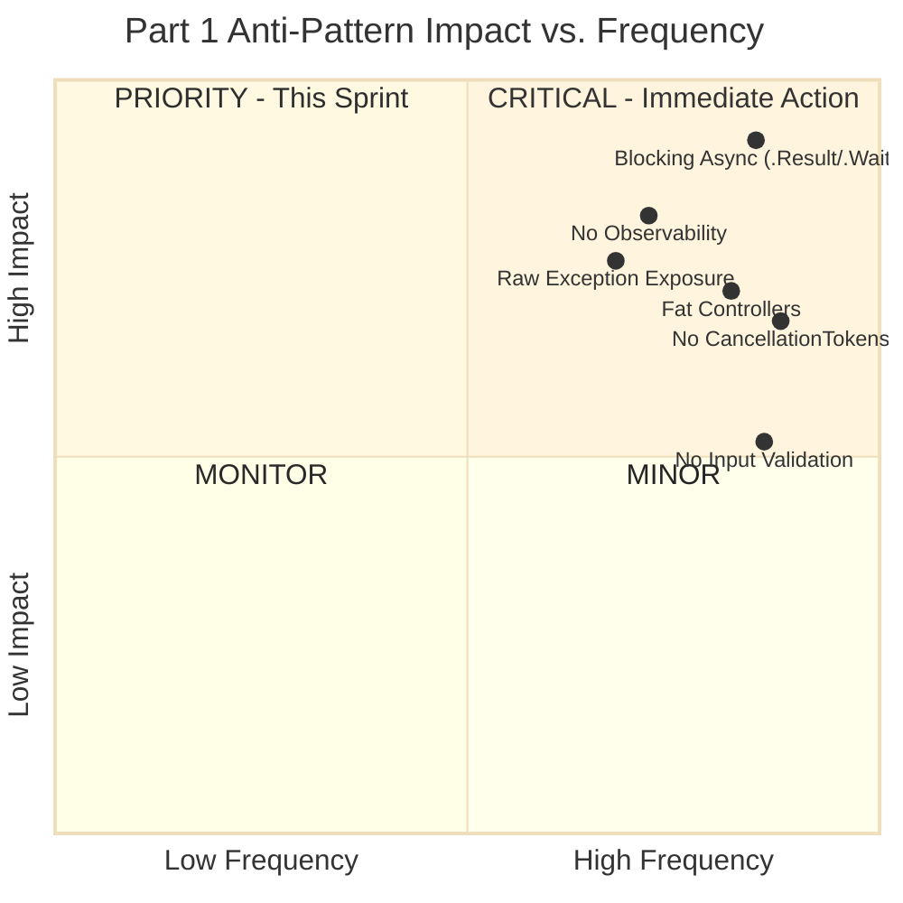

# diagram_01_21-anti-pattern-severity-matrix---part-1-focu-a36b

```mermaid
---
config:
  theme: base
  layout: elk
---
quadrantChart
    title Part 1 Anti-Pattern Impact vs. Frequency
    x-axis "Low Frequency" --> "High Frequency"
    y-axis "Low Impact" --> "High Impact"
    quadrant-1 "CRITICAL - Immediate Action"
    quadrant-2 "PRIORITY - This Sprint"
    quadrant-3 "MONITOR"
    quadrant-4 "MINOR"
    
    "Blocking Async (.Result/.Wait)": [0.85, 0.92]
    "No Observability": [0.72, 0.82]
    "Fat Controllers": [0.82, 0.72]
    "No CancellationTokens": [0.88, 0.68]
    "Raw Exception Exposure": [0.68, 0.76]
    "No Input Validation": [0.86, 0.52]
```
