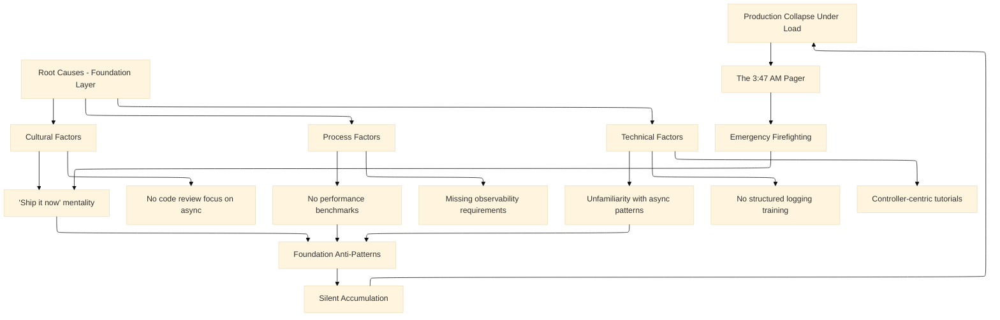

# diagram_02_22-root-cause-analysis---part-1-patterns-f911

```mermaid
---
config:
  theme: base
  layout: elk
---
flowchart TD
    A[Root Causes - Foundation Layer] --> B[Cultural Factors]
    A --> C[Process Factors]
    A --> D[Technical Factors]
    
    B --> B1["'Ship it now' mentality"]
    B --> B2[No code review focus on async]
    
    C --> C1[No performance benchmarks]
    C --> C2[Missing observability requirements]
    
    D --> D1[Unfamiliarity with async patterns]
    D --> D2[No structured logging training]
    D --> D3[Controller-centric tutorials]
    
    B1 & C1 & D1 --> E[Foundation Anti-Patterns]
    E --> F[Silent Accumulation]
    F --> G[Production Collapse Under Load]
    
    G --> H["The 3:47 AM Pager"]
    H --> I[Emergency Firefighting]
    I --> B1
```
