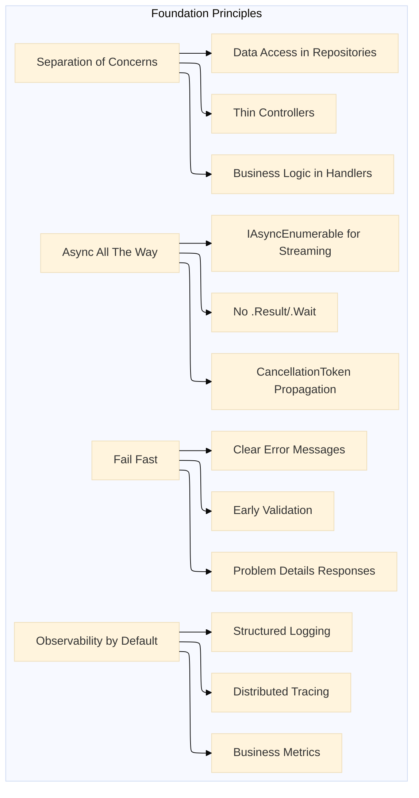

# diagram_03_31-core-principles-for-part-1

```mermaid
---
config:
  theme: base
  layout: elk
---
graph LR
    subgraph "Foundation Principles"
        A[Separation of Concerns] --> A1[Thin Controllers]
        A --> A2[Business Logic in Handlers]
        A --> A3[Data Access in Repositories]
        
        B[Async All The Way] --> B1[No .Result/.Wait]
        B --> B2[CancellationToken Propagation]
        B --> B3[IAsyncEnumerable for Streaming]
        
        C[Observability by Default] --> C1[Structured Logging]
        C --> C2[Distributed Tracing]
        C --> C3[Business Metrics]
        
        D[Fail Fast] --> D1[Early Validation]
        D --> D2[Problem Details Responses]
        D --> D3[Clear Error Messages]
    end
```
