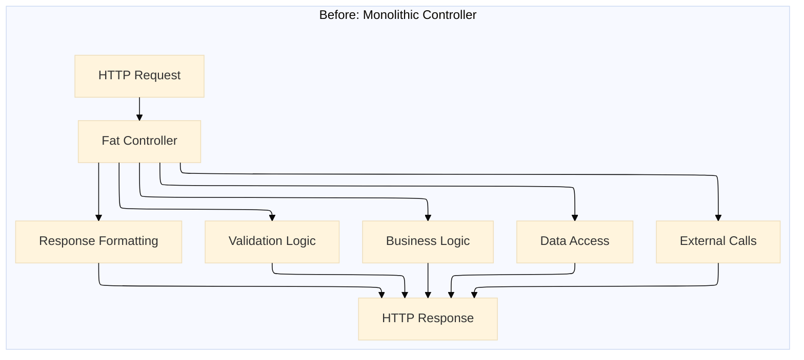

# diagram_04_before-remediation-the-architecture-looked-like-t-f2ed

```mermaid
---
config:
  theme: base
  layout: elk
---
flowchart TD
    subgraph "Before: Monolithic Controller"
        A[HTTP Request] --> B[Fat Controller]
        B --> C[Validation Logic]
        B --> D[Business Logic]
        B --> E[Data Access]
        B --> F[External Calls]
        B --> G[Response Formatting]
        C & D & E & F & G --> H[HTTP Response]
    end
```
