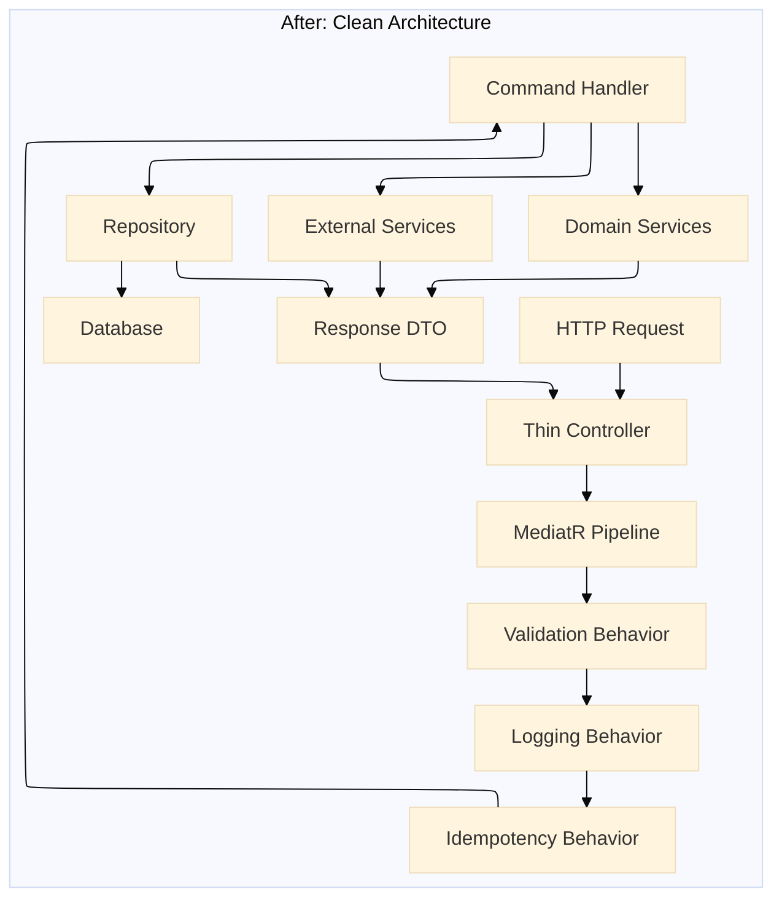

# diagram_05_after-remediation-the-architecture-becomes-eb9a

```mermaid
---
config:
  theme: base
  layout: elk
---
flowchart TD
    subgraph "After: Clean Architecture"
        A[HTTP Request] --> B[Thin Controller]
        B --> C[MediatR Pipeline]
        C --> D[Validation Behavior]
        D --> E[Logging Behavior]
        E --> F[Idempotency Behavior]
        F --> G[Command Handler]
        G --> H[Domain Services]
        G --> I[Repository]
        I --> J[Database]
        G --> K[External Services]
        H & I & K --> L[Response DTO]
        L --> B
    end
```
