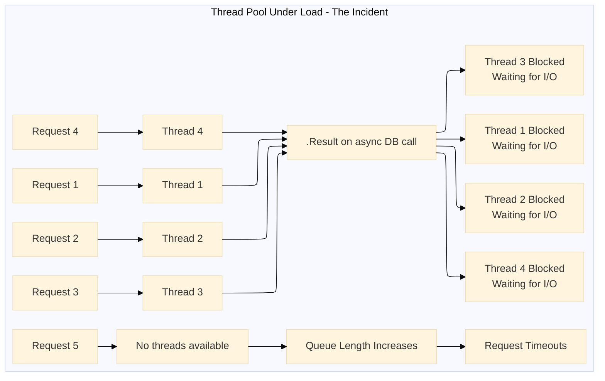

# diagram_06_thread-pool-starvation-mechanics-a815

```mermaid
---
config:
  theme: base
  layout: elk
---
flowchart LR
    subgraph "Thread Pool Under Load - The Incident"
        A[Request 1] --> B[Thread 1]
        C[Request 2] --> D[Thread 2]
        E[Request 3] --> F[Thread 3]
        G[Request 4] --> H[Thread 4]
        
        B --> I[.Result on async DB call]
        D --> I
        F --> I
        H --> I
        
        I --> J[Thread 1 Blocked<br/>Waiting for I/O]
        I --> K[Thread 2 Blocked<br/>Waiting for I/O]
        I --> L[Thread 3 Blocked<br/>Waiting for I/O]
        I --> M[Thread 4 Blocked<br/>Waiting for I/O]
        
        N[Request 5] --> O[No threads available]
        O --> P[Queue Length Increases]
        P --> Q[Request Timeouts]
    end
```
