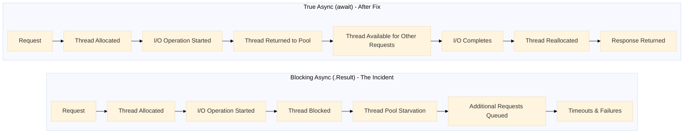

# diagram_07_performance-comparison

```mermaid
---
config:
  theme: base
  layout: elk
---
graph LR
    subgraph "Blocking Async (.Result) - The Incident"
        A[Request] --> B[Thread Allocated]
        B --> C[I/O Operation Started]
        C --> D[Thread Blocked]
        D --> E[Thread Pool Starvation]
        E --> F[Additional Requests Queued]
        F --> G[Timeouts & Failures]
    end
    
    subgraph "True Async (await) - After Fix"
        A2[Request] --> B2[Thread Allocated]
        B2 --> C2[I/O Operation Started]
        C2 --> D2[Thread Returned to Pool]
        D2 --> E2[Thread Available for Other Requests]
        E2 --> F2[I/O Completes]
        F2 --> G2[Thread Reallocated]
        G2 --> H2[Response Returned]
    end
```
