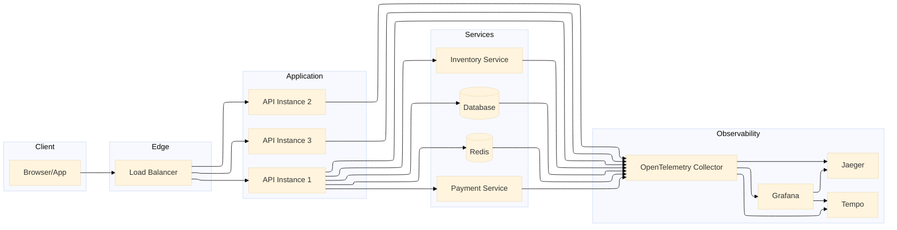

# diagram_08_63-distributed-tracing-architecture-4e74

```mermaid
---
config:
  theme: base
  layout: elk
---
flowchart LR
    subgraph "Client"
        Browser[Browser/App]
    end
    
    subgraph "Edge"
        LB[Load Balancer]
    end
    
    subgraph "Application"
        API1[API Instance 1]
        API2[API Instance 2]
        API3[API Instance 3]
    end
    
    subgraph "Services"
        DB[(Database)]
        Redis[(Redis)]
        Payment[Payment Service]
        Inventory[Inventory Service]
    end
    
    subgraph "Observability"
        Collector[OpenTelemetry Collector]
        Jaeger[Jaeger]
        Tempo[Tempo]
        Grafana[Grafana]
    end
    
    Browser --> LB --> API1 & API2 & API3
    
    API1 --> DB
    API1 --> Redis
    API1 --> Payment
    API1 --> Inventory
    
    API1 & API2 & API3 --> Collector
    DB --> Collector
    Redis --> Collector
    Payment --> Collector
    Inventory --> Collector
    
    Collector --> Jaeger
    Collector --> Tempo
    Collector --> Grafana
    
    Grafana --> Jaeger
    Grafana --> Tempo
```
