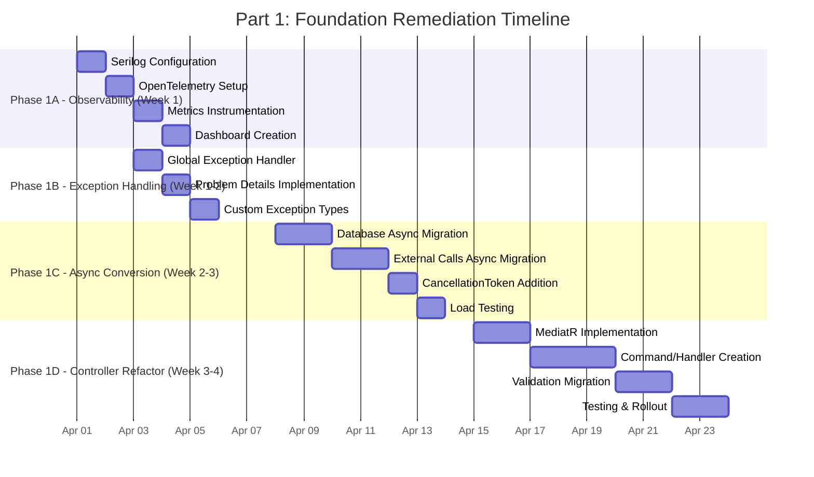

# diagram_09_71-phased-approach-for-foundation-remediation-c079

```mermaid

gantt
    title Part 1: Foundation Remediation Timeline
    dateFormat YYYY-MM-DD
    axisFormat %b %d
    
    section Phase 1A - Observability (Week 1)
    Serilog Configuration           :phase1a1, 2026-04-01, 1d
    OpenTelemetry Setup             :phase1a2, after phase1a1, 1d
    Metrics Instrumentation         :phase1a3, after phase1a2, 1d
    Dashboard Creation              :phase1a4, after phase1a3, 1d
    
    section Phase 1B - Exception Handling (Week 1-2)
    Global Exception Handler        :phase1b1, 2026-04-03, 1d
    Problem Details Implementation  :phase1b2, after phase1b1, 1d
    Custom Exception Types          :phase1b3, after phase1b2, 1d
    
    section Phase 1C - Async Conversion (Week 2-3)
    Database Async Migration        :phase1c1, 2026-04-08, 2d
    External Calls Async Migration  :phase1c2, after phase1c1, 2d
    CancellationToken Addition      :phase1c3, after phase1c2, 1d
    Load Testing                    :phase1c4, after phase1c3, 1d
    
    section Phase 1D - Controller Refactor (Week 3-4)
    MediatR Implementation          :phase1d1, 2026-04-15, 2d
    Command/Handler Creation        :phase1d2, after phase1d1, 3d
    Validation Migration            :phase1d3, after phase1d2, 2d
    Testing & Rollout               :phase1d4, after phase1d3, 2d
```
