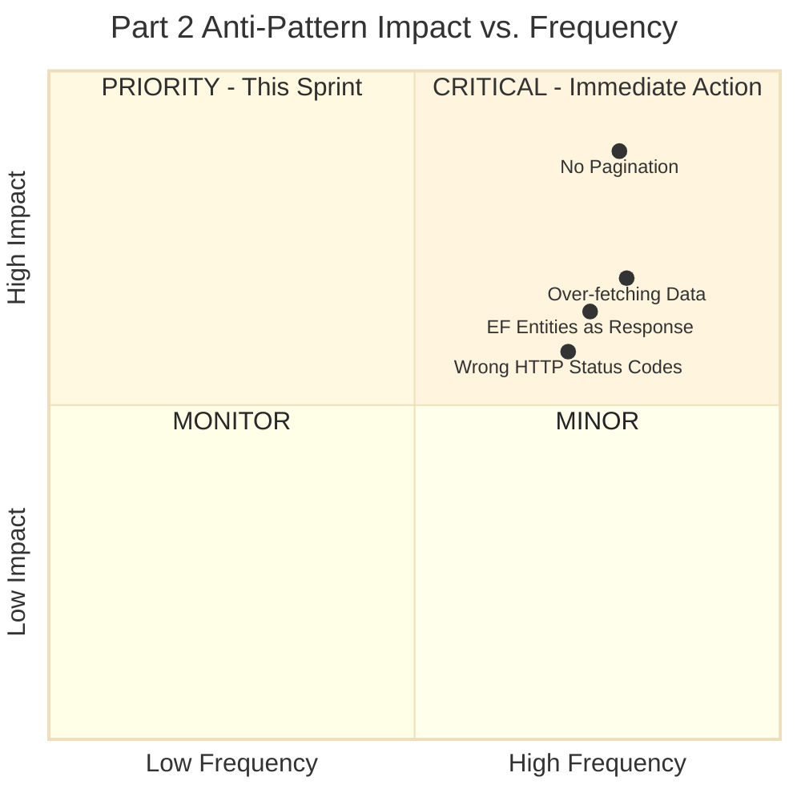

# diagram_01_21-anti-pattern-severity-matrix---part-2-focu-7368

```mermaid
---
config:
  theme: base
  layout: elk
---
quadrantChart
    title Part 2 Anti-Pattern Impact vs. Frequency
    x-axis "Low Frequency" --> "High Frequency"
    y-axis "Low Impact" --> "High Impact"
    quadrant-1 "CRITICAL - Immediate Action"
    quadrant-2 "PRIORITY - This Sprint"
    quadrant-3 "MONITOR"
    quadrant-4 "MINOR"
    
    "No Pagination": [0.78, 0.88]
    "Over-fetching Data": [0.79, 0.69]
    "EF Entities as Response": [0.74, 0.64]
    "Wrong HTTP Status Codes": [0.71, 0.58]
```
