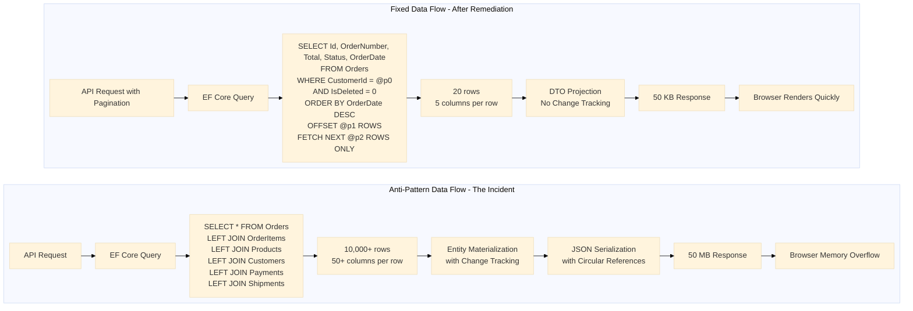

# diagram_02_22-data-flow-anti-pattern-visualization-d52c

```mermaid
---
config:
  theme: base
  layout: elk
---
flowchart LR
    subgraph "Anti-Pattern Data Flow - The Incident"
        A[API Request] --> B[EF Core Query]
        B --> C["SELECT * FROM Orders<br/>LEFT JOIN OrderItems<br/>LEFT JOIN Products<br/>LEFT JOIN Customers<br/>LEFT JOIN Payments<br/>LEFT JOIN Shipments"]
        C --> D[10,000+ rows<br/>50+ columns per row]
        D --> E[Entity Materialization<br/>with Change Tracking]
        E --> F[JSON Serialization<br/>with Circular References]
        F --> G[50 MB Response]
        G --> H[Browser Memory Overflow]
    end
    
    subgraph "Fixed Data Flow - After Remediation"
        A2[API Request with Pagination] --> B2[EF Core Query]
        B2 --> C2["SELECT Id, OrderNumber, Total, Status, OrderDate<br/>FROM Orders<br/>WHERE CustomerId = @p0<br/>AND IsDeleted = 0<br/>ORDER BY OrderDate DESC<br/>OFFSET @p1 ROWS<br/>FETCH NEXT @p2 ROWS ONLY"]
        C2 --> D2[20 rows<br/>5 columns per row]
        D2 --> E2[DTO Projection<br/>No Change Tracking]
        E2 --> F2[50 KB Response]
        F2 --> G2[Browser Renders Quickly]
    end
```
