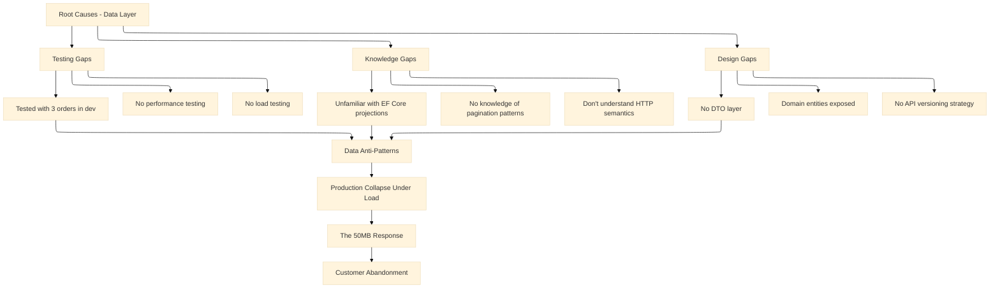

# diagram_03_23-root-cause-analysis---data-layer-df4c

```mermaid
---
config:
  theme: base
  layout: elk
---
flowchart TD
    A[Root Causes - Data Layer] --> B[Testing Gaps]
    A --> C[Knowledge Gaps]
    A --> D[Design Gaps]
    
    B --> B1[Tested with 3 orders in dev]
    B --> B2[No performance testing]
    B --> B3[No load testing]
    
    C --> C1[Unfamiliar with EF Core projections]
    C --> C2[No knowledge of pagination patterns]
    C --> C3[Don't understand HTTP semantics]
    
    D --> D1[No DTO layer]
    D --> D2[Domain entities exposed]
    D --> D3[No API versioning strategy]
    
    B1 & C1 & D1 --> E[Data Anti-Patterns]
    E --> F[Production Collapse Under Load]
    
    F --> G[The 50MB Response]
    G --> H[Customer Abandonment]
```
