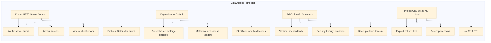

# diagram_04_31-core-principles-for-part-2

```mermaid
---
config:
  theme: base
  layout: elk
---
graph TD
    subgraph "Data Access Principles"
        A[Pagination by Default] --> A1[Skip/Take for all collections]
        A --> A2[Cursor-based for large datasets]
        A --> A3[Metadata in response headers]
        
        B[Project Only What You Need] --> B1[Select projections]
        B --> B2[No SELECT *]
        B --> B3[Explicit column lists]
        
        C[DTOs for API Contracts] --> C1[Decouple from domain]
        C --> C2[Version independently]
        C --> C3[Security through omission]
        
        D[Proper HTTP Status Codes] --> D1[2xx for success]
        D --> D2[4xx for client errors]
        D --> D3[5xx for server errors]
        D --> D4[Problem Details for errors]
    end
```
