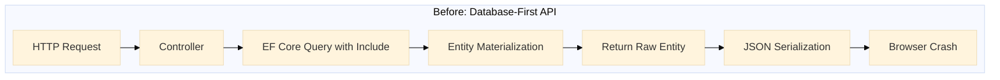

# diagram_05_before-remediation-the-data-flow-looked-like-this-8d32

```mermaid
---
config:
  theme: base
  layout: elk
---
flowchart LR
 subgraph subGraph0["Before: Database-First API"]
        B["Controller"]
        A["HTTP Request"]
        C["EF Core Query with Include"]
        D["Entity Materialization"]
        E["Return Raw Entity"]
        F["JSON Serialization"]
        G["Browser Crash"]
  end
    A --> B
    B --> C
    C --> D
    D --> E
    E --> F
    F --> G
```
