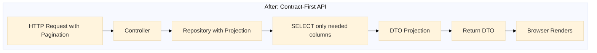

# diagram_06_after-remediation-the-data-flow-becomes-2598

```mermaid
---
config:
  theme: base
  layout: elk
---
flowchart LR
    subgraph "After: Contract-First API"
        A[HTTP Request with Pagination] --> B[Controller]
        B --> C[Repository with Projection]
        C --> D[SELECT only needed columns]
        D --> E[DTO Projection]
        E --> F[Return DTO]
        F --> G[Browser Renders]
    end
```
