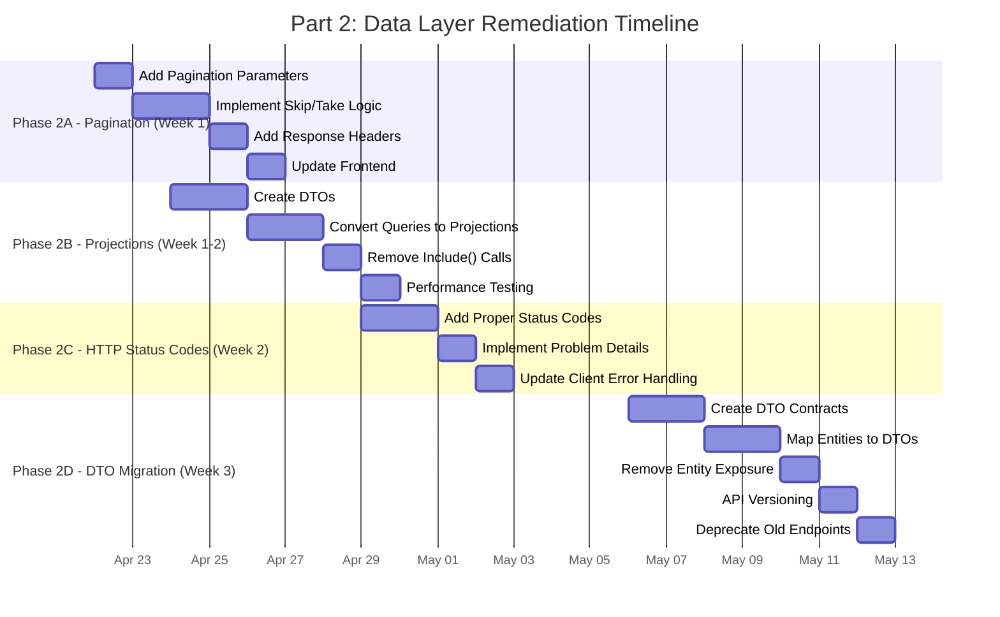

# diagram_07_71-phased-approach-for-data-layer-remediation-9739

```mermaid

gantt
    title Part 2: Data Layer Remediation Timeline
    dateFormat YYYY-MM-DD
    axisFormat %b %d
    
    section Phase 2A - Pagination (Week 1)
    Add Pagination Parameters      :phase2a1, 2026-04-22, 1d
    Implement Skip/Take Logic      :phase2a2, after phase2a1, 2d
    Add Response Headers           :phase2a3, after phase2a2, 1d
    Update Frontend                :phase2a4, after phase2a3, 1d
    
    section Phase 2B - Projections (Week 1-2)
    Create DTOs                    :phase2b1, 2026-04-24, 2d
    Convert Queries to Projections :phase2b2, after phase2b1, 2d
    Remove Include() Calls         :phase2b3, after phase2b2, 1d
    Performance Testing            :phase2b4, after phase2b3, 1d
    
    section Phase 2C - HTTP Status Codes (Week 2)
    Add Proper Status Codes        :phase2c1, 2026-04-29, 2d
    Implement Problem Details      :phase2c2, after phase2c1, 1d
    Update Client Error Handling   :phase2c3, after phase2c2, 1d
    
    section Phase 2D - DTO Migration (Week 3)
    Create DTO Contracts           :phase2d1, 2026-05-06, 2d
    Map Entities to DTOs           :phase2d2, after phase2d1, 2d
    Remove Entity Exposure         :phase2d3, after phase2d2, 1d
    API Versioning                 :phase2d4, after phase2d3, 1d
    Deprecate Old Endpoints        :phase2d5, after phase2d4, 1d
```
