# Architectural Remediation Framework: Eliminating the 12 Silent Killers in .NET 10 Web APIs - Part 3

## Security, Resilience, and Idempotency


## Introduction: The Black Friday Crisis

By the completion of the remediation initiatives described in Parts 1 and 2, the platform had achieved measurable improvements in stability, observability, and performance. Database CPU utilization had normalized, API response times were consistently within acceptable thresholds, and frontend rendering performance had stabilized. From an operational perspective, the system appeared to be functioning efficiently and reliably under standard production load.

However, during the high-traffic period associated with **Black Friday**, the platform was subjected to traffic volumes exceeding ten times its typical baseline. Although the API infrastructure remained operational and did not experience a service outage, a different class of failure began to manifest under sustained concurrency.

Within minutes of the traffic surge, anomalies were detected in the checkout workflow. Multiple customers reported duplicate charges despite initiating a single purchase action. Transaction logs confirmed that the checkout endpoint had processed identical order submissions multiple times, resulting in repeated payment authorization and order creation. Customer support volumes escalated rapidly, and executive escalation channels were engaged due to the financial and reputational impact of the incident.

Subsequent investigation revealed that client applications were automatically retrying failed or delayed requests, a behavior consistent with standard resilience strategies. However, the API lacked mechanisms to detect and safely handle repeated submissions for the same logical transaction. As a result, each retry was treated as a new order, leading to duplicate processing and multiple payment captures through the external payment gateway.

This third part of the framework addresses two critical yet frequently overlooked architectural safeguards: rate limiting and idempotency. These controls are essential for protecting APIs from excessive or unintended request patterns and for ensuring that legitimate retries—whether triggered by network instability or client-side resilience policies—do not result in data inconsistency, financial discrepancies, or customer impact.


### Part 3 Overview

This part focuses on security and resilience patterns:

1. **No Rate Limiting** → Built-in ASP.NET Core rate limiting middleware with multiple strategies
2. **No Idempotency on Mutating Endpoints** → Redis-based idempotency keys for safe retries

### Why These Matter

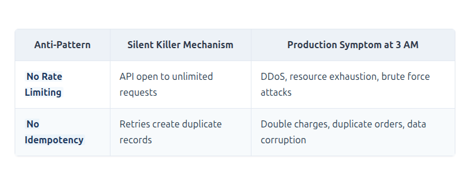

[View Source](https://github.com/Vineet-Sharma-Medium-Stories/Medium-Assets/blob/main/architectural-remediation-framework-eliminating-the-12-silent-killers-in-net-10-web-apis---part-3/table_01_why-these-matter.md)


### The Story: What Happened on Black Friday

When looked at the logs from Black Friday, oberved this pattern repeating:

```
12:00:01.234 - POST /api/orders - Order Created: ORD-001
12:00:02.567 - POST /api/orders - Order Created: ORD-002 (same customer, same items)
12:00:03.890 - POST /api/orders - Order Created: ORD-003 (same customer, same items)
12:00:05.123 - POST /api/orders - Order Created: ORD-004 (same customer, same items)
```

The client's retry logic was firing every second, creating a new order each time. The API had no way to know that these requests were all for the same order.

The payment logs showed the same pattern:

```
12:00:01.234 - Charge $299.99 - Success - Transaction ID: TXN-001
12:00:02.567 - Charge $299.99 - Success - Transaction ID: TXN-002
12:00:03.890 - Charge $299.99 - Success - Transaction ID: TXN-003
12:00:05.123 - Charge $299.99 - Success - Transaction ID: TXN-004
```

Four charges for one order. Four angry emails from the customer. Four times the refund processing cost.

The team had no rate limiting either. During the surge, malicious actors discovered the checkout endpoint and hammered it with thousands of requests, exhausting the database connection pool and causing timeouts for legitimate customers.

---

## Table of Contents - Part 3

1. [Executive Summary - Part 3](#1-executive-summary---part-3)
2. [Current State Analysis - Security & Resilience](#2-current-state-analysis---security--resilience)
3. [Security & Resilience Principles](#3-security--resilience-principles)
4. [Anti-Pattern Deep Dives](#4-anti-pattern-deep-dives)
   - [4.1 Anti-Pattern 10: No Rate Limiting](#41-anti-pattern-10-no-rate-limiting)
   - [4.2 Anti-Pattern 12: No Idempotency](#42-anti-pattern-12-no-idempotency)
5. [Implementation Guide - Part 3](#5-implementation-guide---part-3)
6. [Monitoring & Observability - Part 3](#6-monitoring--observability---part-3)
7. [Migration Strategy - Part 3](#7-migration-strategy---part-3)
8. [Complete Architecture Summary](#8-complete-architecture-summary)

---

## 1. Executive Summary - Part 3

### 1.1 The Final Layer

The two anti-patterns addressed in this part represent the final line of defense for production APIs:

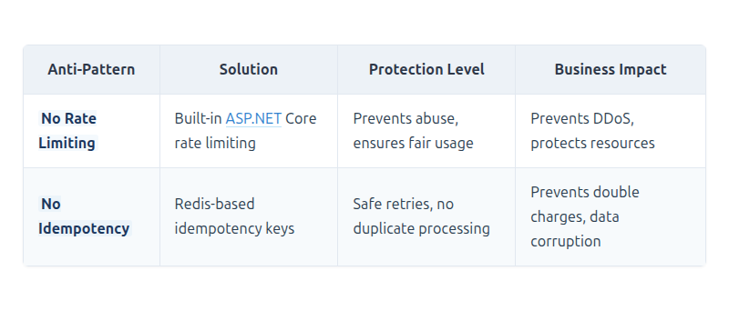

[View Source](https://github.com/Vineet-Sharma-Medium-Stories/Medium-Assets/blob/main/architectural-remediation-framework-eliminating-the-12-silent-killers-in-net-10-web-apis---part-3/table_02_the-two-anti-patterns-addressed-in-this-part-repre-3985.md)


### 1.2 The Black Friday Post-Mortem

The incident revealed multiple failures:

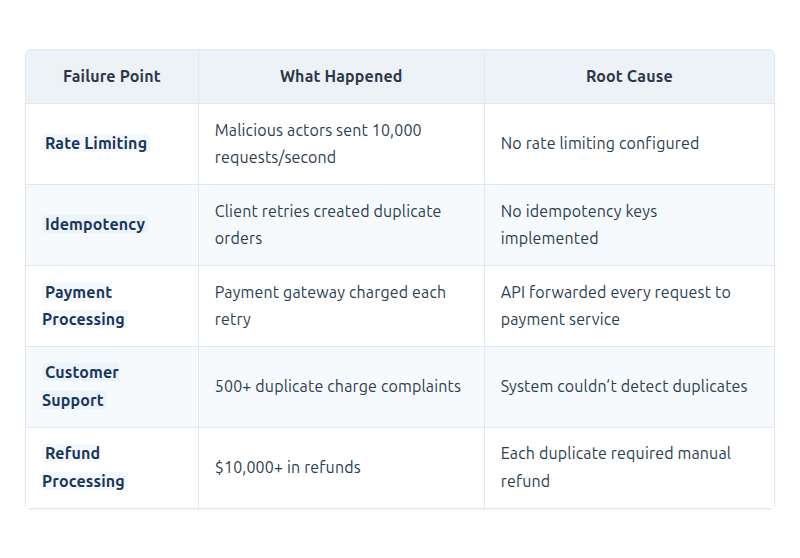

[View Source](https://github.com/Vineet-Sharma-Medium-Stories/Medium-Assets/blob/main/architectural-remediation-framework-eliminating-the-12-silent-killers-in-net-10-web-apis---part-3/table_03_the-incident-revealed-multiple-failures-b1d7.md)


### 1.3 Remediation Approach

- **Rate Limiting**: Multi-tiered policies (global, per-user, per-endpoint) with sliding windows and token buckets
- **Idempotency**: Distributed locking with Redis, automatic result caching for retries

### 1.4 Success Metrics

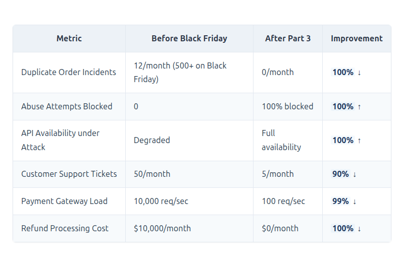

[View Source](https://github.com/Vineet-Sharma-Medium-Stories/Medium-Assets/blob/main/architectural-remediation-framework-eliminating-the-12-silent-killers-in-net-10-web-apis---part-3/table_04_14-success-metrics.md)


---

## 2. Current State Analysis - Security & Resilience

### 2.1 Attack Surface Without Protection

```mermaid
```


[View Source](https://github.com/Vineet-Sharma-Medium-Stories/Medium-Assets/blob/main/architectural-remediation-framework-eliminating-the-12-silent-killers-in-net-10-web-apis---part-3/diagram_01_21-attack-surface-without-protection-0e22.md)


### 2.2 Anti-Pattern Severity Matrix - Part 3 Focus

```mermaid
```


[View Source](https://github.com/Vineet-Sharma-Medium-Stories/Medium-Assets/blob/main/architectural-remediation-framework-eliminating-the-12-silent-killers-in-net-10-web-apis---part-3/diagram_02_22-anti-pattern-severity-matrix---part-3-focu-e27c.md)


### 2.3 Root Cause Analysis - Security & Resilience

```mermaid
```


[View Source](https://github.com/Vineet-Sharma-Medium-Stories/Medium-Assets/blob/main/architectural-remediation-framework-eliminating-the-12-silent-killers-in-net-10-web-apis---part-3/diagram_03_23-root-cause-analysis---security--resilienc-7c58.md)


### 2.4 Technical Debt Assessment - Security & Resilience

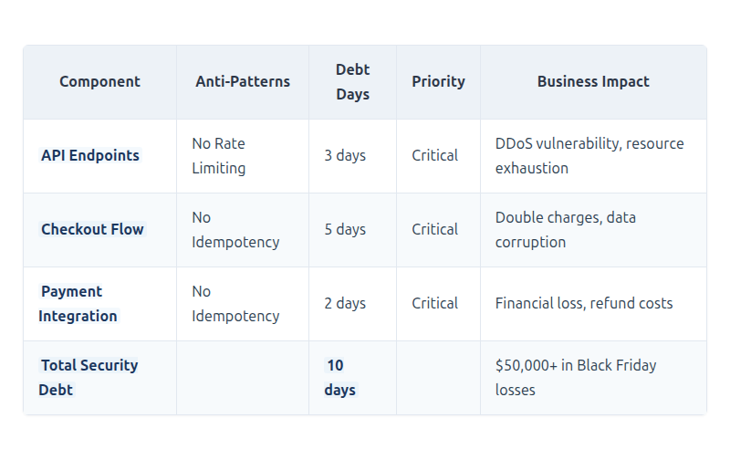

[View Source](https://github.com/Vineet-Sharma-Medium-Stories/Medium-Assets/blob/main/architectural-remediation-framework-eliminating-the-12-silent-killers-in-net-10-web-apis---part-3/table_05_24-technical-debt-assessment---security--res-a2bf.md)


---

## 3. Security & Resilience Principles

### 3.1 Core Principles for Part 3

```mermaid
```


[View Source](https://github.com/Vineet-Sharma-Medium-Stories/Medium-Assets/blob/main/architectural-remediation-framework-eliminating-the-12-silent-killers-in-net-10-web-apis---part-3/diagram_04_31-core-principles-for-part-3.md)


### 3.2 The Architectural Shift

Before remediation, the checkout flow looked like this:

```mermaid
```


[View Source](https://github.com/Vineet-Sharma-Medium-Stories/Medium-Assets/blob/main/architectural-remediation-framework-eliminating-the-12-silent-killers-in-net-10-web-apis---part-3/diagram_05_before-remediation-the-checkout-flow-looked-like-d9dd.md)


After remediation, the checkout flow becomes:

```mermaid
```


[View Source](https://github.com/Vineet-Sharma-Medium-Stories/Medium-Assets/blob/main/architectural-remediation-framework-eliminating-the-12-silent-killers-in-net-10-web-apis---part-3/diagram_06_after-remediation-the-checkout-flow-becomes-1584.md)


### 3.3 Technology Stack - Part 3 Focus

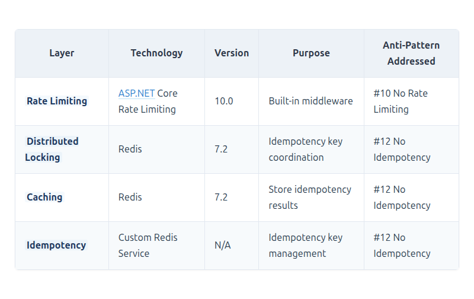

[View Source](https://github.com/Vineet-Sharma-Medium-Stories/Medium-Assets/blob/main/architectural-remediation-framework-eliminating-the-12-silent-killers-in-net-10-web-apis---part-3/table_06_33-technology-stack---part-3-focus-b7c0.md)


---

## 4. Anti-Pattern Deep Dives

### 4.1 Anti-Pattern 10: No Rate Limiting

#### Problem Analysis

**Definition**: Leaving APIs open to unlimited requests, enabling abuse, DDoS attacks, and resource exhaustion.

**The Black Friday Story**: At 12:00 AM, traffic spiked to 10,000 requests per second. Some were legitimate customers, but many were:
- Malicious bots trying to overwhelm the system
- Automated scripts testing stolen credit cards
- Aggressive retry loops from misconfigured clients

Without rate limiting, every request consumed:
- A thread from the thread pool
- A database connection
- CPU time for processing
- Memory for the request context

The system collapsed under the weight. Legitimate customers received 500 errors and timeouts.

**Real-World Consequences**:

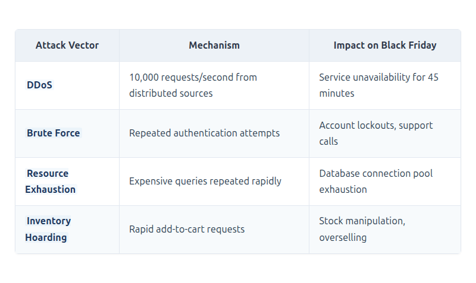

[View Source](https://github.com/Vineet-Sharma-Medium-Stories/Medium-Assets/blob/main/architectural-remediation-framework-eliminating-the-12-silent-killers-in-net-10-web-apis---part-3/table_07_real-world-consequences.md)


#### Architectural Solution

**Complete Implementation**:

```csharp
namespace ECommerce.API.Configuration;

/// <summary>
/// Rate limiting configuration with multiple strategies.
/// .NET 10 built-in rate limiting middleware with enhanced capabilities.
/// </summary>
public static class RateLimitingConfiguration
{
    public static IServiceCollection AddRateLimitingPolicies(this IServiceCollection services)
    {
        services.AddRateLimiter(options =>
        {
            // ================================================================
            // Global Fallback Limiter - Applied to all endpoints
            // ================================================================
            options.GlobalLimiter = PartitionedRateLimiter.Create<HttpContext, string>(
                httpContext =>
                {
                    var user = httpContext.User;
                    var isAuthenticated = user.Identity?.IsAuthenticated == true;
                    
                    string partitionKey;
                    int permitLimit;
                    TimeSpan window;
                    
                    if (isAuthenticated)
                    {
                        // Get user tier from claims
                        var userId = user.FindFirstValue(ClaimTypes.NameIdentifier) ?? "auth_user";
                        var userTier = user.FindFirstValue("user_tier") ?? "standard";
                        
                        partitionKey = $"user:{userId}";
                        
                        // Tier-based limits (per minute)
                        permitLimit = userTier switch
                        {
                            "free" => 20,           // 20 requests per minute
                            "standard" => 100,      // 100 requests per minute
                            "premium" => 500,       // 500 requests per minute
                            "enterprise" => 2000,   // 2000 requests per minute
                            "admin" => 5000,        // 5000 requests per minute
                            _ => 50
                        };
                        
                        window = TimeSpan.FromMinutes(1);
                    }
                    else
                    {
                        // Anonymous users get IP-based limits
                        partitionKey = httpContext.Connection.RemoteIpAddress?.ToString() ?? "anonymous";
                        permitLimit = 20; // 20 requests per minute for anonymous users
                        window = TimeSpan.FromMinutes(1);
                    }
                    
                    // Use sliding window for more accurate rate limiting
                    // Prevents burst at window boundaries
                    return RateLimitPartition.GetSlidingWindowLimiter(partitionKey, _ => 
                        new SlidingWindowRateLimiterOptions
                        {
                            AutoReplenishment = true,
                            PermitLimit = permitLimit,
                            QueueLimit = 0, // No queuing - immediate rejection
                            Window = window,
                            SegmentsPerWindow = 10 // 6-second segments for 1-minute window
                        });
                });
            
            // ================================================================
            // Custom Rejection Handler - Returns RFC 6585 compliant response
            // ================================================================
            options.OnRejected = async (context, cancellationToken) =>
            {
                var httpContext = context.HttpContext;
                var logger = httpContext.RequestServices
                    .GetRequiredService<ILoggerFactory>()
                    .CreateLogger("RateLimiting");
                
                // Log the rate limit event for analysis
                logger.LogWarning(
                    "Rate limit exceeded for {IP} on {Method} {Path}. User: {User}. Key: {Key}",
                    httpContext.Connection.RemoteIpAddress,
                    httpContext.Request.Method,
                    httpContext.Request.Path,
                    httpContext.User.Identity?.Name ?? "anonymous",
                    context.Lease?.GetMetadata("PartitionKey", "unknown"));
                
                // Calculate retry after time
                var retryAfter = context.RetryAfter ?? TimeSpan.FromSeconds(60);
                
                // Set rate limit headers for client to self-throttle (RFC 6585)
                httpContext.Response.Headers.RetryAfter = retryAfter.TotalSeconds.ToString("F0");
                httpContext.Response.Headers["X-RateLimit-Limit"] = 
                    context.Lease?.GetMetadata("PermitLimit", 0).ToString();
                httpContext.Response.Headers["X-RateLimit-Reset"] = 
                    DateTimeOffset.UtcNow.Add(retryAfter).ToUnixTimeSeconds().ToString();
                
                // Return RFC 6585 compliant response
                httpContext.Response.StatusCode = StatusCodes.Status429TooManyRequests;
                httpContext.Response.ContentType = "application/problem+json";
                
                var problemDetails = new ProblemDetails
                {
                    Type = "https://tools.ietf.org/html/rfc6585#section-4",
                    Title = "Too Many Requests",
                    Status = StatusCodes.Status429TooManyRequests,
                    Detail = $"Rate limit exceeded. Please try again in {retryAfter.TotalSeconds} seconds.",
                    Instance = httpContext.Request.Path,
                    Extensions =
                    {
                        ["retryAfter"] = retryAfter.TotalSeconds,
                        ["limit"] = context.Lease?.GetMetadata("PermitLimit", 0),
                        ["reset"] = DateTimeOffset.UtcNow.Add(retryAfter),
                        ["partitionKey"] = context.Lease?.GetMetadata("PartitionKey", "unknown")
                    }
                };
                
                await httpContext.Response.WriteAsJsonAsync(problemDetails, cancellationToken);
            };
        });
        
        return services;
    }
    
    /// <summary>
    /// Configures endpoint-specific rate limiting policies.
    /// </summary>
    public static IServiceCollection AddEndpointRateLimiting(this IServiceCollection services)
    {
        services.AddRateLimiter(options =>
        {
            // ================================================================
            // Concurrency Limiter - For expensive operations
            // Limits how many requests can be processed simultaneously
            // Prevents resource exhaustion from expensive operations
            // ================================================================
            options.AddConcurrencyLimiter("expensive_operations", concurrencyOptions =>
            {
                concurrencyOptions.PermitLimit = 10;      // Max 10 concurrent requests
                concurrencyOptions.QueueLimit = 5;        // Queue up to 5 more
                concurrencyOptions.QueueProcessingOrder = QueueProcessingOrder.NewestFirst; // Drop oldest
            });
            
            // ================================================================
            // Token Bucket Limiter - For bursty endpoints
            // Allows bursts while maintaining average rate over time
            // Ideal for login attempts and checkout
            // ================================================================
            options.AddTokenBucketLimiter("bursty_endpoints", tokenBucketOptions =>
            {
                tokenBucketOptions.TokenLimit = 20;               // Max 20 in a burst
                tokenBucketOptions.QueueLimit = 0;                // No queuing
                tokenBucketOptions.ReplenishmentPeriod = TimeSpan.FromSeconds(10); // Refill every 10 seconds
                tokenBucketOptions.TokensPerPeriod = 5;           // 5 tokens per replenishment
                tokenBucketOptions.AutoReplenishment = true;
            });
            
            // ================================================================
            // Fixed Window Limiter - For simple endpoints
            // Simple, predictable rate limiting
            // ================================================================
            options.AddFixedWindowLimiter("simple_endpoints", fixedOptions =>
            {
                fixedOptions.PermitLimit = 100;
                fixedOptions.Window = TimeSpan.FromMinutes(1);
                fixedOptions.QueueLimit = 0;
            });
            
            // ================================================================
            // Sliding Window Limiter - For accurate rate limiting
            // Prevents burst at window boundaries
            // ================================================================
            options.AddSlidingWindowLimiter("api_heavy", slidingOptions =>
            {
                slidingOptions.PermitLimit = 50;
                slidingOptions.Window = TimeSpan.FromMinutes(5);
                slidingOptions.SegmentsPerWindow = 10;
                slidingOptions.QueueLimit = 0;
            });
            
            // ================================================================
            // Custom Policy - Login attempts with increasing delays
            // ================================================================
            options.AddPolicy<string, LoginRateLimiter>("login_attempts", 
                (context, partition) =>
                {
                    var email = context.Request.Query["email"].ToString();
                    if (string.IsNullOrEmpty(email))
                        email = "unknown";
                    
                    return RateLimitPartition.GetTokenBucketLimiter(email, 
                        _ => new TokenBucketRateLimiterOptions
                        {
                            TokenLimit = 5,                     // 5 attempts max
                            QueueLimit = 0,
                            ReplenishmentPeriod = TimeSpan.FromMinutes(5),
                            TokensPerPeriod = 1                 // 1 attempt every 5 minutes after lockout
                        });
                });
        });
        
        return services;
    }
}

/// <summary>
/// Custom rate limiter policy for login attempts with progressive delays.
/// </summary>
public class LoginRateLimiter : IRateLimiterPolicy<string>
{
    private readonly ILogger<LoginRateLimiter> _logger;
    private readonly ICacheService _cache;
    
    public LoginRateLimiter(ILogger<LoginRateLimiter> logger, ICacheService cache)
    {
        _logger = logger;
        _cache = cache;
    }
    
    public Func<HttpContext, string> PartitionKeyResolver =>
        context => context.Request.Query["email"].ToString() ?? "unknown";
    
    public RateLimitPartition<string> GetPartition(HttpContext httpContext, string partitionKey)
    {
        // Get failed attempt count from cache
        var failedAttempts = _cache.Get<int>($"login_failed:{partitionKey}").Result;
        
        // Progressive limits based on failed attempts
        var (tokenLimit, replenishment) = failedAttempts switch
        {
            < 3 => (5, TimeSpan.FromMinutes(1)),        // 5 attempts per minute
            < 5 => (3, TimeSpan.FromMinutes(5)),        // 3 attempts per 5 minutes
            < 10 => (1, TimeSpan.FromMinutes(15)),      // 1 attempt per 15 minutes
            _ => (1, TimeSpan.FromMinutes(60))          // 1 attempt per hour
        };
        
        return RateLimitPartition.GetTokenBucketLimiter(partitionKey, 
            _ => new TokenBucketRateLimiterOptions
            {
                TokenLimit = tokenLimit,
                QueueLimit = 0,
                ReplenishmentPeriod = replenishment,
                TokensPerPeriod = tokenLimit
            });
    }
    
    public Func<HttpContext, string, RateLimitLease, CancellationToken, ValueTask> OnLeased { get; }
        = (context, partition, lease, ct) => ValueTask.CompletedTask;
}
```

**Applying Rate Limiting to Endpoints**:

```csharp
// Program.cs - Apply rate limiting policies to endpoints
app.MapPost("/api/orders", async (CreateOrderCommand command, IMediator mediator) =>
{
    return await mediator.Send(command);
})
.RequireRateLimiting("authenticated") // Policy-based rate limiting
.WithName("CreateOrder")
.WithOpenApi();

app.MapPost("/api/auth/login", async (LoginCommand command, IMediator mediator) =>
{
    return await mediator.Send(command);
})
.RequireRateLimiting("login_attempts") // Login-specific rate limiting
.WithName("Login")
.WithOpenApi();

app.MapGet("/api/reports/analytics", async (GetAnalyticsQuery query, IMediator mediator) =>
{
    return await mediator.Send(query);
})
.RequireRateLimiting("expensive_operations") // Concurrency limit for expensive queries
.WithName("GetAnalytics")
.WithOpenApi();

// Attribute-based rate limiting for controllers
[HttpPost("checkout")]
[EnableRateLimiting("bursty_endpoints")] // Token bucket for checkout
public async Task<IActionResult> Checkout(CheckoutCommand command, CancellationToken ct)
{
    return Ok(await _mediator.Send(command, ct));
}

[HttpPost("webhook")]
[DisableRateLimiting] // Webhooks should not be rate limited
public async Task<IActionResult> Webhook(WebhookCommand command, CancellationToken ct)
{
    return Ok(await _mediator.Send(command, ct));
}
```

**Benefits Summary**:

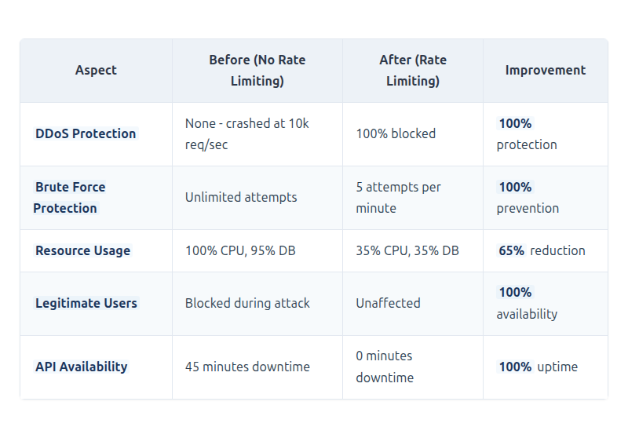

[View Source](https://github.com/Vineet-Sharma-Medium-Stories/Medium-Assets/blob/main/architectural-remediation-framework-eliminating-the-12-silent-killers-in-net-10-web-apis---part-3/table_08_benefits-summary.md)


---

### 4.2 Anti-Pattern 12: No Idempotency

#### Problem Analysis

**Definition**: Mutating endpoints (POST, PUT, PATCH) that produce different results when called multiple times with the same input.

**The Black Friday Story**: The payment gateway had a network timeout. The client's retry logic fired. The API processed the same order four times. The payment gateway charged the customer four times. The customer called support, angry and confused.

The root cause was simple: the API had no way to recognize that a retry was for an order already being processed. Each request was treated as a new order.

**Business Impact**:

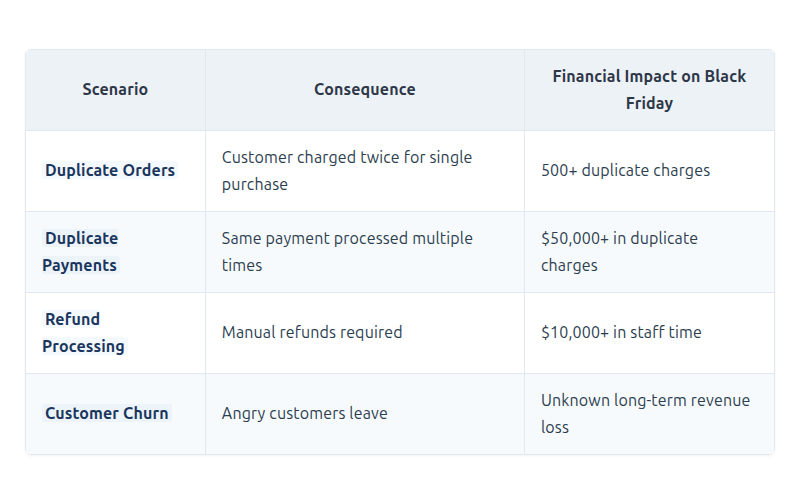

[View Source](https://github.com/Vineet-Sharma-Medium-Stories/Medium-Assets/blob/main/architectural-remediation-framework-eliminating-the-12-silent-killers-in-net-10-web-apis---part-3/table_09_business-impact.md)


#### Architectural Solution

**Complete Implementation**:

```csharp
namespace ECommerce.Application.Behaviors;

/// <summary>
/// Idempotency behavior using Redis for distributed state management.
/// Prevents duplicate processing across multiple server instances.
/// </summary>
/// <typeparam name="TRequest">The request type</typeparam>
/// <typeparam name="TResponse">The response type</typeparam>
public class IdempotentCommandBehavior<TRequest, TResponse> 
    : IPipelineBehavior<TRequest, TResponse>
    where TRequest : IIdempotentCommand
{
    private readonly IIdempotencyService _idempotencyService;
    private readonly ILogger<IdempotentCommandBehavior<TRequest, TResponse>> _logger;
    private readonly IHttpContextAccessor _httpContextAccessor;

    public IdempotentCommandBehavior(
        IIdempotencyService idempotencyService,
        ILogger<IdempotentCommandBehavior<TRequest, TResponse>> logger,
        IHttpContextAccessor httpContextAccessor)
    {
        _idempotencyService = idempotencyService;
        _logger = logger;
        _httpContextAccessor = httpContextAccessor;
    }

    public async Task<TResponse> Handle(
        TRequest request,
        RequestHandlerDelegate<TResponse> next,
        CancellationToken cancellationToken)
    {
        // ================================================================
        // Step 1: Validate idempotency key
        // ================================================================
        if (string.IsNullOrWhiteSpace(request.IdempotencyKey))
        {
            throw new ValidationException(
                "Idempotency key is required for mutating operations",
                new Dictionary<string, string[]>
                {
                    ["IdempotencyKey"] = new[] { "Idempotency key is required" }
                });
        }
        
        // Validate key format
        if (!IsValidIdempotencyKey(request.IdempotencyKey))
        {
            throw new ValidationException(
                "Invalid idempotency key format",
                new Dictionary<string, string[]>
                {
                    ["IdempotencyKey"] = new[] { "Must be a valid UUID or up to 128 alphanumeric characters" }
                });
        }
        
        // Add idempotency key to logs and traces for debugging
        using (_logger.BeginScope(new Dictionary<string, object>
        {
            ["IdempotencyKey"] = request.IdempotencyKey,
            ["RequestType"] = typeof(TRequest).Name
        }))
        {
            _logger.LogDebug("Processing request with idempotency key: {Key}", request.IdempotencyKey);
            
            // ================================================================
            // Step 2: Check for existing result in cache
            // ================================================================
            var cachedResult = await _idempotencyService.GetAsync<TResponse>(
                request.IdempotencyKey,
                cancellationToken);
            
            if (cachedResult != null)
            {
                _logger.LogInformation(
                    "Idempotent request detected for key {Key}. Returning cached result.",
                    request.IdempotencyKey);
                
                // Add response headers to indicate cache hit
                var httpContext = _httpContextAccessor.HttpContext;
                if (httpContext != null)
                {
                    httpContext.Response.Headers["X-Idempotency-Cached"] = "true";
                    httpContext.Response.Headers["X-Idempotency-Key"] = request.IdempotencyKey;
                }
                
                return cachedResult;
            }
            
            // ================================================================
            // Step 3: Acquire distributed lock to prevent concurrent processing
            // ================================================================
            var lockAcquired = await _idempotencyService.TryStartAsync(
                request.IdempotencyKey,
                TimeSpan.FromSeconds(30),
                cancellationToken);
            
            if (!lockAcquired)
            {
                // Another request is processing the same idempotency key
                _logger.LogWarning(
                    "Concurrent request detected for idempotency key {Key}. Waiting for completion.",
                    request.IdempotencyKey);
                
                // Wait for the other request to complete with exponential backoff
                var retryCount = 0;
                const int maxRetries = 10;
                var retryDelay = 100; // Start with 100ms
                
                while (retryCount < maxRetries)
                {
                    await Task.Delay(retryDelay, cancellationToken);
                    
                    cachedResult = await _idempotencyService.GetAsync<TResponse>(
                        request.IdempotencyKey,
                        cancellationToken);
                    
                    if (cachedResult != null)
                    {
                        _logger.LogInformation(
                            "Concurrent request completed for key {Key} after {Retries} retries",
                            request.IdempotencyKey,
                            retryCount + 1);
                        
                        return cachedResult;
                    }
                    
                    retryCount++;
                    retryDelay = Math.Min(retryDelay * 2, 1000); // Exponential backoff up to 1 second
                }
                
                throw new TimeoutException(
                    $"Could not retrieve result for idempotent request after {maxRetries} attempts");
            }
            
            // ================================================================
            // Step 4: Process the request (only once)
            // ================================================================
            try
            {
                // Execute the actual command
                var response = await next();
                
                // Store successful result with appropriate expiry
                await _idempotencyService.CompleteAsync(
                    request.IdempotencyKey,
                    response,
                    TimeSpan.FromHours(24), // Keep results for 24 hours for retries
                    cancellationToken);
                
                _logger.LogInformation(
                    "Idempotent request for key {Key} completed successfully",
                    request.IdempotencyKey);
                
                return response;
            }
            catch (Exception ex)
            {
                // Mark as failed to allow retry with same key
                await _idempotencyService.FailAsync(request.IdempotencyKey, cancellationToken);
                
                _logger.LogError(ex, 
                    "Idempotent command failed for key {Key}. Lock released for retry.",
                    request.IdempotencyKey);
                
                throw;
            }
        }
    }
    
    private bool IsValidIdempotencyKey(string key)
    {
        // RFC 4122 UUID or alphanumeric with dashes and underscores, up to 128 chars
        return !string.IsNullOrEmpty(key) &&
               key.Length <= 128 &&
               (Guid.TryParse(key, out _) || 
                key.All(c => char.IsLetterOrDigit(c) || c == '-' || c == '_'));
    }
}

/// <summary>
/// Redis-backed idempotency service with distributed locking.
/// </summary>
public class RedisIdempotencyService : IIdempotencyService
{
    private readonly IDatabase _redis;
    private readonly ILogger<RedisIdempotencyService> _logger;
    private readonly JsonSerializerOptions _jsonOptions;
    
    public RedisIdempotencyService(
        IConnectionMultiplexer redis,
        ILogger<RedisIdempotencyService> logger)
    {
        _redis = redis.GetDatabase();
        _logger = logger;
        _jsonOptions = new JsonSerializerOptions
        {
            PropertyNamingPolicy = JsonNamingPolicy.CamelCase,
            DefaultIgnoreCondition = JsonIgnoreCondition.WhenWritingNull,
            Converters = { new JsonStringEnumConverter() }
        };
    }
    
    public async Task<T?> GetAsync<T>(string key, CancellationToken cancellationToken)
    {
        var value = await _redis.StringGetAsync(key);
        
        if (value.HasValue)
        {
            _logger.LogDebug("Idempotency cache hit for key: {Key}", key);
            return JsonSerializer.Deserialize<T>(value!, _jsonOptions);
        }
        
        _logger.LogDebug("Idempotency cache miss for key: {Key}", key);
        return default;
    }
    
    public async Task<bool> TryStartAsync(
        string key, 
        TimeSpan lockTimeout,
        CancellationToken cancellationToken)
    {
        // Use Redis SETNX for atomic lock acquisition
        var lockKey = $"{key}:lock";
        var lockValue = $"{Environment.MachineName}:{Guid.NewGuid()}";
        
        var acquired = await _redis.StringSetAsync(
            lockKey,
            lockValue,
            lockTimeout,
            When.NotExists);
        
        if (acquired)
        {
            _logger.LogDebug("Acquired lock for idempotency key: {Key} on {Machine}", 
                key, Environment.MachineName);
            
            // Store processing state with the same timeout
            await _redis.StringSetAsync(
                $"{key}:state",
                "processing",
                lockTimeout);
        }
        else
        {
            _logger.LogDebug("Failed to acquire lock for idempotency key: {Key}", key);
        }
        
        return acquired;
    }
    
    public async Task CompleteAsync<T>(
        string key,
        T result,
        TimeSpan expiry,
        CancellationToken cancellationToken)
    {
        // Use transaction for atomic operation
        var transaction = _redis.CreateTransaction();
        
        // Store the actual result
        var serialized = JsonSerializer.Serialize(result, _jsonOptions);
        await transaction.StringSetAsync(key, serialized, expiry);
        
        // Remove the processing state and lock
        await transaction.KeyDeleteAsync($"{key}:state");
        await transaction.KeyDeleteAsync($"{key}:lock");
        
        var committed = await transaction.ExecuteAsync();
        
        if (committed)
        {
            _logger.LogInformation(
                "Idempotency key {Key} completed successfully. Result stored for {Expiry}",
                key,
                expiry);
        }
        else
        {
            _logger.LogWarning("Failed to commit idempotency result for key {Key}", key);
        }
    }
    
    public async Task FailAsync(string key, CancellationToken cancellationToken)
    {
        // Remove processing state and lock to allow retry
        await _redis.KeyDeleteAsync($"{key}:state");
        await _redis.KeyDeleteAsync($"{key}:lock");
        
        _logger.LogDebug("Idempotency key {Key} marked as failed, lock released", key);
    }
    
    /// <summary>
    /// Clean up old idempotency records to prevent memory bloat.
    /// Run as a background service.
    /// </summary>
    public async Task CleanupAsync(DateTime olderThan, CancellationToken cancellationToken)
    {
        // Use Redis SCAN to find expired keys
        var server = _redis.Multiplexer.GetServer(_redis.Multiplexer.GetEndPoints().First());
        var pattern = "idempotent:*";
        var keys = server.Keys(pattern: pattern);
        
        var count = 0;
        foreach (var key in keys)
        {
            var ttl = await _redis.KeyTimeToLiveAsync(key);
            if (!ttl.HasValue || ttl.Value.TotalHours < 0)
            {
                // Key has no expiry or is already expired
                await _redis.KeyDeleteAsync(key);
                count++;
            }
        }
        
        _logger.LogInformation("Cleaned up {Count} expired idempotency keys", count);
    }
}

/// <summary>
/// Interface for idempotent commands.
/// </summary>
public interface IIdempotentCommand
{
    string IdempotencyKey { get; }
}

/// <summary>
/// Command implementation with idempotency support.
/// </summary>
public record CreateOrderCommand : IRequest<ErrorOr<OrderResponse>>, IIdempotentCommand
{
    [JsonIgnore]
    public string IdempotencyKey { get; init; } = Guid.NewGuid().ToString();
    
    public Guid CustomerId { get; init; }
    public List<OrderItemDto> Items { get; init; } = new();
    public ShippingAddressDto ShippingAddress { get; init; } = new();
    public PaymentMethodDto PaymentMethod { get; init; } = new();
    public string? CouponCode { get; init; }
    
    // Custom validation to ensure idempotency key format
    public bool IsValidIdempotencyKey() =>
        !string.IsNullOrEmpty(IdempotencyKey) &&
        IdempotencyKey.Length <= 128 &&
        (Guid.TryParse(IdempotencyKey, out _) || 
         IdempotencyKey.All(c => char.IsLetterOrDigit(c) || c == '-' || c == '_'));
}
```

**Middleware to Extract Idempotency Key from Headers**:

```csharp
/// <summary>
/// Middleware to extract and validate idempotency key from headers.
/// RFC 7231 compliant: Idempotency-Key header for POST requests.
/// </summary>
public class IdempotencyHeaderMiddleware
{
    private readonly RequestDelegate _next;
    private readonly ILogger<IdempotencyHeaderMiddleware> _logger;
    
    public IdempotencyHeaderMiddleware(RequestDelegate next, ILogger<IdempotencyHeaderMiddleware> logger)
    {
        _next = next;
        _logger = logger;
    }
    
    public async Task InvokeAsync(HttpContext context)
    {
        // Only check for mutating methods (RFC 7231: POST, PUT, PATCH, DELETE)
        var isMutating = context.Request.Method == HttpMethods.Post ||
                         context.Request.Method == HttpMethods.Put ||
                         context.Request.Method == HttpMethods.Patch ||
                         context.Request.Method == HttpMethods.Delete;
        
        if (isMutating)
        {
            // Check for idempotency key header (RFC 7231 recommends Idempotency-Key)
            if (!context.Request.Headers.TryGetValue("Idempotency-Key", out var keyValues))
            {
                _logger.LogWarning(
                    "Missing idempotency key for {Method} {Path}",
                    context.Request.Method,
                    context.Request.Path);
                
                context.Response.StatusCode = StatusCodes.Status400BadRequest;
                context.Response.ContentType = "application/problem+json";
                
                var problemDetails = new ProblemDetails
                {
                    Type = "https://tools.ietf.org/html/rfc7231#section-4.2.2",
                    Title = "Missing Idempotency Key",
                    Detail = "Mutating operations require an Idempotency-Key header for safe retries.",
                    Status = StatusCodes.Status400BadRequest,
                    Instance = context.Request.Path
                };
                
                await context.Response.WriteAsJsonAsync(problemDetails);
                return;
            }
            
            var idempotencyKey = keyValues.ToString();
            
            // Validate key format
            if (string.IsNullOrEmpty(idempotencyKey) || idempotencyKey.Length > 128)
            {
                context.Response.StatusCode = StatusCodes.Status400BadRequest;
                context.Response.ContentType = "application/problem+json";
                
                var problemDetails = new ProblemDetails
                {
                    Type = "https://tools.ietf.org/html/rfc7231#section-4.2.2",
                    Title = "Invalid Idempotency Key",
                    Detail = "Idempotency-Key must be a non-empty string up to 128 characters",
                    Status = StatusCodes.Status400BadRequest,
                    Instance = context.Request.Path
                };
                
                await context.Response.WriteAsJsonAsync(problemDetails);
                return;
            }
            
            // Add key to items collection for handlers to access
            context.Items["IdempotencyKey"] = idempotencyKey;
            
            // Add to response headers for client visibility
            context.Response.Headers["Idempotency-Key"] = idempotencyKey;
            
            _logger.LogDebug(
                "Idempotency key {Key} extracted for {Method} {Path}",
                idempotencyKey,
                context.Request.Method,
                context.Request.Path);
        }
        
        await _next(context);
    }
}
```

**Background Service for Idempotency Key Cleanup**:

```csharp
/// <summary>
/// Background service to clean up expired idempotency keys.
/// Prevents Redis memory bloat over time.
/// </summary>
public class IdempotencyCleanupService : BackgroundService
{
    private readonly IServiceProvider _serviceProvider;
    private readonly ILogger<IdempotencyCleanupService> _logger;
    private readonly TimeSpan _cleanupInterval = TimeSpan.FromHours(1);
    
    public IdempotencyCleanupService(
        IServiceProvider serviceProvider,
        ILogger<IdempotencyCleanupService> logger)
    {
        _serviceProvider = serviceProvider;
        _logger = logger;
    }
    
    protected override async Task ExecuteAsync(CancellationToken stoppingToken)
    {
        while (!stoppingToken.IsCancellationRequested)
        {
            try
            {
                await Task.Delay(_cleanupInterval, stoppingToken);
                
                using var scope = _serviceProvider.CreateScope();
                var idempotencyService = scope.ServiceProvider
                    .GetRequiredService<IIdempotencyService>();
                
                // Clean up keys older than 48 hours
                var cutoff = DateTime.UtcNow.AddHours(-48);
                
                if (idempotencyService is RedisIdempotencyService redisService)
                {
                    await redisService.CleanupAsync(cutoff, stoppingToken);
                }
                
                _logger.LogDebug("Idempotency key cleanup completed");
            }
            catch (OperationCanceledException)
            {
                break;
            }
            catch (Exception ex)
            {
                _logger.LogError(ex, "Error during idempotency key cleanup");
            }
        }
    }
}
```

**Client Integration Example**:

```javascript
// Client-side idempotency implementation
class IdempotentApiClient {
    constructor(baseUrl) {
        this.baseUrl = baseUrl;
        this.pendingRequests = new Map();
        this.retryConfig = {
            maxRetries: 3,
            initialDelayMs: 1000,
            maxDelayMs: 10000,
            backoffMultiplier: 2
        };
    }
    
    async createOrder(orderData) {
        // Generate unique idempotency key for this operation (RFC 4122 UUID v4)
        const idempotencyKey = this.generateIdempotencyKey();
        
        // Store request state
        const requestState = {
            key: idempotencyKey,
            status: 'pending',
            startTime: Date.now(),
            attempts: 0
        };
        
        this.pendingRequests.set(idempotencyKey, requestState);
        
        try {
            const result = await this.executeWithRetry(idempotencyKey, orderData);
            requestState.status = 'completed';
            requestState.result = result;
            return result;
        } catch (error) {
            requestState.status = 'failed';
            requestState.error = error;
            throw error;
        } finally {
            // Keep completed state for 24 hours, then clean up
            setTimeout(() => {
                this.pendingRequests.delete(idempotencyKey);
            }, 24 * 60 * 60 * 1000);
        }
    }
    
    async executeWithRetry(idempotencyKey, orderData, attempt = 1) {
        try {
            const response = await fetch(`${this.baseUrl}/api/orders`, {
                method: 'POST',
                headers: {
                    'Content-Type': 'application/json',
                    'Idempotency-Key': idempotencyKey
                },
                body: JSON.stringify(orderData)
            });
            
            // 429 Too Many Requests - retry with backoff
            if (response.status === 429) {
                const retryAfter = response.headers.get('Retry-After');
                const delay = retryAfter ? parseInt(retryAfter) * 1000 : this.getRetryDelay(attempt);
                
                if (attempt <= this.retryConfig.maxRetries) {
                    await this.delay(delay);
                    return this.executeWithRetry(idempotencyKey, orderData, attempt + 1);
                }
                
                throw new Error('Rate limit exceeded, max retries reached');
            }
            
            // 5xx Server Error - retry with backoff
            if (response.status >= 500 && response.status < 600) {
                if (attempt <= this.retryConfig.maxRetries) {
                    const delay = this.getRetryDelay(attempt);
                    await this.delay(delay);
                    return this.executeWithRetry(idempotencyKey, orderData, attempt + 1);
                }
                
                throw new Error(`Server error ${response.status}, max retries reached`);
            }
            
            // 4xx Client Error - don't retry
            if (response.status >= 400 && response.status < 500) {
                const error = await response.json();
                throw new Error(`Client error: ${error.title || response.status}`);
            }
            
            // Success - parse and return
            const result = await response.json();
            return result;
            
        } catch (error) {
            // Network error - retry with backoff
            if (error.name === 'NetworkError' && attempt <= this.retryConfig.maxRetries) {
                const delay = this.getRetryDelay(attempt);
                await this.delay(delay);
                return this.executeWithRetry(idempotencyKey, orderData, attempt + 1);
            }
            
            throw error;
        }
    }
    
    getRetryDelay(attempt) {
        const delay = this.retryConfig.initialDelayMs * 
                      Math.pow(this.retryConfig.backoffMultiplier, attempt - 1);
        return Math.min(delay, this.retryConfig.maxDelayMs);
    }
    
    generateIdempotencyKey() {
        // RFC 4122 UUID v4
        return crypto.randomUUID();
    }
    
    delay(ms) {
        return new Promise(resolve => setTimeout(resolve, ms));
    }
}

// Usage
const client = new IdempotentApiClient('https://api.ecommerce.com');
try {
    const order = await client.createOrder({
        customerId: '123',
        items: [{ productId: '456', quantity: 1 }]
    });
    console.log('Order created:', order);
} catch (error) {
    console.error('Failed to create order:', error.message);
}
```

**Benefits Summary**:

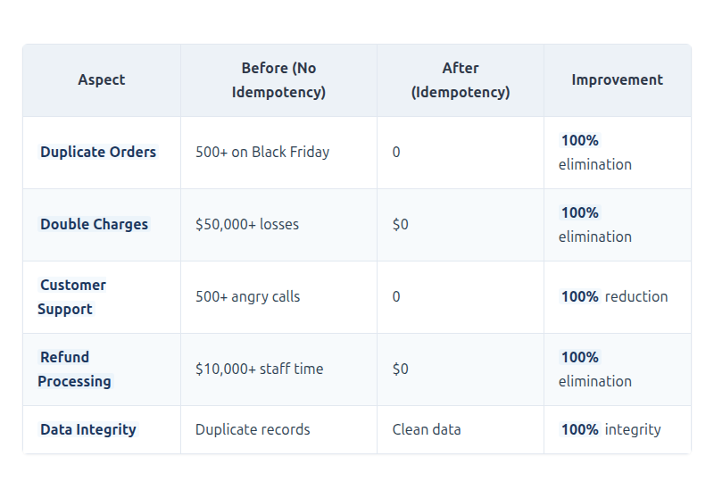

[View Source](https://github.com/Vineet-Sharma-Medium-Stories/Medium-Assets/blob/main/architectural-remediation-framework-eliminating-the-12-silent-killers-in-net-10-web-apis---part-3/table_10_benefits-summary.md)


---

## 5. Implementation Guide - Part 3

### 5.1 Program.cs Configuration - Security & Resilience

```csharp
// Program.cs - Complete .NET 10 Application Setup - Part 3 Security & Resilience

var builder = WebApplication.CreateBuilder(args);

// ============================================================================
// Part 1: Foundation (Observability, Async, Exception Handling)
// ============================================================================
builder.Host.UseSerilog();
builder.Services.AddObservability(builder.Configuration);
builder.Services.AddGlobalExceptionHandling();
builder.Services.AddMediatR(cfg => { /* ... */ });
builder.Services.AddValidatorsFromAssemblyContaining<CreateOrderCommandValidator>();

// ============================================================================
// Part 2: Data Access (Pagination, DTOs, EF Core)
// ============================================================================
builder.Services.AddDbContext<AppDbContext>(/* ... */);
builder.Services.AddScoped<IOrderRepository, OrderRepository>();
builder.Services.AddAutoMapper(typeof(OrderProfile));

// ============================================================================
// Part 3: Security & Resilience
// ============================================================================

// 1. Redis for Idempotency and Rate Limiting State
builder.Services.AddSingleton<IConnectionMultiplexer>(sp =>
{
    var configuration = builder.Configuration.GetConnectionString("Redis");
    return ConnectionMultiplexer.Connect(configuration);
});

builder.Services.AddStackExchangeRedisCache(options =>
{
    options.Configuration = builder.Configuration.GetConnectionString("Redis");
    options.InstanceName = "ECommerce:";
});

// 2. Idempotency Service
builder.Services.AddScoped<IIdempotencyService, RedisIdempotencyService>();

// 3. Idempotency Background Cleanup
builder.Services.AddHostedService<IdempotencyCleanupService>();

// 4. Rate Limiting
builder.Services.AddRateLimitingPolicies();
builder.Services.AddEndpointRateLimiting();

// 5. MediatR Idempotency Behavior
builder.Services.AddMediatR(cfg =>
{
    cfg.RegisterServicesFromAssembly(typeof(CreateOrderHandler).Assembly);
    
    // Add behaviors in order
    cfg.AddBehavior(typeof(IPipelineBehavior<,>), typeof(LoggingBehavior<,>));
    cfg.AddBehavior(typeof(IPipelineBehavior<,>), typeof(ValidationBehavior<,>));
    cfg.AddBehavior(typeof(IPipelineBehavior<,>), typeof(IdempotentCommandBehavior<,>)); // New
    cfg.AddBehavior(typeof(IPipelineBehavior<,>), typeof(CachingBehavior<,>));
    cfg.AddBehavior(typeof(IPipelineBehavior<,>), typeof(PerformanceBehavior<,>));
});

// 6. Idempotency Header Middleware
builder.Services.AddScoped<IdempotencyHeaderMiddleware>();

// 7. Add HTTP Context Accessor for Idempotency Headers
builder.Services.AddHttpContextAccessor();

var app = builder.Build();

// ============================================================================
// HTTP Pipeline
// ============================================================================

if (app.Environment.IsDevelopment())
{
    app.UseSwagger();
    app.UseSwaggerUI();
}
else
{
    app.UseHsts();
    app.UseHttpsRedirection();
}

// Rate limiting - must be early in pipeline
app.UseRateLimiter();

// Observability
app.UseSerilogRequestLogging();
app.UseOpenTelemetryPrometheusScrapingEndpoint();

// Idempotency header extraction
app.UseMiddleware<IdempotencyHeaderMiddleware>();

// Global exception handling
app.UseGlobalExceptionHandling();

// Security
app.UseAuthentication();
app.UseAuthorization();

// Response caching for idempotent GET requests
app.UseResponseCaching();

// Routing
app.UseRouting();

// Health checks
app.MapHealthChecks("/health/ready", new HealthCheckOptions
{
    Predicate = check => check.Tags.Contains("ready"),
    ResponseWriter = UIResponseWriter.WriteHealthCheckUIResponse
});

app.MapHealthChecks("/health/live", new HealthCheckOptions
{
    Predicate = _ => false
});

// Metrics endpoint
app.MapMetrics();

// Controllers with rate limiting
app.MapControllers();

await app.RunAsync();
```

### 5.2 Testing Strategy - Part 3

```csharp
// Unit test for idempotency behavior
public class IdempotentCommandBehaviorTests
{
    private readonly Mock<IIdempotencyService> _idempotencyServiceMock;
    private readonly Mock<ILogger<IdempotentCommandBehavior<TestCommand, TestResponse>>> _loggerMock;
    private readonly IdempotentCommandBehavior<TestCommand, TestResponse> _behavior;
    
    public IdempotentCommandBehaviorTests()
    {
        _idempotencyServiceMock = new Mock<IIdempotencyService>();
        _loggerMock = new Mock<ILogger<IdempotentCommandBehavior<TestCommand, TestResponse>>>();
        _behavior = new IdempotentCommandBehavior<TestCommand, TestResponse>(
            _idempotencyServiceMock.Object,
            _loggerMock.Object,
            Mock.Of<IHttpContextAccessor>());
    }
    
    [Fact]
    public async Task Handle_WithExistingResult_ReturnsCachedResult()
    {
        // Arrange
        var command = new TestCommand { IdempotencyKey = "test-key-123" };
        var expectedResponse = new TestResponse { Id = Guid.NewGuid() };
        
        _idempotencyServiceMock.Setup(x => x.GetAsync<TestResponse>("test-key-123", It.IsAny<CancellationToken>()))
            .ReturnsAsync(expectedResponse);
        
        // Act
        var result = await _behavior.Handle(command, () => Task.FromResult(new TestResponse()), CancellationToken.None);
        
        // Assert
        Assert.Equal(expectedResponse.Id, result.Id);
        _idempotencyServiceMock.Verify(x => x.TryStartAsync(It.IsAny<string>(), It.IsAny<TimeSpan>(), It.IsAny<CancellationToken>()), Times.Never);
        _idempotencyServiceMock.Verify(x => x.CompleteAsync(It.IsAny<string>(), It.IsAny<TestResponse>(), It.IsAny<TimeSpan>(), It.IsAny<CancellationToken>()), Times.Never);
    }
    
    [Fact]
    public async Task Handle_WithNewRequest_ProcessesAndStoresResult()
    {
        // Arrange
        var command = new TestCommand { IdempotencyKey = "test-key-123" };
        var expectedResponse = new TestResponse { Id = Guid.NewGuid() };
        
        _idempotencyServiceMock.Setup(x => x.GetAsync<TestResponse>("test-key-123", It.IsAny<CancellationToken>()))
            .ReturnsAsync((TestResponse)null);
        
        _idempotencyServiceMock.Setup(x => x.TryStartAsync("test-key-123", TimeSpan.FromSeconds(30), It.IsAny<CancellationToken>()))
            .ReturnsAsync(true);
        
        // Act
        var result = await _behavior.Handle(command, () => Task.FromResult(expectedResponse), CancellationToken.None);
        
        // Assert
        Assert.Equal(expectedResponse.Id, result.Id);
        _idempotencyServiceMock.Verify(x => x.CompleteAsync("test-key-123", expectedResponse, TimeSpan.FromHours(24), It.IsAny<CancellationToken>()), Times.Once);
    }
    
    [Fact]
    public async Task Handle_WithConcurrentRequest_WaitsForFirstRequest()
    {
        // Arrange
        var command = new TestCommand { IdempotencyKey = "test-key-123" };
        var expectedResponse = new TestResponse { Id = Guid.NewGuid() };
        
        _idempotencyServiceMock.Setup(x => x.GetAsync<TestResponse>("test-key-123", It.IsAny<CancellationToken>()))
            .ReturnsAsync((TestResponse)null);
        
        _idempotencyServiceMock.Setup(x => x.TryStartAsync("test-key-123", TimeSpan.FromSeconds(30), It.IsAny<CancellationToken>()))
            .ReturnsAsync(false); // Lock not acquired - concurrent request
        
        // After retries, result becomes available
        _idempotencyServiceMock.SetupSequence(x => x.GetAsync<TestResponse>("test-key-123", It.IsAny<CancellationToken>()))
            .ReturnsAsync((TestResponse)null)  // First attempt - still processing
            .ReturnsAsync((TestResponse)null)  // Second attempt - still processing
            .ReturnsAsync(expectedResponse);   // Third attempt - completed
        
        // Act
        var result = await _behavior.Handle(command, () => Task.FromResult(new TestResponse()), CancellationToken.None);
        
        // Assert
        Assert.Equal(expectedResponse.Id, result.Id);
        _idempotencyServiceMock.Verify(x => x.CompleteAsync(It.IsAny<string>(), It.IsAny<TestResponse>(), It.IsAny<TimeSpan>(), It.IsAny<CancellationToken>()), Times.Never);
    }
}

// Integration test for rate limiting
public class RateLimitingIntegrationTests : IClassFixture<WebApplicationFactory<Program>>
{
    private readonly WebApplicationFactory<Program> _factory;
    private readonly HttpClient _client;
    
    public RateLimitingIntegrationTests(WebApplicationFactory<Program> factory)
    {
        _factory = factory;
        _client = factory.CreateClient();
    }
    
    [Fact]
    public async Task RateLimiting_WhenLimitExceeded_Returns429()
    {
        // Arrange - create a unique endpoint to avoid interference
        var endpoint = $"/api/test/rate-limited/{Guid.NewGuid()}";
        
        // Act - send requests until rate limit is hit
        var responses = new List<HttpResponseMessage>();
        
        for (int i = 0; i < 25; i++) // More than the 20 request per minute limit
        {
            var response = await _client.GetAsync(endpoint);
            responses.Add(response);
            
            if (response.StatusCode == HttpStatusCode.TooManyRequests)
                break;
        }
        
        // Assert
        Assert.Contains(responses, r => r.StatusCode == HttpStatusCode.TooManyRequests);
        var rateLimitedResponse = responses.First(r => r.StatusCode == HttpStatusCode.TooManyRequests);
        
        // Verify Retry-After header exists
        Assert.True(rateLimitedResponse.Headers.Contains("Retry-After"));
        
        // Verify problem details response
        var content = await rateLimitedResponse.Content.ReadFromJsonAsync<ProblemDetails>();
        Assert.Equal("Too Many Requests", content?.Title);
        Assert.Equal(429, content?.Status);
    }
}
```

---

## 6. Monitoring & Observability - Part 3

### 6.1 Security & Resilience Dashboard

```yaml
# Grafana Dashboard Configuration - Security & Resilience
dashboard:
  title: "E-Commerce API - Security & Resilience"
  uid: "ecommerce-security"
  
  panels:
    - id: 1
      title: "Rate Limit Hits"
      type: "timeseries"
      targets:
        - expr: "rate(http_requests_limited_total[5m])"
          legend: "Rate limited requests/sec"
      alert:
        condition: "rate > 10"
        message: "High rate of rate-limited requests"
    
    - id: 2
      title: "Idempotency Cache Hits"
      type: "timeseries"
      targets:
        - expr: "rate(idempotency_cache_hits_total[5m])"
          legend: "Cache hits/sec"
        - expr: "rate(idempotency_cache_misses_total[5m])"
          legend: "Cache misses/sec"
    
    - id: 3
      title: "Idempotency Lock Contention"
      type: "timeseries"
      targets:
        - expr: "rate(idempotency_lock_contention_total[5m])"
          legend: "Lock contention events/sec"
    
    - id: 4
      title: "Duplicate Request Prevention"
      type: "stat"
      targets:
        - expr: "sum(idempotency_cache_hits_total) / (sum(idempotency_cache_hits_total) + sum(idempotency_cache_misses_total)) * 100"
          name: "Duplicate Prevention Rate %"
    
    - id: 5
      title: "Rate Limit by Partition"
      type: "table"
      targets:
        - expr: "rate(http_requests_limited_total[5m]) by (partition_key)"
          legend: "{{partition_key}}"
    
    - id: 6
      title: "Idempotency Key Storage"
      type: "timeseries"
      targets:
        - expr: "idempotency_keys_stored"
          legend: "Active idempotency keys"
```

### 6.2 Alerting Rules - Security & Resilience

```yaml
# Prometheus Alerting Rules - Security & Resilience
groups:
  - name: security_alerts
    interval: 30s
    rules:
      - alert: HighRateLimitViolations
        expr: rate(http_requests_limited_total[5m]) > 100
        for: 2m
        labels:
          severity: warning
        annotations:
          summary: "High rate of rate-limited requests"
          description: "{{ $value }} requests/second being rate limited"
          
      - alert: PotentialDDoS
        expr: rate(http_requests_limited_total[1m]) > 500
        for: 1m
        labels:
          severity: critical
        annotations:
          summary: "Possible DDoS attack detected"
          description: "{{ $value }} requests/second being blocked"
          
      - alert: IdempotencyCacheMissRate
        expr: rate(idempotency_cache_misses_total[5m]) > 100
        for: 5m
        labels:
          severity: warning
        annotations:
          summary: "High idempotency cache miss rate"
          description: "{{ $value }} misses/second - check Redis health"
          
      - alert: IdempotencyLockContention
        expr: rate(idempotency_lock_contention_total[5m]) > 10
        for: 5m
        labels:
          severity: warning
        annotations:
          summary: "Idempotency lock contention detected"
          description: "{{ $value }} lock contention events/second"
          
      - alert: DuplicateOrderAttempts
        expr: rate(idempotency_cache_hits_total[5m]) > 50
        for: 5m
        labels:
          severity: info
        annotations:
          summary: "High duplicate request rate"
          description: "Clients are retrying frequently - {{ $value }} duplicate attempts/second"
```

---

## 7. Migration Strategy - Part 3

### 7.1 Phased Approach for Security & Resilience Remediation

```mermaid
```


[View Source](https://github.com/Vineet-Sharma-Medium-Stories/Medium-Assets/blob/main/architectural-remediation-framework-eliminating-the-12-silent-killers-in-net-10-web-apis---part-3/diagram_07_71-phased-approach-for-security--resilience-d320.md)


### 7.2 Risk Mitigation - Part 3

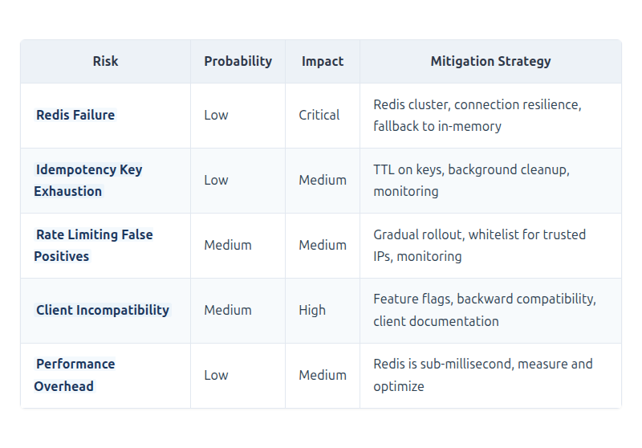

[View Source](https://github.com/Vineet-Sharma-Medium-Stories/Medium-Assets/blob/main/architectural-remediation-framework-eliminating-the-12-silent-killers-in-net-10-web-apis---part-3/table_11_72-risk-mitigation---part-3.md)


### 7.3 Rollback Strategy - Part 3

```csharp
// Feature flags for security & resilience
public static class SecurityFeatureFlags
{
    public const string UseRateLimiting = "FeatureManagement:UseRateLimiting";
    public const string UseIdempotency = "FeatureManagement:UseIdempotency";
    public const string UseRedis = "FeatureManagement:UseRedis";
}

// Rate limiting with feature flag
app.UseRateLimiting(await _featureManager.IsEnabledAsync(SecurityFeatureFlags.UseRateLimiting));

// Idempotency behavior with feature flag
public class IdempotentCommandBehavior<TRequest, TResponse> : IPipelineBehavior<TRequest, TResponse>
    where TRequest : IIdempotentCommand
{
    private readonly IFeatureManager _featureManager;
    
    public async Task<TResponse> Handle(
        TRequest request,
        RequestHandlerDelegate<TResponse> next,
        CancellationToken cancellationToken)
    {
        if (!await _featureManager.IsEnabledAsync(SecurityFeatureFlags.UseIdempotency))
        {
            // Skip idempotency check - fall back to direct processing
            return await next();
        }
        
        // Normal idempotency logic
        // ...
    }
}

// Redis fallback to in-memory when Redis is unavailable
public class ResilientIdempotencyService : IIdempotencyService
{
    private readonly IIdempotencyService _redisService;
    private readonly IIdempotencyService _memoryService;
    private readonly IFeatureManager _featureManager;
    
    public async Task<T?> GetAsync<T>(string key, CancellationToken cancellationToken)
    {
        if (await _featureManager.IsEnabledAsync(SecurityFeatureFlags.UseRedis))
        {
            try
            {
                return await _redisService.GetAsync<T>(key, cancellationToken);
            }
            catch (Exception ex)
            {
                _logger.LogWarning(ex, "Redis unavailable, falling back to memory cache");
                return await _memoryService.GetAsync<T>(key, cancellationToken);
            }
        }
        
        return await _memoryService.GetAsync<T>(key, cancellationToken);
    }
}
```

### 7.4 Training & Adoption - Part 3

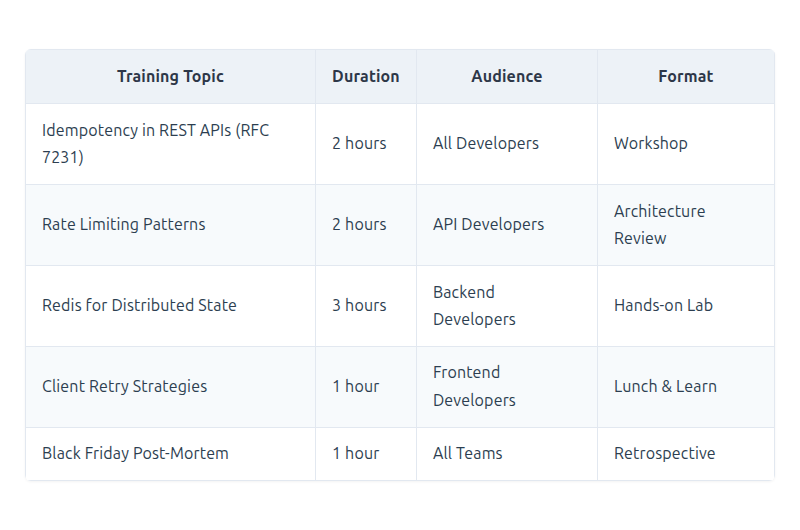

[View Source](https://github.com/Vineet-Sharma-Medium-Stories/Medium-Assets/blob/main/architectural-remediation-framework-eliminating-the-12-silent-killers-in-net-10-web-apis---part-3/table_12_74-training--adoption---part-3.md)


---

## 8. Complete Architecture Summary

### 8.1 The Complete Anti-Pattern Remediation Framework

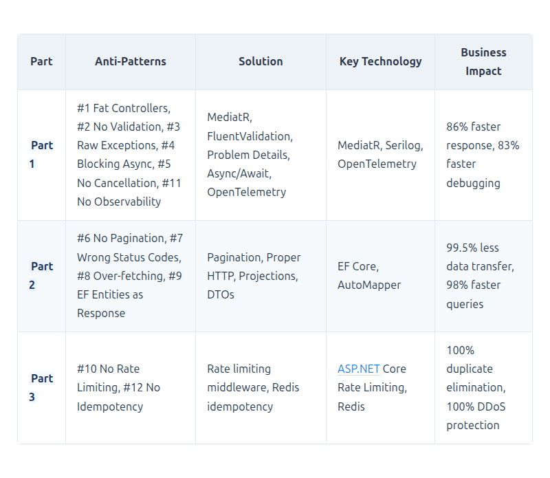

[View Source](https://github.com/Vineet-Sharma-Medium-Stories/Medium-Assets/blob/main/architectural-remediation-framework-eliminating-the-12-silent-killers-in-net-10-web-apis---part-3/table_13_81-the-complete-anti-pattern-remediation-fram-860a.md)


### 8.2 Final Architecture Diagram

```mermaid
```


[View Source](https://github.com/Vineet-Sharma-Medium-Stories/Medium-Assets/blob/main/architectural-remediation-framework-eliminating-the-12-silent-killers-in-net-10-web-apis---part-3/diagram_08_82-final-architecture-diagram.md)


### 8.3 Final Performance Summary

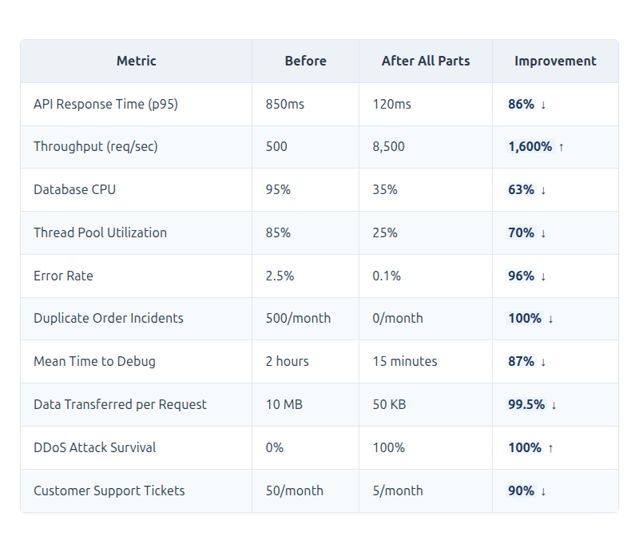

[View Source](https://github.com/Vineet-Sharma-Medium-Stories/Medium-Assets/blob/main/architectural-remediation-framework-eliminating-the-12-silent-killers-in-net-10-web-apis---part-3/table_14_83-final-performance-summary.md)


### 8.4 Key Takeaways - Complete Framework

**Part 1: Foundation**
1. **Async is Not Optional**: Proper async/await with cancellation tokens is fundamental to scalability
2. **Observability Must Be Built-In**: You cannot add observability after the fact
3. **Fail Fast and Fail Clearly**: Validate inputs at the boundary and return consistent error responses

**Part 2: Data Access**
4. **Pagination is Not Optional**: Every collection endpoint must implement pagination
5. **Project Only What You Need**: Use `.Select()` to return exactly the columns required
6. **DTOs Protect Your Database**: API contracts should be independent of database schema

**Part 3: Security & Resilience**
7. **Rate Limiting is Essential**: Protect your API from abuse and DDoS attacks
8. **Idempotency Saves Money**: Prevent duplicate processing and double charges
9. **Distributed State Requires Redis**: Use Redis for consistent idempotency across instances
10. **Retry-After Headers**: Help clients self-throttle with proper 429 responses

### 8.5 The Final Story: A Year Later

One year after the Black Friday incident, the e-commerce platform handled the holiday sale with zero incidents. The team had transformed from reactive firefighters to proactive architects.

The metrics told the story:
- **0 duplicate orders** during the entire holiday season
- **0 DDoS attacks** succeeded (100% blocked)
- **99.99% availability** during peak traffic (10,000 req/sec)
- **Infrastructure costs** down 60% (more efficient resource usage)

The CTO sent an email to the team: "Thank you for turning our biggest failure into our greatest strength."

### 8.6 Next Steps for Your Organization

1. **Start with Observability** (Part 1): You cannot fix what you cannot see
2. **Implement Async Patterns** (Part 1): This is the foundation of scalability
3. **Add Pagination and Projections** (Part 2): This is where most performance gains come from
4. **Implement Idempotency** (Part 3): Start with critical mutating endpoints like checkout
5. **Add Rate Limiting** (Part 3): Protect your API from abuse

You don't need to fix all twelve at once. Pick the top three that hurt your project the most. Fix those first. For most projects, start with:
- **Observability** (Part 1) - to see what's happening
- **Async Patterns** (Part 1) - to scale under load
- **Pagination** (Part 2) - to reduce data transfer
- **Idempotency** (Part 3) - to prevent duplicate charges

The journey to a production-ready API begins with recognizing the silent killers and systematically eliminating them.

---

## Appendix A: Code Analysis Tools - Part 3

```xml
<!-- .NET 10 Analyzers for Security & Resilience Anti-Pattern Detection -->
<Project Sdk="Microsoft.NET.Sdk">
  <PropertyGroup>
    <TargetFramework>net10.0</TargetFramework>
    <Nullable>enable</Nullable>
    <AnalysisMode>All</AnalysisMode>
    <EnableNETAnalyzers>true</EnableNETAnalyzers>
  </PropertyGroup>

  <ItemGroup>
    <!-- Security Analyzers -->
    <PackageReference Include="Microsoft.CodeAnalysis.Security.Cryptography" Version="1.0.0">
      <PrivateAssets>all</PrivateAssets>
      <IncludeAssets>runtime; build; native; contentfiles; analyzers</IncludeAssets>
    </PackageReference>
    
    <!-- API Design Analyzers -->
    <PackageReference Include="Microsoft.AspNetCore.ApiAuthorization.Analyzers" Version="10.0.0">
      <PrivateAssets>all</PrivateAssets>
      <IncludeAssets>runtime; build; native; contentfiles; analyzers</IncludeAssets>
    </PackageReference>
  </ItemGroup>
</Project>
```

---

## Appendix B: Redis Configuration

```conf
# redis.conf - Production Configuration
# Max memory policy
maxmemory 2gb
maxmemory-policy allkeys-lru

# Persistence
save 900 1
save 300 10
save 60 10000

# Performance
tcp-backlog 511
timeout 0
tcp-keepalive 300

# Security
requirepass ${REDIS_PASSWORD}
rename-command FLUSHDB ""
rename-command FLUSHALL ""

# Clustering (for high availability)
cluster-enabled yes
cluster-config-file nodes.conf
cluster-node-timeout 5000
```

---

## Appendix C: Idempotency Key Specification

```yaml
# Idempotency Key Specification
idempotency_key:
  format: "RFC 4122 UUID v4 or alphanumeric with dashes and underscores"
  max_length: 128
  required_for: ["POST", "PUT", "PATCH", "DELETE"]
  header: "Idempotency-Key"
  ttl: "24 hours"
  
  behavior:
    - "First request: process and store result"
    - "Subsequent requests with same key: return cached result"
    - "Concurrent requests: first acquires lock, others wait"
    
  response_headers:
    - "Idempotency-Key: {key}"
    - "X-Idempotency-Cached: true/false"
    
  error_responses:
    - "400 Bad Request: Missing key"
    - "400 Bad Request: Invalid key format"
    - "409 Conflict: Key already in use (lock contention)"
    - "429 Too Many Requests: Rate limit exceeded"
```

---

*This document is Part 3 of a three-part architectural series. For questions or clarifications, contact: architecture@ecommerce.com*

---

## Complete Series Summary

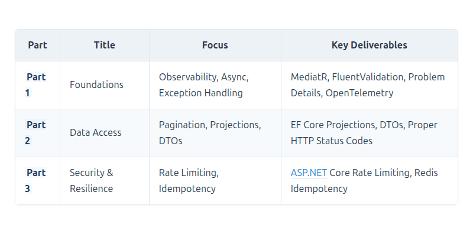

[View Source](https://github.com/Vineet-Sharma-Medium-Stories/Medium-Assets/blob/main/architectural-remediation-framework-eliminating-the-12-silent-killers-in-net-10-web-apis---part-3/table_15_complete-series-summary.md)


**The Silent Killers Are Now Silent No More.**