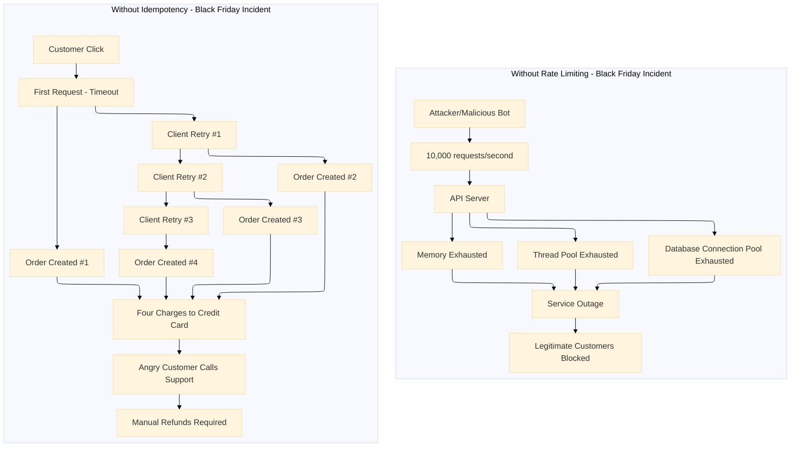

# diagram_01_21-attack-surface-without-protection-0e22

```mermaid
---
config:
  theme: base
  layout: elk
---
flowchart TD
    subgraph "Without Rate Limiting - Black Friday Incident"
        A[Attacker/Malicious Bot] --> B[10,000 requests/second]
        B --> C[API Server]
        C --> D[Database Connection Pool Exhausted]
        C --> E[Thread Pool Exhausted]
        C --> F[Memory Exhausted]
        D & E & F --> G[Service Outage]
        G --> H[Legitimate Customers Blocked]
    end
    
    subgraph "Without Idempotency - Black Friday Incident"
        I[Customer Click] --> J[First Request - Timeout]
        J --> K[Client Retry #1]
        K --> L[Client Retry #2]
        L --> M[Client Retry #3]
        
        J --> N[Order Created #1]
        K --> O[Order Created #2]
        L --> P[Order Created #3]
        M --> Q[Order Created #4]
        
        N & O & P & Q --> R[Four Charges to Credit Card]
        R --> S[Angry Customer Calls Support]
        S --> T[Manual Refunds Required]
    end
```
