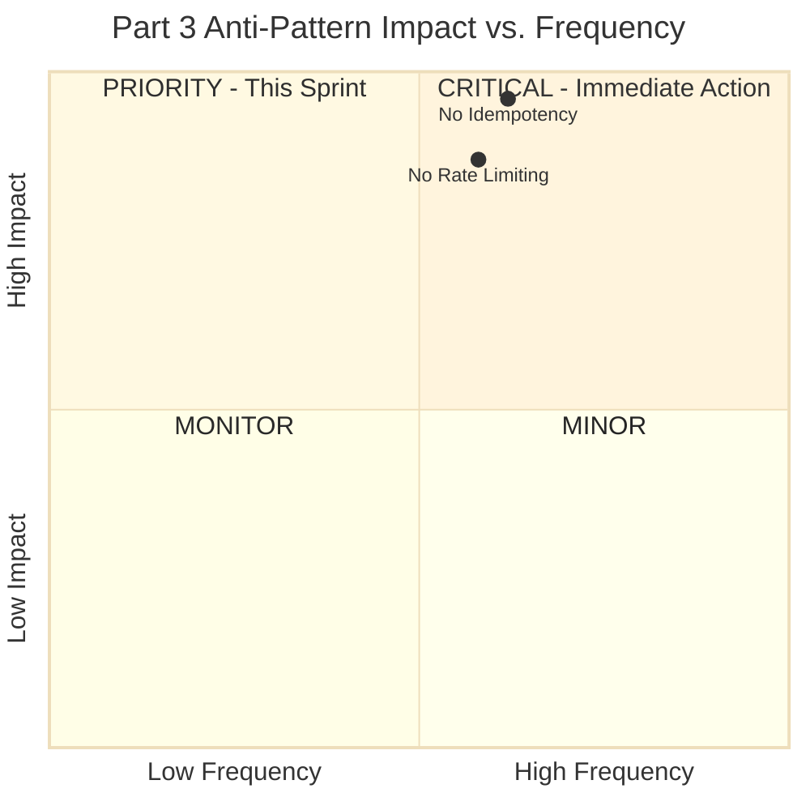

# diagram_02_22-anti-pattern-severity-matrix---part-3-focu-e27c

```mermaid
---
config:
  theme: base
  layout: elk
---
quadrantChart
    title Part 3 Anti-Pattern Impact vs. Frequency
    x-axis "Low Frequency" --> "High Frequency"
    y-axis "Low Impact" --> "High Impact"
    quadrant-1 "CRITICAL - Immediate Action"
    quadrant-2 "PRIORITY - This Sprint"
    quadrant-3 "MONITOR"
    quadrant-4 "MINOR"
    
    "No Idempotency": [0.62, 0.96]
    "No Rate Limiting": [0.58, 0.87]
```
