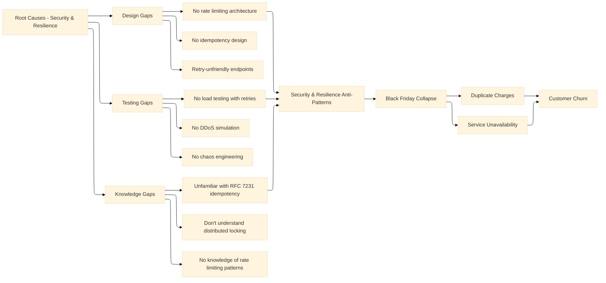

# diagram_03_23-root-cause-analysis---security--resilienc-7c58

```mermaid
---
config:
  theme: base
  layout: elk
---
flowchart LR
    A[Root Causes - Security & Resilience] --> B[Design Gaps]
    A --> C[Testing Gaps]
    A --> D[Knowledge Gaps]
    
    B --> B1[No rate limiting architecture]
    B --> B2[No idempotency design]
    B --> B3[Retry-unfriendly endpoints]
    
    C --> C1[No load testing with retries]
    C --> C2[No DDoS simulation]
    C --> C3[No chaos engineering]
    
    D --> D1[Unfamiliar with RFC 7231 idempotency]
    D --> D2[Don't understand distributed locking]
    D --> D3[No knowledge of rate limiting patterns]
    
    B1 & C1 & D1 --> E[Security & Resilience Anti-Patterns]
    E --> F[Black Friday Collapse]
    
    F --> G[Duplicate Charges]
    F --> H[Service Unavailability]
    G & H --> I[Customer Churn]
```
