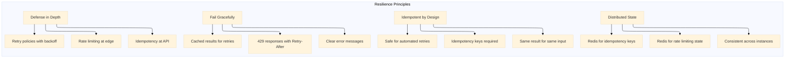

# diagram_04_31-core-principles-for-part-3

```mermaid
---
config:
  theme: base
  layout: elk
---
graph TD
    subgraph "Resilience Principles"
        A[Defense in Depth] --> A1[Rate limiting at edge]
        A --> A2[Idempotency at API]
        A --> A3[Retry policies with backoff]
        
        B[Fail Gracefully] --> B1[429 responses with Retry-After]
        B --> B2[Clear error messages]
        B --> B3[Cached results for retries]
        
        C[Distributed State] --> C1[Redis for idempotency keys]
        C --> C2[Redis for rate limiting state]
        C --> C3[Consistent across instances]
        
        D[Idempotent by Design] --> D1[Idempotency keys required]
        D --> D2[Same result for same input]
        D --> D3[Safe for automated retries]
    end
```
