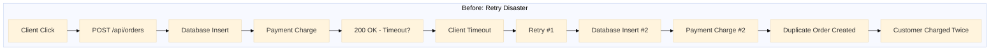

# diagram_05_before-remediation-the-checkout-flow-looked-like-d9dd

```mermaid
---
config:
  theme: base
  layout: elk
---
flowchart LR
    subgraph "Before: Retry Disaster"
        A[Client Click] --> B[POST /api/orders]
        B --> C[Database Insert]
        C --> D[Payment Charge]
        D --> E[200 OK - Timeout?]
        
        E --> F[Client Timeout]
        F --> G[Retry #1]
        G --> H[Database Insert #2]
        H --> I[Payment Charge #2]
        I --> J[Duplicate Order Created]
        
        J --> K[Customer Charged Twice]
    end
```
