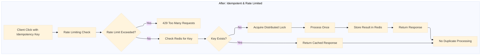

# diagram_06_after-remediation-the-checkout-flow-becomes-1584

```mermaid
---
config:
  theme: base
  layout: elk
---
flowchart LR
    subgraph "After: Idempotent & Rate Limited"
        A[Client Click with Idempotency Key] --> B[Rate Limiting Check]
        
        B --> C{Rate Limit Exceeded?}
        C -->|Yes| D[429 Too Many Requests]
        C -->|No| E[Check Redis for Key]
        
        E --> F{Key Exists?}
        F -->|Yes| G[Return Cached Response]
        F -->|No| H[Acquire Distributed Lock]
        
        H --> I[Process Once]
        I --> J[Store Result in Redis]
        J --> K[Return Response]
        
        G --> L[No Duplicate Processing]
        K --> L
    end
```
