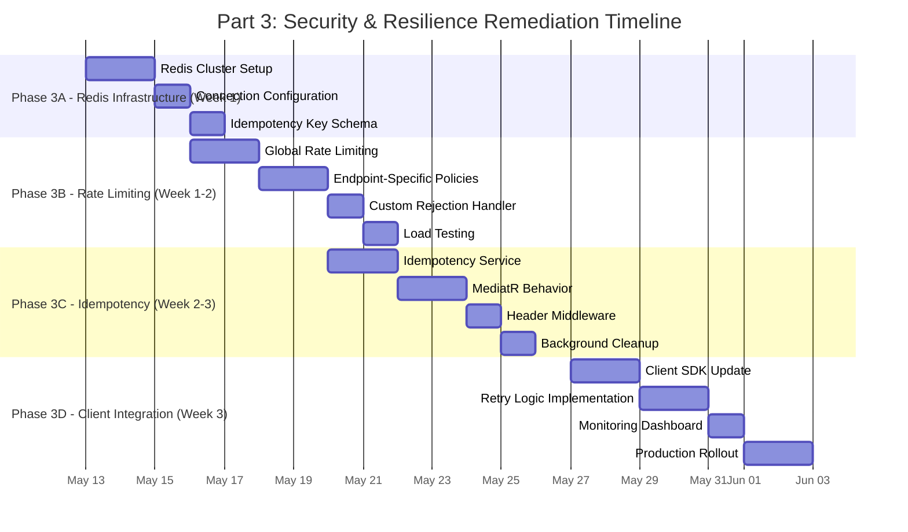

# diagram_07_71-phased-approach-for-security--resilience-d320

```mermaid

gantt
    title Part 3: Security & Resilience Remediation Timeline
    dateFormat YYYY-MM-DD
    axisFormat %b %d
    
    section Phase 3A - Redis Infrastructure (Week 1)
    Redis Cluster Setup           :phase3a1, 2026-05-13, 2d
    Connection Configuration      :phase3a2, after phase3a1, 1d
    Idempotency Key Schema        :phase3a3, after phase3a2, 1d
    
    section Phase 3B - Rate Limiting (Week 1-2)
    Global Rate Limiting          :phase3b1, 2026-05-16, 2d
    Endpoint-Specific Policies    :phase3b2, after phase3b1, 2d
    Custom Rejection Handler      :phase3b3, after phase3b2, 1d
    Load Testing                  :phase3b4, after phase3b3, 1d
    
    section Phase 3C - Idempotency (Week 2-3)
    Idempotency Service           :phase3c1, 2026-05-20, 2d
    MediatR Behavior              :phase3c2, after phase3c1, 2d
    Header Middleware             :phase3c3, after phase3c2, 1d
    Background Cleanup            :phase3c4, after phase3c3, 1d
    
    section Phase 3D - Client Integration (Week 3)
    Client SDK Update             :phase3d1, 2026-05-27, 2d
    Retry Logic Implementation    :phase3d2, after phase3d1, 2d
    Monitoring Dashboard          :phase3d3, after phase3d2, 1d
    Production Rollout            :phase3d4, after phase3d3, 2d
```
