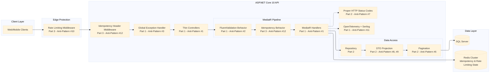

# diagram_08_82-final-architecture-diagram

```mermaid
---
config:
  theme: base
  layout: elk
---
flowchart LR
    subgraph "Client Layer"
        Client[Web/Mobile Clients]
    end
    
    subgraph "Edge Protection"
        RateLimit[Rate Limiting Middleware<br/>Part 3 - Anti-Pattern #10]
    end
    
    subgraph "ASP.NET Core 10 API"
        IdempotencyMiddleware[Idempotency Header Middleware<br/>Part 3 - Anti-Pattern #12]
        ExceptionHandler[Global Exception Handler<br/>Part 1 - Anti-Pattern #3]
        Controller[Thin Controllers<br/>Part 1 - Anti-Pattern #1]
        
        subgraph "MediatR Pipeline"
            Validation[FluentValidation Behavior<br/>Part 1 - Anti-Pattern #2]
            Idempotency[Idempotency Behavior<br/>Part 3 - Anti-Pattern #12]
            Handler[MediatR Handlers<br/>Part 1 - Anti-Pattern #1]
        end
        
        subgraph "Data Access"
            Repo[Repository<br/>Part 2]
            Projection[DTO Projection<br/>Part 2 - Anti-Pattern #8, #9]
            Pagination[Pagination<br/>Part 2 - Anti-Pattern #6]
        end
        
        Observability[OpenTelemetry + Serilog<br/>Part 1 - Anti-Pattern #11]
        StatusCodes[Proper HTTP Status Codes<br/>Part 2 - Anti-Pattern #7]
    end
    
    subgraph "Data Layer"
        SQL[(SQL Server)]
        Redis[(Redis Cluster<br/>Idempotency & Rate Limiting State)]
    end
    
    Client --> RateLimit --> IdempotencyMiddleware --> ExceptionHandler --> Controller
    Controller --> Validation --> Idempotency --> Handler
    Handler --> Repo --> Projection --> Pagination --> SQL
    Handler --> Redis
    Handler -.-> Observability
    Handler -.-> StatusCodes
```
