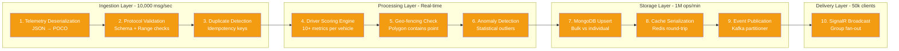

# ### 2.5 Performance Critical Paths in Vehixcare

```mermaid
flowchart LR
    subgraph "Ingestion Layer - 10,000 msg/sec"
        H1[1. Telemetry Deserialization<br/>JSON → POCO]
        H2[2. Protocol Validation<br/>Schema + Range checks]
        H3[3. Duplicate Detection<br/>Idempotency keys]
    end
    
    subgraph "Processing Layer - Real-time"
        H4[4. Driver Scoring Engine<br/>10+ metrics per vehicle]
        H5[5. Geo-fencing Check<br/>Polygon contains point]
        H6[6. Anomaly Detection<br/>Statistical outliers]
    end
    
    subgraph "Storage Layer - 1M ops/min"
        H7[7. MongoDB Upsert<br/>Bulk vs individual]
        H8[8. Cache Serialization<br/>Redis round-trip]
        H9[9. Event Publication<br/>Kafka partitioner]
    end
    
    subgraph "Delivery Layer - 50k clients"
        H10[10. SignalR Broadcast<br/>Group fan-out]
    end
    
    H1 --> H2 --> H3 --> H4
    H4 --> H5 --> H6
    H6 --> H7 --> H8 --> H9
    H9 --> H10
    
    classDef hotspot fill:#f39c12,color:white
    class H1,H2,H3,H4,H5,H6,H7,H8,H9,H10 hotspot
```
