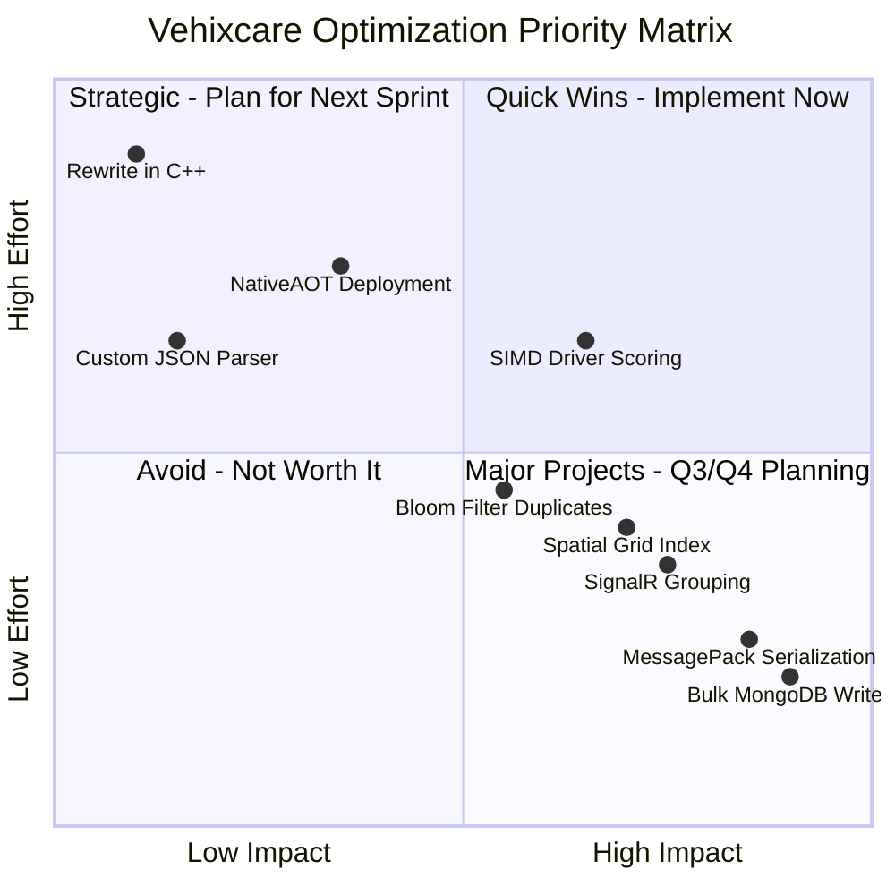

# ## 7.0 Optimization Priority Matrix for Vehixcare

```mermaid
quadrantChart
    title Vehixcare Optimization Priority Matrix
    x-axis "Low Impact" --> "High Impact"
    y-axis "Low Effort" --> "High Effort"
    quadrant-1 "Quick Wins - Implement Now"
    quadrant-2 "Strategic - Plan for Next Sprint"
    quadrant-3 "Avoid - Not Worth It"
    quadrant-4 "Major Projects - Q3/Q4 Planning"
    
    "MessagePack Serialization": [0.85, 0.25]
    "Bulk MongoDB Writes": [0.90, 0.20]
    "SignalR Grouping": [0.75, 0.35]
    "SIMD Driver Scoring": [0.65, 0.65]
    "Bloom Filter Duplicates": [0.55, 0.45]
    "Spatial Grid Index": [0.70, 0.40]
    "NativeAOT Deployment": [0.35, 0.75]
    "Custom JSON Parser": [0.15, 0.65]
    "Rewrite in C++": [0.10, 0.90]
```
