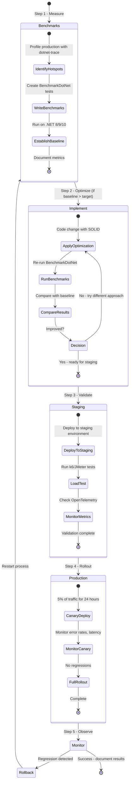

# ## 8.0 Production Rollout Strategy

```mermaid
stateDiagram-v2
    [*] --> Benchmarks: Step 1 - Measure
    
    state Benchmarks {
        [*] --> IdentifyHotspots: Profile production with dotnet-trace
        IdentifyHotspots --> WriteBenchmarks: Create BenchmarkDotNet tests
        WriteBenchmarks --> EstablishBaseline: Run on .NET 8/9/10
        EstablishBaseline --> [*]: Document metrics
    }
    
    Benchmarks --> Implement: Step 2 - Optimize (if baseline > target)
    
    state Implement {
        [*] --> ApplyOptimization: Code change with SOLID
        ApplyOptimization --> RunBenchmarks: Re-run BenchmarkDotNet
        RunBenchmarks --> CompareResults: Compare with baseline
        CompareResults --> Decision: Improved?
        Decision --> ApplyOptimization: No - try different approach
        Decision --> [*]: Yes - ready for staging
    }
    
    Implement --> Staging: Step 3 - Validate
    
    state Staging {
        [*] --> DeployToStaging: Deploy to staging environment
        DeployToStaging --> LoadTest: Run k6/JMeter tests
        LoadTest --> MonitorMetrics: Check OpenTelemetry
        MonitorMetrics --> [*]: Validation complete
    }
    
    Staging --> Production: Step 4 - Rollout
    
    state Production {
        [*] --> CanaryDeploy: 5% of traffic for 24 hours
        CanaryDeploy --> MonitorCanary: Monitor error rates, latency
        MonitorCanary --> FullRollout: No regressions
        FullRollout --> [*]: Complete
    }
    
    Production --> Monitor: Step 5 - Observe
    Monitor --> Rollback: Regression detected
    Rollback --> Benchmarks: Restart process
    Monitor --> [*]: Success - document results
```
