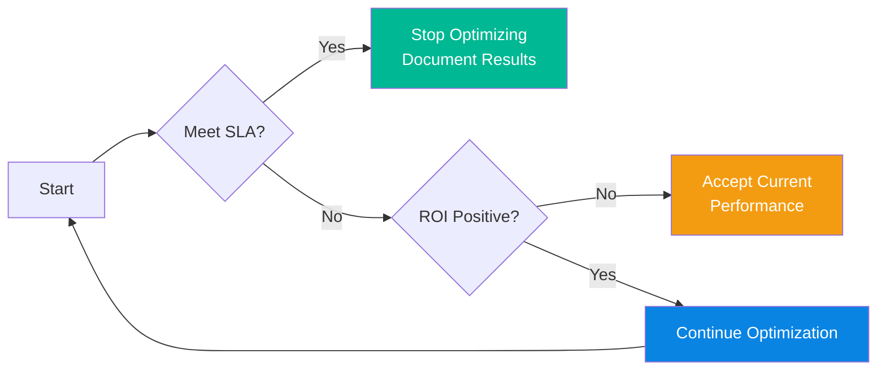

# ### 11.2 When to Stop Optimizing

```mermaid
flowchart LR
    A[Start] --> B{Meet SLA?}
    B -->|Yes| C[Stop Optimizing<br/>Document Results]
    B -->|No| D{ROI Positive?}
    D -->|No| E[Accept Current<br/>Performance]
    D -->|Yes| F[Continue Optimization]
    F --> A
    
    style C fill:#00b894,color:white
    style E fill:#f39c12,color:white
    style F fill:#0984e3,color:white
```
