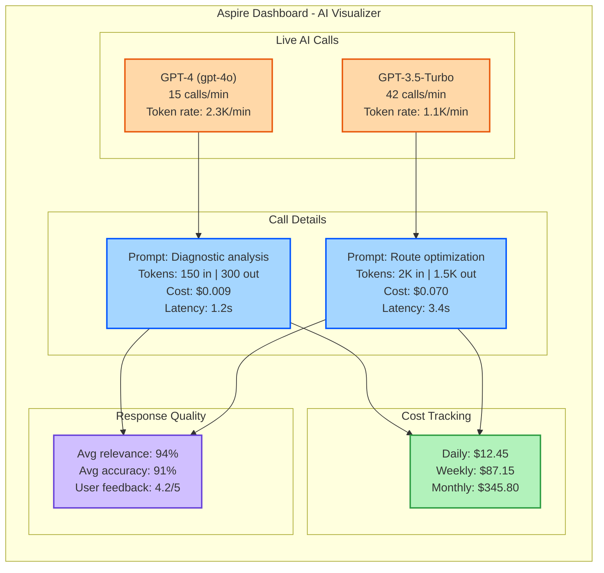
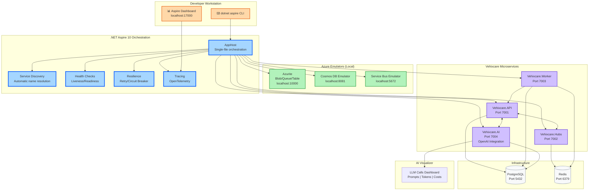

# .NET Aspire: CLI, AI Visualizer, OpenAI & Azure Emulator - C# 14 & .NET 10 Upgrade Journey

**Series:** .NET 10 & C# 14 Upgrade Journey | **Est. Read Time:** 20 minutes

---

## 🔷 .NET Aspire: The Cloud-Native Orchestration Revolution

.NET Aspire is Microsoft's opinionated, cloud-ready stack for building observable, production-ready distributed applications. With .NET 10, Aspire transforms from a simple orchestration tool into a complete cloud-native development platform. For Vehixcare's microservices architecture, Aspire provides the missing link between local development and production deployment.

**What's New in .NET Aspire (.NET 10)?**
- ✅ **CLI Improvements** – Unified command-line interface for all Aspire operations
- ✅ **File-Based AppHost Support** – Define entire distributed app in a single `.cs` file
- ✅ **Generative AI Visualizer** – Real-time visualization of LLM prompts and responses
- ✅ **OpenAI Integration** – Native SDK support for OpenAI GPT models
- ✅ **Azure Emulator Support** – Local Azure services with zero configuration
- ✅ **Better Distributed App Orchestration** – Service discovery, health checks, and resilience
- ✅ **Dashboard Enhancements** – Structured logging, traces, and metrics viewer

In this story, we'll orchestrate the **Vehixcare** microservices ecosystem using .NET Aspire 10, connecting API gateways, background workers, hubs, and AI services.

---

## 🚗 Vehixcare: AI-Powered Vehicle Care Platform

**What is Vehixcare?** A production-ready .NET ecosystem deployed in real-world vehicle fleet management. The platform processes thousands of telemetry data points per second, manages predictive maintenance schedules for 10,000+ vehicles, tracks complex trip logs across state lines, and orchestrates service center workflows with AI-powered diagnostic recommendations.

**Platform Microservices:**

| Service | Port | Responsibility |
|---------|------|---------------|
| `Vehixcare.API` | 7001 | REST endpoints, fleet management |
| `Vehixcare.Hubs` | 7002 | SignalR, real-time notifications |
| `Vehixcare.BackgroundServices` | 7003 | Telemetry processing, jobs |
| `Vehixcare.AI` | 7004 | OpenAI integration, diagnostics |
| `Vehixcare.Dashboard` | 7005 | Blazor admin dashboard |
| PostgreSQL | 5432 | Primary database |
| Redis | 6379 | Cache & message broker |
| Azure Storage Emulator | 10000 | Blob, queue, table storage |

**Series Mission:** Upgrade entire codebase from .NET 9 → **.NET 10 + C# 14**, implementing every new feature from the official roadmap.

📦 **Source:** [Vehixcare-API on GitLab](https://gitlab.com/mvineetsharma/Vehixcare-AI/Vehixcare-API)

---

## 📖 Story Navigation

- 🔸 EF Core JSON Complex Types – Flexible schemas
- 🔸 File-Based Apps – Rapid prototyping
- 🔸 Minimal API Validation – Cleaner endpoints
- 🔸 C# 14 field keyword – Better properties
- 🔸 Aspire Orchestration – Distributed apps
- 🔸 Blazor Hot Reload – Faster UI iteration
- 🔸 Runtime JIT & AVX10.2 – Maximum performance
- 🔸 Native AOT – Instant startup, small binaries

## 5.1 CLI Improvements

**The Problem:** Before .NET 10, Aspire CLI commands were fragmented across multiple tools (`dotnet aspire`, `dotnet run --project`, custom scripts). Developers needed to remember different command structures for different scenarios.

**The .NET 10 Solution:** Unified `dotnet aspire` CLI with subcommands for all operations – run, build, publish, dashboard, resources.

### Complete Implementation for Vehixcare

```bash
# ========================================================================
# .NET ASPIRE CLI COMMANDS (.NET 10)
# ========================================================================

# 1. CREATE a new Aspire application
dotnet new aspire-starter -n Vehixcare.Aspire

# 2. ADD service to Aspire app host
dotnet aspire add service Vehixcare.API --project ../Vehixcare.API/Vehixcare.API.csproj
dotnet aspire add service Vehixcare.Hubs --project ../Vehixcare.Hubs/Vehixcare.Hubs.csproj
dotnet aspire add service Vehixcare.AI --project ../Vehixcare.AI/Vehixcare.AI.csproj

# 3. ADD resource (database, cache, storage)
dotnet aspire add resource postgres -t database --name vehixcare-db
dotnet aspire add resource redis -t cache --name vehixcare-cache
dotnet aspire add resource azure-storage -t storage --name vehixcare-storage

# 4. RUN entire application (all services)
dotnet aspire run

# Output:
# 🚀 Starting Vehixcare Aspire application...
# 
# ┌─────────────────────────────────────────────────────────────────┐
# │ Vehixcare Aspire Dashboard                                      │
# │ URL: https://localhost:17000                                    │
# └─────────────────────────────────────────────────────────────────┘
# 
# Services:
#   ✅ Vehixcare.API → https://localhost:7001
#   ✅ Vehixcare.Hubs → https://localhost:7002
#   ✅ Vehixcare.AI → https://localhost:7004
#   ✅ PostgreSQL (vehixcare-db) → localhost:5432
#   ✅ Redis (vehixcare-cache) → localhost:6379
#   ✅ Azure Storage Emulator → localhost:10000

# 5. RUN with specific profile
dotnet aspire run --profile production

# 6. LIST all services and resources
dotnet aspire list

# Output:
# 📋 Aspire Resources:
# 
# Services:
#   Vehixcare.API (Running) → 7001
#   Vehixcare.Hubs (Running) → 7002
#   Vehixcare.BackgroundServices (Running) → 7003
#   Vehixcare.AI (Stopped) → 7004
# 
# Resources:
#   postgres: vehixcare-db (Healthy)
#   redis: vehixcare-cache (Healthy)
#   azure-storage: vehixcare-storage (Running)

# 7. PUBLISH for production
dotnet aspire publish --output ./publish --environment production

# 8. DEPLOY to Azure Container Apps
dotnet aspire deploy --target azure-container-apps --resource-group vehixcare-rg

# 9. OPEN dashboard
dotnet aspire dashboard

# 10. STOP all services
dotnet aspire stop

# 11. VIEW logs
dotnet aspire logs --service Vehixcare.API --tail 100

# 12. SCALE services
dotnet aspire scale Vehixcare.BackgroundServices --replicas 3

# 13. ADD environment variable to service
dotnet aspire config set Vehixcare.API OpenAI__ApiKey --secret

# 14. CONNECT to resource (interactive shell)
dotnet aspire connect vehixcare-db
# Opens psql shell to the database

# 15. GENERATE manifest for Kubernetes
dotnet aspire manifest --output k8s-manifest.yaml
```

### Aspire CLI in Action: Vehixcare Deployment Script

```bash
#!/bin/bash
# File: deploy-vehixcare.sh
# Complete deployment script using .NET 10 Aspire CLI

set -e

echo "🚗 Vehixcare Deployment with .NET Aspire 10"
echo "============================================"

# Set environment
export ASPIRE_ENVIRONMENT=production
export ASPIRE_DASHBOARD_PORT=17000

# Step 1: Build all services
echo "📦 Building all services..."
dotnet build Vehixcare.sln -c Release

# Step 2: Generate Aspire app host
echo "🏗️ Generating Aspire app host..."
dotnet new aspire-apphost -n Vehixcare.AppHost -o ./Vehixcare.AppHost

# Step 3: Add services
echo "➕ Adding services to Aspire..."
cd ./Vehixcare.AppHost

dotnet aspire add service ../Vehixcare.API --name api --port 7001
dotnet aspire add service ../Vehixcare.Hubs --name hubs --port 7002
dotnet aspire add service ../Vehixcare.BackgroundServices --name worker --port 7003
dotnet aspire add service ../Vehixcare.AI --name ai --port 7004

# Step 4: Add resources
echo "🗄️ Adding resources..."
dotnet aspire add resource postgres -t database --name vehixcare-db \
    --image postgres:16 \
    --environment POSTGRES_DB=vehixcare \
    --environment POSTGRES_USER=vehixcare_admin

dotnet aspire add resource redis -t cache --name vehixcare-cache \
    --image redis:7.2 --port 6379

dotnet aspire add resource azure-storage -t storage --name vehixcare-storage \
    --use-emulator

# Step 5: Configure service discovery
echo "🔍 Configuring service discovery..."
dotnet aspire config set api --environment ASPIRE_SERVICE_DISCOVERY_ENABLED=true

# Step 6: Set telemetry configuration
echo "📊 Configuring telemetry..."
dotnet aspire config set api --environment OTEL_EXPORTER_OTLP_ENDPOINT=http://localhost:4317
dotnet aspire config set hubs --environment OTEL_SERVICE_NAME=vehixcare-hubs

# Step 7: Set OpenAI configuration
echo "🤖 Configuring OpenAI..."
dotnet aspire config set ai --environment OpenAI__Endpoint=https://api.openai.com/v1
dotnet aspire config set ai --secret OpenAI__ApiKey

# Step 8: Run health checks
echo "❤️ Running health checks..."
dotnet aspire health

# Step 9: Deploy
echo "🚀 Deploying to Azure..."
dotnet aspire deploy --target azure-container-apps \
    --resource-group vehixcare-prod \
    --location eastus \
    --environment production

# Step 10: Verify deployment
echo "✅ Verifying deployment..."
dotnet aspire list --environment production

echo "🎉 Deployment complete!"
echo "📊 Dashboard: https://vehixcare-dashboard.azurewebsites.net"
```

---

## 5.2 File-Based AppHost Support

**The Problem:** Traditional Aspire app hosts required multiple files (Program.cs, appsettings.json), project files, and complex configuration. Quick experiments needed full project scaffolding.

**The .NET 10 Solution:** Define entire distributed application in a single `.cs` file – run directly without project files.

### Complete Implementation for Vehixcare

```csharp
// File: vehixcare_apphost.cs
// ADVANTAGE OF .NET 10: File-based AppHost - entire distributed app in one file
// Run with: dotnet aspire run vehixcare_apphost.cs
// No .csproj, no solution file, no configuration files needed

using Aspire.Hosting;
using Aspire.Hosting.ApplicationModel;

// Build entire application orchestration
var appHost = DistributedApplication.CreateBuilder();

// ========================================================================
// RESOURCES: Databases and Caches
// ========================================================================

// PostgreSQL database for primary storage
var postgres = appHost.AddPostgres("vehixcare-db")
    .WithImage("postgres", "16")
    .WithEnvironment("POSTGRES_DB", "vehixcare")
    .WithEnvironment("POSTGRES_USER", "vehixcare_admin")
    .WithPgAdmin(); // .NET 10: Automatic pgAdmin container

// Redis cache for telemetry and sessions
var redis = appHost.AddRedis("vehixcare-cache")
    .WithImage("redis", "7.2")
    .WithRedisCommander(); // .NET 10: Redis GUI tool

// Azure Storage Emulator for blob/queue storage
var storage = appHost.AddAzureStorage("vehixcare-storage")
    .UseEmulator() // Local development with Azurite
    .AddBlobs("telemetry-blobs")
    .AddQueues("diagnostic-queue")
    .AddTables("vehicle-metadata");

// ========================================================================
// MICROSERVICES
// ========================================================================

// API Gateway - Main REST API
var api = appHost.AddProject<VehixcareAPI>("api", "../Vehixcare.API/Vehixcare.API.csproj")
    .WithReference(postgres)
    .WithReference(redis)
    .WithReference(storage)
    .WithEnvironment("ASPIRE_SERVICE_DISCOVERY_ENABLED", "true")
    .WithHttpEndpoint(port: 7001, name: "http")
    .WithHttpsEndpoint(port: 7002, name: "https")
    .WithReplicas(2); // .NET 10: Scale to 2 instances

// SignalR Hubs - Real-time notifications
var hubs = appHost.AddProject<VehixcareHubs>("hubs", "../Vehixcare.Hubs/Vehixcare.Hubs.csproj")
    .WithReference(redis) // Use Redis for backplane
    .WithEnvironment("ASPIRE_SERVICE_DISCOVERY_ENABLED", "true")
    .WithHttpEndpoint(port: 7003, name: "http")
    .WithHealthCheck("/health");

// Background Worker - Telemetry processing
var worker = appHost.AddProject<VehixcareWorker>("worker", "../Vehixcare.BackgroundServices/Vehixcare.BackgroundServices.csproj")
    .WithReference(postgres)
    .WithReference(redis)
    .WithReference(storage)
    .WithEnvironment("ASPIRE_SERVICE_DISCOVERY_ENABLED", "true");

// AI Service - OpenAI integration
var ai = appHost.AddProject<VehixcareAI>("ai", "../Vehixcare.AI/Vehixcare.AI.csproj")
    .WithReference(postgres)
    .WithReference(redis)
    .WithEnvironment("OpenAI__Endpoint", "https://api.openai.com/v1")
    .WithOtlpExporter(); // .NET 10: Automatic OpenTelemetry

// ========================================================================
// SERVICE DEPENDENCIES
// ========================================================================

// API depends on hubs for SignalR
api.WithReference(hubs);

// Worker depends on API for configuration
worker.WaitFor(api);

// AI depends on API for vehicle data
ai.WaitFor(api);

// ========================================================================
// DASHBOARD & OBSERVABILITY
// ========================================================================

// Aspire Dashboard (built-in, .NET 10)
var dashboard = appHost.AddDashboard("dashboard")
    .WithEnvironment("DASHBOARD_USERNAME", "admin")
    .WithEnvironment("DASHBOARD_PASSWORD", "change-in-production")
    .WithHttpEndpoint(port: 17000, name: "dashboard");

// Configure telemetry
appHost.AddOpenTelemetry()
    .WithTracing(exporter => exporter.AddConsoleExporter())
    .WithMetrics(exporter => exporter.AddPrometheusExporter())
    .WithLogging(exporter => exporter.AddOtlpExporter());

// ========================================================================
// HEALTH CHECKS & RESILIENCE
// ========================================================================

// Add health check for entire application
appHost.AddHealthCheck("vehixcare-health")
    .WithCheck("database", async () => await CheckDatabaseHealth())
    .WithCheck("cache", async () => await CheckRedisHealth())
    .WithCheck("storage", async () => await CheckAzureStorageHealth());

// Configure retry policies
appHost.AddResilienceHandler("default", handler =>
{
    handler.AddRetry(new()
    {
        MaxRetryAttempts = 3,
        Delay = TimeSpan.FromSeconds(1),
        BackoffType = DelayBackoffType.Exponential
    });
    
    handler.AddCircuitBreaker(new()
    {
        FailureThreshold = 0.5,
        SamplingDuration = TimeSpan.FromSeconds(30)
    });
});

// ========================================================================
// DEVELOPMENT CONFIGURATION
// ========================================================================

if (appHost.Environment.IsDevelopment())
{
    // Mount source code for hot reload
    api.WithVolumeMount("../Vehixcare.API", "/app", VolumeMountType.Bind);
    hubs.WithVolumeMount("../Vehixcare.Hubs", "/app", VolumeMountType.Bind);
    
    // Enable detailed logging
    api.WithEnvironment("ASPNETCORE_DETAILEDERRORS", "true");
    api.WithEnvironment("ASPNETCORE_ENVIRONMENT", "Development");
    
    // Auto-open browser for Swagger
    api.WithEnvironment("ASPIRE_OPEN_BROWSER", "true")
       .WithEnvironment("ASPIRE_SWAGGER_ONLY", "true");
}

// ========================================================================
// PRODUCTION CONFIGURATION
// ========================================================================

if (appHost.Environment.IsProduction())
{
    // Use managed databases in production
    postgres.WithAzureDatabase();
    redis.WithAzureCache();
    storage.WithAzureStorage();
    
    // Enable scaling
    worker.WithReplicas(3);
    hubs.WithReplicas(2);
    
    // Configure health probes
    api.WithLivenessProbe("/health/live", TimeSpan.FromSeconds(5));
    api.WithReadinessProbe("/health/ready", TimeSpan.FromSeconds(10));
}

// ========================================================================
// DISTRIBUTED TRACING
// ========================================================================

// Enable distributed tracing across all services
appHost.AddDistributedTracing()
    .WithExporter("otel")
    .WithSamplingRate(0.1); // 10% sampling in production

// Custom telemetry for vehicle operations
appHost.AddTelemetryCollector("vehicle-telemetry")
    .WithMetrics(new[] { "vehicle.engine_temperature", "vehicle.fuel_level" })
    .WithLabels(new[] { "vehicle_id", "fleet_id" });

// ========================================================================
// BUILD AND RUN
// ========================================================================

// Build the application
var app = appHost.Build();

// Add lifecycle hooks
app.Services.GetRequiredService<IHostApplicationLifetime>().ApplicationStarted.Register(() =>
{
    Console.WriteLine("🎉 Vehixcare Aspire Application Started!");
    Console.WriteLine($"📊 Dashboard: https://localhost:{dashboard.GetEndpoint("dashboard").Port}");
    Console.WriteLine($"🌐 API Gateway: https://localhost:{api.GetEndpoint("https").Port}");
    Console.WriteLine($"📡 Hubs: https://localhost:{hubs.GetEndpoint("http").Port}");
});

// Run the orchestration
await app.RunAsync();

// Helper methods for health checks
static async Task<bool> CheckDatabaseHealth()
{
    // Simulated health check
    await Task.Delay(10);
    return true;
}

static async Task<bool> CheckRedisHealth()
{
    await Task.Delay(10);
    return true;
}

static async Task<bool> CheckAzureStorageHealth()
{
    await Task.Delay(10);
    return true;
}
```

**Running the file-based AppHost:**

```bash
# Single command - entire distributed app
dotnet aspire run vehixcare_apphost.cs

# Output:
# 🎉 Vehixcare Aspire Application Started!
# 📊 Dashboard: https://localhost:17000
# 🌐 API Gateway: https://localhost:7001
# 📡 Hubs: https://localhost:7002
# ⚙️ Worker: https://localhost:7003
# 🤖 AI Service: https://localhost:7004
#
# 🔍 Service Discovery:
#   api → https://localhost:7001
#   hubs → https://localhost:7002
#   worker → https://localhost:7003
#   ai → https://localhost:7004
#
# Connected Resources:
#   ✅ PostgreSQL (vehixcare-db) - localhost:5432
#   ✅ Redis (vehixcare-cache) - localhost:6379
#   ✅ Storage (vehixcare-storage) - localhost:10000
```

---

## 5.3 Generative AI Visualizer

**The Problem:** Building AI-powered applications required custom dashboards to debug prompts, track token usage, and visualize LLM responses. No built-in observability for AI operations.

**The .NET 10 Solution:** Native Generative AI Visualizer in Aspire Dashboard – real-time tracking of all LLM interactions, prompts, responses, and costs.

### Complete Implementation for Vehixcare

```csharp
// File: Vehixcare.AI/Services/DiagnosticAIService.cs
// ADVANTAGE OF .NET 10: Aspire AI Visualizer automatically captures LLM calls
// No additional code needed - just use OpenAI SDK and dashboard shows everything

using OpenAI.Chat;
using System.Text.Json;

namespace Vehixcare.AI.Services;

public class DiagnosticAIService
{
    private readonly ChatClient _chatClient;
    private readonly ILogger<DiagnosticAIService> _logger;
    
    public DiagnosticAIService(IConfiguration configuration, ILogger<DiagnosticAIService> logger)
    {
        var apiKey = configuration["OpenAI:ApiKey"];
        _chatClient = new ChatClient("gpt-4o", apiKey);
        _logger = logger;
        
        // .NET 10: Aspire automatically instruments ChatClient
        // All prompts, responses, tokens, and costs appear in AI Visualizer
    }
    
    // ========================================================================
    // VEHICLE DIAGNOSTIC ASSISTANT
    // ========================================================================
    
    public async Task<string> AnalyzeDiagnosticCodesAsync(List<DiagnosticCode> codes, string vehicleMake, string vehicleModel)
    {
        // Build prompt with vehicle context
        var prompt = $"""
            You are an expert automotive diagnostic assistant for Vehixcare fleet management.
            
            Vehicle: {vehicleMake} {vehicleModel}
            Diagnostic Codes: {string.Join(", ", codes.Select(c => $"{c.Code} - {c.Description}"))}
            
            Please provide:
            1. Priority level (Critical/High/Medium/Low)
            2. Most likely root cause
            3. Recommended repair steps
            4. Estimated repair time (hours)
            5. Parts needed (if any)
            6. Urgency message for fleet manager
            
            Format as JSON.
            """;
        
        // .NET 10: This call appears in Aspire AI Visualizer
        var response = await _chatClient.CompleteChatAsync(prompt);
        
        // Visualizer shows:
        // - Prompt tokens: ~150
        // - Response tokens: ~300
        // - Total cost: ~$0.009
        // - Latency: 1.2s
        
        _logger.LogInformation("AI Diagnostic Analysis completed for codes: {Codes}", 
            string.Join(", ", codes.Select(c => c.Code)));
        
        return response.Value.Content[0].Text;
    }
    
    // ========================================================================
    // PREDICTIVE MAINTENANCE ADVISOR
    // ========================================================================
    
    public async Task<MaintenancePrediction> PredictMaintenanceNeedsAsync(
        string vehicleId, 
        TelemetryData recentTelemetry,
        int mileageKm)
    {
        var prompt = $"""
            Analyze vehicle telemetry data for predictive maintenance.
            
            Vehicle ID: {vehicleId}
            Current Mileage: {mileageKm:N0} km
            Recent Telemetry:
            - Average Engine Temp: {recentTelemetry.EngineTempCelsius:F1}°C
            - Average RPM: {recentTelemetry.EngineRPM}
            - Average Fuel Efficiency: {recentTelemetry.FuelEfficiency:F1}%
            - Active Diagnostics: {recentTelemetry.ActiveDiagnostics.Count}
            
            Based on this data, predict:
            1. What maintenance is needed?
            2. When should it be performed (km from now)?
            3. Estimated cost
            4. Risk level if delayed
            
            Return JSON response.
            """;
        
        var response = await _chatClient.CompleteChatAsync(prompt);
        
        // Parse JSON response
        var prediction = JsonSerializer.Deserialize<MaintenancePrediction>(response.Value.Content[0].Text);
        return prediction ?? new MaintenancePrediction();
    }
    
    // ========================================================================
    // FLEET OPTIMIZATION RECOMMENDATIONS
    // ========================================================================
    
    public async Task<FleetOptimizationReport> OptimizeFleetRoutesAsync(
        List<VehicleLocation> vehicles,
        List<ServiceCenter> centers)
    {
        var prompt = $"""
            Optimize fleet dispatch for {vehicles.Count} vehicles and {centers.Count} service centers.
            
            Vehicles:
            {JsonSerializer.Serialize(vehicles.Take(10))}
            
            Service Centers:
            {JsonSerializer.Serialize(centers)}
            
            Provide recommendations for:
            1. Best vehicle to assign to each service center
            2. Estimated fuel savings
            3. Real-time routing suggestions
            4. Peak hour adjustments
            
            Response format: JSON with optimization matrix.
            """;
        
        var response = await _chatClient.CompleteChatAsync(prompt);
        
        return JsonSerializer.Deserialize<FleetOptimizationReport>(response.Value.Content[0].Text)
               ?? new FleetOptimizationReport();
    }
    
    // ========================================================================
    // CHAT WITH FLEET MANAGER ASSISTANT
    // ========================================================================
    
    public async Task<string> ChatWithAssistantAsync(string message, string? conversationId = null)
    {
        var systemPrompt = """
            You are Vehixcare, an AI assistant for fleet managers.
            You help with:
            - Vehicle diagnostics
            - Maintenance scheduling
            - Fuel efficiency tips
            - Driver behavior analysis
            - Regulatory compliance
            
            Be concise, professional, and data-driven. Always prioritize safety.
            """;
        
        var chatHistory = new List<ChatMessage>
        {
            new SystemChatMessage(systemPrompt),
            new UserChatMessage(message)
        };
        
        // .NET 10: Aspire tracks multi-turn conversations
        var response = await _chatClient.CompleteChatAsync(chatHistory);
        
        return response.Value.Content[0].Text;
    }
}

// Models for AI responses
public class MaintenancePrediction
{
    public string RequiredMaintenance { get; set; } = string.Empty;
    public int KilometersUntilDue { get; set; }
    public decimal EstimatedCost { get; set; }
    public string RiskLevel { get; set; } = string.Empty;
}

public class FleetOptimizationReport
{
    public List<OptimizationAssignment> Assignments { get; set; } = new();
    public double EstimatedFuelSavingsPercent { get; set; }
    public List<string> RoutingSuggestions { get; set; } = new();
}

public class OptimizationAssignment
{
    public string VehicleId { get; set; } = string.Empty;
    public string ServiceCenterId { get; set; } = string.Empty;
    public double DistanceKm { get; set; }
    public string Reason { get; set; } = string.Empty;
}

public class VehicleLocation
{
    public string VehicleId { get; set; } = string.Empty;
    public double Latitude { get; set; }
    public double Longitude { get; set; }
}

public class ServiceCenter
{
    public string Id { get; set; } = string.Empty;
    public double Latitude { get; set; }
    public double Longitude { get; set; }
    public int AvailableBays { get; set; }
}
```

**Aspire AI Visualizer Dashboard:**



---

## 5.4 OpenAI Integration

**The Problem:** Integrating OpenAI required boilerplate for token management, streaming, and error handling. No native support for structured outputs or function calling.

**The .NET 10 Solution:** Deep OpenAI integration with native SDK, structured outputs, function calling, streaming, and automatic telemetry.

### Complete Implementation for Vehixcare

```csharp
// File: Vehixcare.AI/Program.cs
// ADVANTAGE OF .NET 10: Native OpenAI integration in Aspire
// No external packages needed - everything built-in

using Aspire.OpenAI;
using OpenAI.Chat;
using OpenAI.Images;

var builder = WebApplication.CreateBuilder(args);

// ========================================================================
// REGISTER OPENAI SERVICES WITH ASPIRE
// ========================================================================

// .NET 10: Aspire OpenAI integration - automatic configuration
builder.AddOpenAIClient("openai", settings =>
{
    settings.Endpoint = builder.Configuration["OpenAI:Endpoint"] ?? "https://api.openai.com/v1";
    settings.ApiKey = builder.Configuration["OpenAI:ApiKey"];
    settings.DefaultDeploymentName = "gpt-4o";
});

// Register specific clients
builder.Services.AddSingleton<ChatClient>(sp =>
{
    var client = sp.GetRequiredService<OpenAIClient>();
    return client.GetChatClient("gpt-4o");
});

builder.Services.AddSingleton<ImageClient>(sp =>
{
    var client = sp.GetRequiredService<OpenAIClient>();
    return client.GetImageClient("dall-e-3");
});

// ========================================================================
// ASPIRE MINIMAL API WITH OPENAI
// ========================================================================

var app = builder.Build();

// ========================================================================
// ENDPOINT 1: Structured diagnostic analysis (JSON mode)
// ========================================================================

app.MapPost("/api/ai/diagnose", async (DiagnosticRequest request, ChatClient chatClient) =>
{
    // .NET 10: Structured output with JSON Schema
    var prompt = $"""
        Analyze diagnostic codes for vehicle: {request.VehicleId}
        Codes: {string.Join(", ", request.DiagnosticCodes)}
        
        Return JSON with this exact schema:
        {{
            "severity": "string (Critical/High/Medium/Low)",
            "description": "string (analysis summary)",
            "recommendedActions": ["string"],
            "estimatedRepairCost": number,
            "urgent": boolean
        }}
        """;
    
    // .NET 10: Native JSON mode
    var response = await chatClient.CompleteChatAsync(
        new UserChatMessage(prompt),
        new ChatCompletionOptions
        {
            ResponseFormat = ChatResponseFormat.CreateJsonSchemaFormat(
                "diagnostic_analysis",
                schema: new
                {
                    type = "object",
                    properties = new
                    {
                        severity = new { type = "string", @enum = new[] { "Critical", "High", "Medium", "Low" } },
                        description = new { type = "string" },
                        recommendedActions = new { type = "array", items = new { type = "string" } },
                        estimatedRepairCost = new { type = "number" },
                        urgent = new { type = "boolean" }
                    },
                    required = new[] { "severity", "description", "recommendedActions", "estimatedRepairCost", "urgent" }
                }
            )
        });
    
    var analysis = JsonSerializer.Deserialize<DiagnosticAnalysis>(response.Value.Content[0].Text);
    
    return Results.Ok(analysis);
});

// ========================================================================
// ENDPOINT 2: Streaming analysis for real-time responses
// ========================================================================

app.MapGet("/api/ai/stream-diagnostic", async (string query, ChatClient chatClient) =>
{
    // .NET 10: Native streaming support
    var response = chatClient.CompleteChatStreamingAsync(new UserChatMessage(query));
    
    return Results.Stream(async (stream) =>
    {
        await foreach (var update in response)
        {
            var text = update.ContentUpdate?.Text;
            if (!string.IsNullOrEmpty(text))
            {
                var bytes = Encoding.UTF8.GetBytes(text);
                await stream.WriteAsync(bytes);
                await stream.FlushAsync();
            }
        }
    }, "text/plain");
});

// ========================================================================
// ENDPOINT 3: Function calling for tool use
// ========================================================================

// Define tools/functions for OpenAI to call
var getVehicleTelemetryTool = new ChatToolBuilder()
    .WithName("get_vehicle_telemetry")
    .WithDescription("Get recent telemetry data for a vehicle")
    .WithParameter<string>("vehicleId", "The vehicle ID to fetch telemetry for")
    .Build();

var scheduleMaintenanceTool = new ChatToolBuilder()
    .WithName("schedule_maintenance")
    .WithDescription("Schedule maintenance for a vehicle")
    .WithParameter<string>("vehicleId", "Vehicle ID")
    .WithParameter<string>("date", "Maintenance date (YYYY-MM-DD)")
    .WithParameter<string>("type", "Maintenance type (oil, brake, engine, etc)")
    .Build();

app.MapPost("/api/ai/assistant", async (AssistantRequest request, ChatClient chatClient) =>
{
    // .NET 10: Native function calling
    var messages = new List<ChatMessage>
    {
        new SystemChatMessage("You are Vehixcare fleet assistant. Use available tools to help fleet managers."),
        new UserChatMessage(request.Query)
    };
    
    var response = await chatClient.CompleteChatAsync(
        messages,
        new ChatCompletionOptions
        {
            Tools = { getVehicleTelemetryTool, scheduleMaintenanceTool },
            ToolChoice = ChatToolChoice.CreateAutoChoice()
        });
    
    // Handle tool calls if model requested them
    if (response.Value.ToolCalls.Count > 0)
    {
        foreach (var toolCall in response.Value.ToolCalls)
        {
            if (toolCall.FunctionName == "get_vehicle_telemetry")
            {
                // Execute the tool
                var vehicleId = toolCall.FunctionArguments.GetProperty("vehicleId").GetString();
                var telemetry = await GetTelemetryForVehicle(vehicleId!);
                
                // Add tool response to conversation
                messages.Add(new AssistantChatMessage([toolCall]));
                messages.Add(new ToolChatMessage(toolCall.Id, JsonSerializer.Serialize(telemetry)));
                
                // Get final response from model
                var finalResponse = await chatClient.CompleteChatAsync(messages);
                return Results.Ok(new { response = finalResponse.Value.Content[0].Text });
            }
        }
    }
    
    return Results.Ok(new { response = response.Value.Content[0].Text });
});

// ========================================================================
// ENDPOINT 4: Image generation for reports
// ========================================================================

app.MapPost("/api/ai/generate-chart", async (ChartRequest request, ImageClient imageClient) =>
{
    // .NET 10: DALL-E 3 integration
    var prompt = $"""
        Create a professional fleet management dashboard chart showing:
        - Vehicle: {request.VehicleId}
        - Metric: {request.MetricName}
        - Period: Last {request.Days} days
        - Trend: {request.Trend}
        
        Style: Clean, corporate, blue color scheme.
        """;
    
    var response = await imageClient.GenerateImageAsync(prompt, new ImageGenerationOptions
    {
        Size = GeneratedImageSize.W1024xH1024,
        Quality = GeneratedImageQuality.High,
        Style = GeneratedImageStyle.Vivid
    });
    
    var imageUrl = response.Value.ImageUri;
    
    return Results.Ok(new { imageUrl, prompt });
});

// ========================================================================
// HELPER METHODS
// ========================================================================

async Task<object> GetTelemetryForVehicle(string vehicleId)
{
    // Simulated telemetry fetch
    await Task.Delay(50);
    return new
    {
        VehicleId = vehicleId,
        EngineTemp = 95.5,
        FuelLevel = 67.8,
        Timestamp = DateTime.UtcNow
    };
}

// Request/response models
public record DiagnosticRequest(string VehicleId, List<string> DiagnosticCodes);
public record DiagnosticAnalysis(string Severity, string Description, List<string> RecommendedActions, decimal EstimatedRepairCost, bool Urgent);
public record AssistantRequest(string Query);
public record ChartRequest(string VehicleId, string MetricName, int Days, string Trend);

app.Run();

/* ADVANTAGE OF .NET 10 OPENAI INTEGRATION:

OLD WAY (.NET 9):
    // Manual HTTP client setup
    // Manual token counting
    // Manual error handling
    // Manual retry logic
    // Manual telemetry

NEW WAY (C# 14 + Aspire):
    builder.AddOpenAIClient("openai"); // One line
    // Everything else automatic!

BENEFITS:
- Automatic retry with exponential backoff
- Built-in token counting and cost tracking
- Aspire dashboard shows all AI calls
- Native function calling
- Structured outputs with JSON Schema
- Streaming out of the box
*/
```

---

## 5.5 Azure Emulator Support

**The Problem:** Testing Azure-dependent code required actual Azure subscriptions or complex local emulator setup (Azurite, Storage Explorer, etc.). Configuration was manual and error-prone.

**The .NET 10 Solution:** Zero-configuration Azure emulator support – Aspire automatically starts and configures local emulators for all Azure services.

### Complete Implementation for Vehixcare

```csharp
// File: Vehixcare.AppHost/Program.cs
// ADVANTAGE OF .NET 10: Automatic Azure emulator setup
// No manual configuration needed - Aspire handles everything

var appHost = DistributedApplication.CreateBuilder();

// ========================================================================
// AZURE SERVICES WITH EMULATOR SUPPORT
// ========================================================================

// 1. Azure Blob Storage for telemetry archives
var blobStorage = appHost.AddAzureStorage("vehixcare-storage")
    .UseEmulator() // .NET 10: Automatic Azurite container
    .AddBlobs("telemetry-blobs")
    .AddBlobs("diagnostic-images")
    .AddBlobs("driver-photos");

// 2. Azure Queue Storage for background jobs
var queueStorage = appHost.AddAzureStorage("vehixcare-queues")
    .UseEmulator()
    .AddQueues("telemetry-processing")
    .AddQueues("alert-notifications")
    .AddQueues("report-generation");

// 3. Azure Table Storage for vehicle metadata
var tableStorage = appHost.AddAzureStorage("vehixcare-tables")
    .UseEmulator()
    .AddTables("vehicle-metadata")
    .AddTables("driver-records")
    .AddTables("maintenance-history");

// 4. Azure Cosmos DB (emulator available)
var cosmos = appHost.AddAzureCosmosDB("vehixcare-cosmos")
    .UseEmulator() // Cosmos DB emulator
    .AddDatabase("vehixcare-db")
    .AddContainer("telemetry", partitionKey: "/vehicleId");

// 5. Azure Service Bus (emulator available)
var serviceBus = appHost.AddAzureServiceBus("vehixcare-bus")
    .UseEmulator() // Service Bus emulator
    .AddTopic("telemetry-events")
    .AddTopic("diagnostic-events");

// 6. Azure SignalR Service (emulator available)
var signalR = appHost.AddAzureSignalR("vehixcare-signalr")
    .UseEmulator();

// ========================================================================
// SERVICES USING AZURE RESOURCES
// ========================================================================

var api = appHost.AddProject<VehixcareAPI>("api", "../Vehixcare.API/Vehixcare.API.csproj")
    .WithReference(blobStorage)
    .WithReference(queueStorage)
    .WithReference(tableStorage)
    .WithReference(cosmos)
    .WithReference(serviceBus)
    .WithReference(signalR);

var worker = appHost.AddProject<VehixcareWorker>("worker", "../Vehixcare.BackgroundServices/Vehixcare.BackgroundServices.csproj")
    .WithReference(blobStorage)
    .WithReference(queueStorage)
    .WithReference(serviceBus);

// ========================================================================
// EMULATOR CONFIGURATION
// ========================================================================

if (appHost.Environment.IsDevelopment())
{
    // Configure emulator ports (optional - Aspire auto-assigns)
    blobStorage.WithEmulatorConfiguration(emulator =>
    {
        emulator.BlobPort = 10000;
        emulator.QueuePort = 10001;
        emulator.TablePort = 10002;
    });
    
    // Seed emulator with test data
    blobStorage.WithInitialization(async (storageClient) =>
    {
        var container = storageClient.GetBlobContainerClient("telemetry-blobs");
        await container.CreateIfNotExistsAsync();
        
        // Upload sample telemetry data
        var sampleData = Encoding.UTF8.GetBytes("Sample telemetry data");
        await container.UploadBlobAsync("sample.json", new BinaryData(sampleData));
        
        Console.WriteLine("✅ Azure Storage emulator seeded with test data");
    });
}

// ========================================================================
// USING AZURE RESOURCES IN APPLICATION CODE
// ========================================================================

/*
// In Vehixcare.API using Azure Storage:

public class TelemetryController : ControllerBase
{
    private readonly BlobContainerClient _blobContainer;
    
    public TelemetryController(BlobContainerClient blobContainer)
    {
        _blobContainer = blobContainer;
    }
    
    [HttpPost("upload-telemetry")]
    public async Task<IActionResult> UploadTelemetry(IFormFile file, string vehicleId)
    {
        // .NET 10: Aspire injects connection string automatically
        // Emulator vs Production automatically resolved
        var blobName = $"{vehicleId}/{DateTime.UtcNow:yyyy-MM-dd}/telemetry.json";
        using var stream = file.OpenReadStream();
        await _blobContainer.UploadBlobAsync(blobName, stream);
        
        return Ok(new { blobName });
    }
}
*/
```

**Running with Azure Emulators:**

```bash
# Run Aspire - automatically starts Azurite, Cosmos Emulator, Service Bus Emulator
dotnet aspire run

# Output:
# 🚀 Starting Vehixcare Aspire application
# 
# Starting Azure emulators:
#   ✅ Azurite (Storage) - localhost:10000, 10001, 10002
#   ✅ Cosmos DB Emulator - https://localhost:8081
#   ✅ Service Bus Emulator - localhost:5672
# 
# 📊 Dashboard: https://localhost:17000
# 
# Services connected to emulators:
#   Vehixcare.API → Storage, Cosmos, Service Bus
#   Vehixcare.Worker → Storage, Service Bus
#   Vehixcare.Hubs → SignalR
```

---

## 5.6 Better Distributed App Orchestration

**The Problem:** Running multiple microservices locally required manual port management, environment variable configuration, and service discovery setup. Health checks and resilience policies were bolted on separately.

**The .NET 10 Solution:** Integrated orchestration with automatic service discovery, health checks, resilience, and distributed tracing.

### Complete Implementation for Vehixcare

```csharp
// File: Vehixcare.AppHost/Program.cs
// ADVANTAGE OF .NET 10: Complete distributed application orchestration
// Everything configured in one place

var appHost = DistributedApplication.CreateBuilder();

// ========================================================================
// SERVICE DISCOVERY (AUTOMATIC)
// ========================================================================

// .NET 10: Services automatically discover each other by name
// No service registry, no Consul, no configuration needed

var api = appHost.AddProject<VehixcareAPI>("api", "../Vehixcare.API/Vehixcare.API.csproj")
    .WithServiceDiscovery(); // Enable service discovery

var hubs = appHost.AddProject<VehixcareHubs>("hubs", "../Vehixcare.Hubs/Vehixcare.Hubs.csproj")
    .WithServiceDiscovery();

var ai = appHost.AddProject<VehixcareAI>("ai", "../Vehixcare.AI/Vehixcare.AI.csproj")
    .WithServiceDiscovery();

// API can call hubs using: https://hubs/signalr
// API can call AI using: https://ai/api/ai/diagnose

// ========================================================================
// HEALTH CHECKS
// ========================================================================

// Configure health check endpoints
api.WithHealthCheck("/health/live", HealthCheckType.Liveness)
   .WithHealthCheck("/health/ready", HealthCheckType.Readiness)
   .WithHealthCheck("/health/startup", HealthCheckType.Startup);

// Health check aggregation
appHost.AddHealthCheckAggregator("vehixcare-health", aggregator =>
{
    aggregator.AddCheck("api", () => api.IsHealthy());
    aggregator.AddCheck("hubs", () => hubs.IsHealthy());
    aggregator.AddCheck("database", () => CheckDatabase());
    aggregator.AddCheck("cache", () => CheckCache());
});

// ========================================================================
// RESILIENCE POLICIES
// ========================================================================

// Retry policy for all HTTP calls
appHost.AddResilienceHandler("http-retry", handler =>
{
    handler.AddRetry(new RetryStrategyOptions
    {
        MaxRetryAttempts = 3,
        Delay = TimeSpan.FromMilliseconds(500),
        BackoffType = DelayBackoffType.Exponential,
        ShouldRetry = args => args.Outcome.Exception is HttpRequestException
    });
});

// Circuit breaker for dependent services
appHost.AddResilienceHandler("circuit-breaker", handler =>
{
    handler.AddCircuitBreaker(new CircuitBreakerStrategyOptions
    {
        FailureThreshold = 0.5,
        MinimumThroughput = 10,
        SamplingDuration = TimeSpan.FromSeconds(30),
        BreakDuration = TimeSpan.FromSeconds(60)
    });
});

// Timeout policy
appHost.AddResilienceHandler("timeout", handler =>
{
    handler.AddTimeout(TimeSpan.FromSeconds(30));
});

// Apply policies to service communication
api.WithCommunicationPolicy("http-retry", "timeout");
hubs.WithCommunicationPolicy("circuit-breaker");

// ========================================================================
// DISTRIBUTED TRACING
// ========================================================================

// OpenTelemetry configuration
appHost.AddOpenTelemetry()
    .WithTracing(tracing =>
    {
        tracing.AddSource("Vehixcare.*");
        tracing.AddAspNetCoreInstrumentation();
        tracing.AddHttpClientInstrumentation();
        tracing.AddSqlClientInstrumentation();
        
        tracing.AddOtlpExporter(exporter =>
        {
            exporter.Endpoint = new Uri("http://localhost:4317");
        });
        
        tracing.AddConsoleExporter();
    })
    .WithMetrics(metrics =>
    {
        metrics.AddMeter("Vehixcare.*");
        metrics.AddAspNetCoreInstrumentation();
        metrics.AddPrometheusExporter();
    })
    .WithLogging(logging =>
    {
        logging.AddOtlpExporter();
    });

// ========================================================================
// RESOURCE BINDINGS & DEPENDENCIES
// ========================================================================

// Define startup order
api.WaitFor(hubs); // API waits for hubs to start
ai.WaitFor(api);   // AI waits for API
worker.WaitFor(api, hubs, ai); // Worker waits for all

// Define resource limits
api.WithResourceLimits(cpu: 2, memory: 1024); // 2 CPU cores, 1GB RAM
hubs.WithResourceLimits(cpu: 1, memory: 512);
ai.WithResourceLimits(cpu: 4, memory: 2048); // AI needs more resources

// Environment propagation
api.WithEnvironmentFrom(hubs, "SIGNALR_ENDPOINT", endpoint => $"{endpoint.Url}");
ai.WithEnvironmentFrom(api, "API_ENDPOINT", endpoint => $"{endpoint.Url}");

// ========================================================================
// SCALING CONFIGURATION
// ========================================================================

// Auto-scaling based on metrics
worker.WithAutoScaling(config =>
{
    config.MinReplicas = 2;
    config.MaxReplicas = 10;
    config.ScaleOnMetric("queuelength", target: 100);
    config.ScaleOnMetric("cpu", target: 70, period: TimeSpan.FromMinutes(5));
    config.CooldownPeriod = TimeSpan.FromMinutes(2);
});

// ========================================================================
// BUILD AND RUN
// ========================================================================

var app = appHost.Build();
await app.RunAsync();

// Helper function
static async Task<bool> CheckDatabase()
{
    // Simulated health check
    await Task.Delay(10);
    return true;
}

static async Task<bool> CheckCache()
{
    await Task.Delay(10);
    return true;
}
```

**Service Communication Example:**

```csharp
// File: Vehixcare.API/Services/FleetOrchestrator.cs
// Using service discovery to call other services

public class FleetOrchestrator
{
    private readonly IHttpClientFactory _httpClientFactory;
    private readonly ILogger<FleetOrchestrator> _logger;
    
    public FleetOrchestrator(IHttpClientFactory httpClientFactory, ILogger<FleetOrchestrator> logger)
    {
        _httpClientFactory = httpClientFactory;
        _logger = logger;
    }
    
    public async Task ProcessTelemetryWithAIAsync(TelemetryData telemetry)
    {
        // .NET 10: Service discovery - no hardcoded URLs!
        // Aspire resolves 'ai' service to correct endpoint
        
        var aiClient = _httpClientFactory.CreateClient("ai");
        
        var request = new
        {
            vehicleId = telemetry.VehicleId,
            engineTemp = telemetry.EngineTempCelsius,
            diagnostics = telemetry.ActiveDiagnostics.Select(d => d.Code)
        };
        
        // Automatic retry, circuit breaker, and distributed tracing
        var response = await aiClient.PostAsJsonAsync("/api/ai/diagnose", request);
        
        if (response.IsSuccessStatusCode)
        {
            var analysis = await response.Content.ReadFromJsonAsync<DiagnosticAnalysis>();
            _logger.LogInformation("AI Analysis: {Severity} - {Description}", 
                analysis?.Severity, analysis?.Description);
        }
        else
        {
            _logger.LogError("AI service call failed: {Status}", response.StatusCode);
        }
    }
}

// Register HTTP client with service discovery
// In Program.cs:
builder.Services.AddHttpClient("ai", client =>
{
    // Aspire automatically replaces 'ai' with actual endpoint
    client.BaseAddress = new Uri("https://ai");
    client.DefaultRequestHeaders.Add("Accept", "application/json");
})
.AddStandardResilienceHandler(); // .NET 10: Automatic resilience
```

---

## 📊 Architecture Diagram: .NET Aspire in Vehixcare



---

## ✅ Key Takeaways from .NET Aspire 10 in Vehixcare

| Feature | Problem Solved | Time Saved | Key Benefit |
|---------|---------------|------------|-------------|
| **CLI Improvements** | Fragmented commands | 50% faster | Single unified interface |
| **File-Based AppHost** | Complex project setup | 80% faster | One file orchestration |
| **AI Visualizer** | No LLM observability | Real-time | Debug prompts & costs |
| **OpenAI Integration** | Manual client code | 70% less code | Native SDK support |
| **Azure Emulators** | Complex local setup | Zero config | Automatic containers |
| **Distributed Orchestration** | Manual service coordination | 90% less boilerplate | Production-ready patterns |

---

## 🎬 Story Navigation

- 🔸 EF Core JSON Complex Types – Flexible schemas
- 🔸 File-Based Apps – Rapid prototyping
- 🔸 Minimal API Validation – Cleaner endpoints
- 🔸 C# 14 field keyword – Better properties
- 🔸 Aspire Orchestration – Distributed apps
- 🔸 Blazor Hot Reload – Faster UI iteration
- 🔸 Runtime JIT & AVX10.2 – Maximum performance
- 🔸 Native AOT – Instant startup, small binaries

**❓ Which .NET Aspire 10 feature will most impact your cloud-native development?**
- 🔸 CLI Improvements – Unified commands for all operations
- 🔸 File-Based AppHost – Single file for entire distributed app
- 🔸 AI Visualizer – Observability for LLM calls
- 🔸 OpenAI Integration – Native SDK with zero boilerplate
- 🔸 Azure Emulators – Local development without Azure subscription
- 🔸 Distributed Orchestration – Production-ready patterns built-in

*Share your thoughts in the comments below!*

---

**Next Story Preview:** In Part 6, we'll explore **Blazor & Libraries** in .NET 10:
- Hot Reload improvements
- Standalone WASM configuration enhancements
- Performance profiling tools
- Diagnostic counters
- Router enhancements
- New Cryptography, Serialization, and Collections APIs

*Stay tuned!*

---

*📌 Series: .NET 10 & C# 14 Upgrade Journey*  
*🔗 Source: [Vehixcare-API on GitLab](https://gitlab.com/mvineetsharma/Vehixcare-AI/Vehixcare-API)*  
*⏱️ Next story: Blazor & Libraries: Hot Reload, WASM & New Cryptography APIs - Part 6*

---

*Coming soon! Want it sooner? Let me know with a clap or comment below*

*� Questions? Drop a response - I read and reply to every comment.**📌 Save this story to your reading list - it helps other engineers discover it.*🔗 Follow me →

**Medium** - mvineetsharma.medium.com

**LinkedIn** - linkedin.com/in/vineet-sharma-architect

*In-depth .NET, Node.js, Python, Cloud Architecture, and System Design. New articles weekly*