# Blazor & Libraries: Hot Reload, WASM & New Cryptography APIs - C# 14 & .NET 10 - Part 6

**Series:** .NET 10 & C# 14 Upgrade Journey | **Est. Read Time:** 20 minutes

---

## 🔷 Blazor & Libraries: The Full-Stack .NET Revolution

Blazor has matured from an experimental framework to a production-ready solution for full-stack web development. With .NET 10, Blazor bridges the gap between server-side and client-side development even further, while the core .NET libraries receive significant enhancements in cryptography, serialization, and collections. For Vehixcare's fleet management dashboard, these improvements translate to faster development cycles, better performance, and more secure data handling.

**What's New in Blazor (.NET 10)?**
- ✅ **Hot Reload Improvements** – CSS updates, component parameter changes without restart
- ✅ **Standalone WASM Config Enhancements** – Better PWA support, asset management
- ✅ **Performance Profiling Tools** – Built-in Blazor-specific performance analysis
- ✅ **Diagnostic Counters** – Real-time component rendering metrics
- ✅ **Router Enhancements** – Lazy loading, pre-rendering, navigation improvements

**What's New in Libraries (.NET 10)?**
- ✅ **Cryptography** – Extended AES-GCM, ChaCha20-Poly1305, KMAC, XChaCha20
- ✅ **Serialization** – Source generator improvements, polymorphic serialization
- ✅ **Collections** – `IndexedSet<T>`, `PriorityQueue<T>` enhancements, `FrozenSet<T>` optimizations
- ✅ **JSON** – Utf8JsonWriter improvements, custom converter performance

In this story, we'll build the **Vehixcare Fleet Dashboard** using Blazor .NET 10 and leverage the new library APIs across the platform.

---

## 🚗 Vehixcare: AI-Powered Vehicle Care Platform

**What is Vehixcare?** A production-ready .NET ecosystem deployed in real-world vehicle fleet management. The platform processes thousands of telemetry data points per second, manages predictive maintenance schedules for 10,000+ vehicles, tracks complex trip logs across state lines, and orchestrates service center workflows with AI-powered diagnostic recommendations.

**Platform Components:**

| Project | Responsibility |
|---------|---------------|
| `Vehixcare.API` | REST endpoints & controllers |
| `Vehixcare.Hubs` | Real-time SignalR notifications |
| `Vehixcare.BackgroundServices` | Telemetry workers & jobs |
| `Vehixcare.Data` | EF Core DbContext & migrations |
| `Vehixcare.Repository` | Data access patterns |
| `Vehixcare.Business` | Domain logic & AI services |
| `Vehixcare.Models` | DTOs & domain entities |
| `Vehixcare.SeedData` | Database seeding utilities |
| `Vehixcare.Dashboard` | Blazor WASM admin dashboard |
| `Vehixcare.Shared` | Shared components & utilities |

**Series Mission:** Upgrade entire codebase from .NET 9 → **.NET 10 + C# 14**, implementing every new feature from the official roadmap.

📦 **Source:** [Vehixcare-API on GitLab](https://gitlab.com/mvineetsharma/Vehixcare-AI/Vehixcare-API)

---

## 📖 Story Navigation

- 🔸 EF Core JSON Complex Types – Flexible schemas
- 🔸 File-Based Apps – Rapid prototyping
- 🔸 Minimal API Validation – Cleaner endpoints
- 🔸 C# 14 field keyword – Better properties
- 🔸 Aspire Orchestration – Distributed apps
- 🔸 Blazor Hot Reload – Faster UI iteration
- 🔸 Runtime JIT & AVX10.2 – Maximum performance
- 🔸 Native AOT – Instant startup, small binaries

## 6.1 Blazor Hot Reload Improvements

**The Problem:** Hot Reload in Blazor was limited – CSS changes required full refresh, component parameter changes broke state, and WASM hot reload was unreliable.

**The .NET 10 Solution:** Comprehensive Hot Reload support including CSS updates, component parameter modifications, and reliable WASM hot reload.

### Complete Implementation for Vehixcare Dashboard

```csharp
// File: Vehixcare.Dashboard/Components/VehicleMonitor.razor
// ADVANTAGE OF .NET 10: Hot Reload preserves component state
// Change CSS, modify parameters, update logic - all without page refresh

@namespace Vehixcare.Dashboard.Components
@using Vehixcare.Shared.Models
@inject ITelemetryService TelemetryService

<div class="vehicle-monitor" @attributes="GetDynamicAttributes()">
    <div class="monitor-header">
        <h3>🚗 Vehicle Monitor</h3>
        <div class="status-badge @StatusClass">
            @CurrentStatus
        </div>
    </div>
    
    <div class="vehicle-grid">
        @foreach (var vehicle in FilteredVehicles)
        {
            <VehicleCard Vehicle="@vehicle" 
                        OnVehicleSelected="OnVehicleSelected"
                        @key="vehicle.Id" />
        }
    </div>
    
    @if (SelectedVehicle != null)
    {
        <VehicleDetailPanel Vehicle="@SelectedVehicle" 
                          Telemetry="@VehicleTelemetry"
                          OnClose="() => SelectedVehicle = null" />
    }
</div>

<style>
    /* .NET 10: CSS Hot Reload - edit this style and see changes instantly */
    .vehicle-monitor {
        padding: 20px;
        background: linear-gradient(135deg, var(--bs-gray-100), var(--bs-gray-200));
        border-radius: 12px;
    }
    
    .monitor-header {
        display: flex;
        justify-content: space-between;
        align-items: center;
        margin-bottom: 20px;
        flex-wrap: wrap; /* Added in .NET 10 Hot Reload - no page refresh needed */
    }
    
    .vehicle-grid {
        display: grid;
        grid-template-columns: repeat(auto-fill, minmax(300px, 1fr));
        gap: 16px;
    }
    
    /* Edit this CSS while app is running - instantly updates! */
    .status-badge {
        padding: 4px 12px;
        border-radius: 20px;
        font-size: 0.85rem;
        font-weight: 600;
        transition: all 0.3s ease;
    }
    
    .status-badge.active { background: #d4edda; color: #155724; }
    .status-badge.warning { background: #fff3cd; color: #856404; }
    .status-badge.critical { background: #f8d7da; color: #721c24; animation: pulse 1s infinite; }
    
    @@keyframes pulse {
        0% { opacity: 1; }
        50% { opacity: 0.7; }
        100% { opacity: 1; }
    }
</style>

@code {
    [Parameter] public List<Vehicle> Vehicles { get; set; } = new();
    [Parameter] public string? FilterStatus { get; set; }
    [Parameter] public EventCallback<Vehicle> OnVehicleSelected { get; set; }
    
    // .NET 10: Hot Reload preserves these values when editing code
    private Vehicle? SelectedVehicle { get; set; }
    private Dictionary<string, TelemetryData> VehicleTelemetry { get; set; } = new();
    private string CurrentStatus => GetAggregatedStatus();
    private string StatusClass => CurrentStatus.ToLowerInvariant();
    
    private IEnumerable<Vehicle> FilteredVehicles =>
        string.IsNullOrEmpty(FilterStatus) 
            ? Vehicles 
            : Vehicles.Where(v => v.Status == FilterStatus);
    
    private async Task OnVehicleSelected(Vehicle vehicle)
    {
        SelectedVehicle = vehicle;
        VehicleTelemetry = await TelemetryService.GetLatestTelemetryAsync(vehicle.Id);
        await OnVehicleSelected.InvokeAsync(vehicle);
    }
    
    private string GetAggregatedStatus()
    {
        if (FilteredVehicles.Any(v => v.Status == "CRITICAL")) return "CRITICAL";
        if (FilteredVehicles.Any(v => v.Status == "WARNING")) return "WARNING";
        if (FilteredVehicles.Any(v => v.Status == "ACTIVE")) return "ACTIVE";
        return "UNKNOWN";
    }
    
    // .NET 10: Hot reloadable method - edit this while debugging!
    private string GetDynamicAttributes()
    {
        var randomId = $"monitor-{DateTime.Now.Ticks}";
        return $"data-monitor-id={randomId}";
    }
}
```

**VehicleCard Component with Hot Reload:**

```csharp
// File: Vehixcare.Dashboard/Components/VehicleCard.razor
// ADVANTAGE OF .NET 10: Component parameter Hot Reload
// Change parameter types or add new ones - state preserved

@typeparam TVehicle where TVehicle : class

<div class="vehicle-card @GetCardClass()" @onclick="OnClick">
    <div class="card-header">
        <span class="vehicle-reg">@Vehicle?.RegNumber</span>
        <span class="vehicle-status" style="color: @StatusColor">
            @GetStatusIcon() @GetStatusText()
        </span>
    </div>
    
    <div class="card-body">
        <div class="vehicle-info">
            <div>🚙 @Vehicle?.Make @Vehicle?.Model</div>
            <div>📅 @Vehicle?.Year</div>
            <div>📊 @Telemetry?.EngineTempCelsius:F1°C</div>
            <div>⛽ @Telemetry?.FuelLevelPercent:F0%</div>
        </div>
        
        @if (HasDiagnostics)
        {
            <div class="diagnostic-badge">
                ⚠️ @DiagnosticCount diagnostic(s)
            </div>
        }
    </div>
    
    <div class="card-footer">
        <button class="btn btn-sm btn-outline-primary" 
                @onclick:stopPropagation="true"
                @onclick="() => OnViewDetails.InvokeAsync(Vehicle)">
            View Details
        </button>
    </div>
</div>

<style>
    .vehicle-card {
        border: 1px solid #dee2e6;
        border-radius: 8px;
        padding: 12px;
        cursor: pointer;
        transition: transform 0.2s, box-shadow 0.2s;
        background: white;
    }
    
    .vehicle-card:hover {
        transform: translateY(-2px);
        box-shadow: 0 4px 12px rgba(0,0,0,0.1);
    }
    
    .vehicle-card.critical { border-left: 4px solid #dc3545; background: #fff5f5; }
    .vehicle-card.warning { border-left: 4px solid #ffc107; background: #fffbf0; }
    .vehicle-card.active { border-left: 4px solid #28a745; }
    
    .diagnostic-badge {
        margin-top: 8px;
        padding: 4px 8px;
        background: #f8d7da;
        border-radius: 4px;
        font-size: 0.75rem;
        color: #721c24;
    }
</style>

@code {
    [Parameter] public TVehicle? Vehicle { get; set; }
    [Parameter] public TelemetryData? Telemetry { get; set; }
    [Parameter] public EventCallback<TVehicle> OnViewDetails { get; set; }
    
    // .NET 10: Can add new parameters during Hot Reload
    [Parameter] public bool ShowDiagnostics { get; set; } = true;
    [Parameter] public string? CustomCssClass { get; set; }
    
    private string StatusColor => Telemetry?.IsCritical == true ? "#dc3545" :
                                   Telemetry?.IsWarning == true ? "#ffc107" : "#28a745";
    
    private bool HasDiagnostics => Telemetry?.ActiveDiagnostics.Any() == true;
    private int DiagnosticCount => Telemetry?.ActiveDiagnostics.Count ?? 0;
    
    private string GetCardClass()
    {
        if (Telemetry?.IsCritical == true) return "critical";
        if (Telemetry?.IsWarning == true) return "warning";
        return "active";
    }
    
    private string GetStatusIcon() => Telemetry?.IsCritical == true ? "🔴" :
                                      Telemetry?.IsWarning == true ? "🟡" : "🟢";
    
    private string GetStatusText() => Telemetry?.IsCritical == true ? "Critical" :
                                      Telemetry?.IsWarning == true ? "Warning" : "Active";
    
    private async Task OnClick()
    {
        if (Vehicle != null)
        {
            await OnViewDetails.InvokeAsync(Vehicle);
        }
    }
}
```

---

## 6.2 Standalone WASM Configuration Enhancements

**The Problem:** Blazor WebAssembly configuration was limited - PWA updates were manual, asset management was complex, and startup performance needed optimization.

**The .NET 10 Solution:** Enhanced WASM configuration with automatic PWA updates, optimized asset loading, and improved startup performance.

### Complete Implementation for Vehixcare WASM

```xml
<!-- File: Vehixcare.Dashboard/index.html -->
<!-- ADVANTAGE OF .NET 10: Enhanced PWA and asset configuration -->

<!DOCTYPE html>
<html lang="en">
<head>
    <meta charset="UTF-8">
    <meta name="viewport" content="width=device-width, initial-scale=1.0">
    <title>Vehixcare Fleet Dashboard</title>
    <base href="/" />
    
    <!-- .NET 10: Improved asset preloading -->
    <link rel="preload" href="_framework/blazor.webassembly.js" as="script">
    <link rel="preload" href="_framework/dotnet.js" as="script">
    <link rel="preconnect" href="https://api.vehixcare.com">
</head>
<body>
    <div id="app">Loading Vehixcare Fleet Dashboard...</div>
    
    <div id="blazor-error-ui">
        An error occurred. Please <a href="">refresh</a>.
    </div>
    
    <script src="_framework/blazor.webassembly.js"></script>
    
    <script>
        // .NET 10: Enhanced startup configuration
        window.vehixcare = {
            startup: {
                environment: 'production',
                apiBaseUrl: 'https://api.vehixcare.com',
                signalRHubUrl: 'https://hubs.vehixcare.com/telemetryHub',
                telemetryRefreshIntervalMs: 5000,
                enableDiagnostics: true,
                maxVehiclesPerPage: 50
            },
            
            // .NET 10: Offline support configuration
            offline: {
                enabled: true,
                cacheName: 'vehixcare-v1',
                offlineFallbackPage: '/offline.html',
                syncOnReconnect: true
            },
            
            // .NET 10: Performance configuration
            performance: {
                enableLazyLoading: true,
                preloadThreshold: 10,
                componentCacheSize: 100,
                virtualizeThreshold: 200
            }
        };
        
        // .NET 10: Automatic PWA update handling
        if ('serviceWorker' in navigator) {
            navigator.serviceWorker.register('/service-worker.js').then(registration => {
                registration.addEventListener('updatefound', () => {
                    const newWorker = registration.installing;
                    newWorker.addEventListener('statechange', () => {
                        if (newWorker.state === 'installed' && navigator.serviceWorker.controller) {
                            // New version available - show update prompt
                            showUpdateNotification();
                        }
                    });
                });
            });
        }
        
        function showUpdateNotification() {
            const notification = document.createElement('div');
            notification.className = 'update-notification';
            notification.innerHTML = `
                <span>🔄 New version available!</span>
                <button onclick="location.reload()">Update Now</button>
            `;
            document.body.appendChild(notification);
        }
    </script>
</body>
</html>
```

**Service Worker with .NET 10 Enhancements:**

```javascript
// File: Vehixcare.Dashboard/wwwroot/service-worker.js
// ADVANTAGE OF .NET 10: Enhanced service worker for PWA

const CACHE_NAME = 'vehixcare-cache-v2';
const API_CACHE_NAME = 'vehixcare-api-v1';
const STATIC_ASSETS = [
    '/',
    '/index.html',
    '/_framework/blazor.webassembly.js',
    '/_framework/dotnet.js',
    '/css/app.css',
    '/icon-192.png',
    '/icon-512.png'
];

// .NET 10: Improved cache strategies
self.addEventListener('install', event => {
    event.waitUntil(
        caches.open(CACHE_NAME).then(cache => {
            return cache.addAll(STATIC_ASSETS);
        }).then(() => self.skipWaiting())
    );
});

self.addEventListener('activate', event => {
    event.waitUntil(
        caches.keys().then(keys => {
            return Promise.all(
                keys.filter(key => key !== CACHE_NAME && key !== API_CACHE_NAME)
                    .map(key => caches.delete(key))
            );
        }).then(() => self.clients.claim())
    );
});

// .NET 10: Intelligent fetch handling
self.addEventListener('fetch', event => {
    const url = new URL(event.request.url);
    
    // API requests - stale-while-revalidate strategy
    if (url.pathname.startsWith('/api/')) {
        event.respondWith(
            caches.open(API_CACHE_NAME).then(async cache => {
                const cachedResponse = await cache.match(event.request);
                const fetchPromise = fetch(event.request).then(networkResponse => {
                    cache.put(event.request, networkResponse.clone());
                    return networkResponse;
                }).catch(() => {
                    // .NET 10: Offline queue for API requests
                    if (cachedResponse) return cachedResponse;
                    return new Response(JSON.stringify({ offline: true }), {
                        status: 503,
                        headers: { 'Content-Type': 'application/json' }
                    });
                });
                
                return cachedResponse || fetchPromise;
            })
        );
        return;
    }
    
    // Static assets - cache-first strategy
    event.respondWith(
        caches.match(event.request).then(cachedResponse => {
            return cachedResponse || fetch(event.request).then(networkResponse => {
                if (networkResponse.status === 200) {
                    const responseToCache = networkResponse.clone();
                    caches.open(CACHE_NAME).then(cache => {
                        cache.put(event.request, responseToCache);
                    });
                }
                return networkResponse;
            });
        })
    );
});

// .NET 10: Background sync for offline telemetry
self.addEventListener('sync', event => {
    if (event.tag === 'sync-telemetry') {
        event.waitUntil(syncTelemetryData());
    }
});

async function syncTelemetryData() {
    const db = await openIndexedDB();
    const pendingTelemetry = await db.getAll('pendingTelemetry');
    
    for (const telemetry of pendingTelemetry) {
        try {
            const response = await fetch('/api/telemetry/batch', {
                method: 'POST',
                headers: { 'Content-Type': 'application/json' },
                body: JSON.stringify(telemetry)
            });
            
            if (response.ok) {
                await db.delete('pendingTelemetry', telemetry.id);
            }
        } catch (error) {
            console.error('Sync failed:', error);
        }
    }
}

function openIndexedDB() {
    return new Promise((resolve, reject) => {
        const request = indexedDB.open('VehixcareOffline', 1);
        request.onupgradeneeded = () => {
            const db = request.result;
            db.createObjectStore('pendingTelemetry', { keyPath: 'id' });
        };
        request.onsuccess = () => resolve(request.result);
        request.onerror = () => reject(request.error);
    });
}
```

**WASM Configuration File:**

```json
// File: Vehixcare.Dashboard/wwwroot/appsettings.json
// .NET 10: Enhanced configuration with environment overrides

{
  "environment": "production",
  
  "api": {
    "baseUrl": "https://api.vehixcare.com",
    "timeoutSeconds": 30,
    "retryCount": 3,
    "retryDelayMs": 1000
  },
  
  "signalR": {
    "hubUrl": "https://hubs.vehixcare.com/telemetryHub",
    "reconnectIntervalMs": 5000,
    "maxReconnectAttempts": 10
  },
  
  "telemetry": {
    "refreshIntervalMs": 5000,
    "maxHistoryPoints": 1000,
    "criticalTempThreshold": 105,
    "warningTempThreshold": 95
  },
  
  "ui": {
    "theme": "dark",
    "vehiclesPerPage": 50,
    "enableVirtualScrolling": true,
    "dashboardRefreshMs": 30000
  },
  
  "offline": {
    "enabled": true,
    "cacheApiResponses": true,
    "syncOnReconnect": true,
    "maxOfflineTelemetryPoints": 500
  },
  
  "diagnostics": {
    "enabled": true,
    "logLevel": "Information",
    "exportTelemetry": true
  }
}
```

---

## 6.3 Performance Profiling Tools

**The Problem:** Debugging Blazor performance required third-party tools. No built-in way to see component render counts, memory leaks, or unnecessary re-renders.

**The .NET 10 Solution:** Built-in Blazor performance profiling tools in browser DevTools.

### Complete Implementation for Vehixcare

```csharp
// File: Vehixcare.Dashboard/Components/PerformanceMonitor.razor
// ADVANTAGE OF .NET 10: Built-in Blazor performance profiling
// View component render counts, memory usage, and re-render causes

@implements IDisposable
@inject IJSRuntime JSRuntime

<div class="performance-monitor" @attributes="GetProfilerAttributes()">
    @if (IsVisible)
    {
        <div class="profiler-panel">
            <div class="profiler-header">
                <h5>📊 Performance Profiler</h5>
                <button @onclick="ToggleVisibility" class="btn-close"></button>
            </div>
            
            <div class="profiler-stats">
                <div class="stat">
                    <span class="stat-label">Component Renders:</span>
                    <span class="stat-value">@TotalRenders</span>
                </div>
                <div class="stat">
                    <span class="stat-label">Last Render (ms):</span>
                    <span class="stat-value">@LastRenderDuration.ToString("F2")</span>
                </div>
                <div class="stat">
                    <span class="stat-label">Avg Render (ms):</span>
                    <span class="stat-value">@AverageRenderDuration.ToString("F2")</span>
                </div>
                <div class="stat">
                    <span class="stat-label">Memory (MB):</span>
                    <span class="stat-value">@MemoryUsage.ToString("F1")</span>
                </div>
                <div class="stat">
                    <span class="stat-label">Component Re-renders:</span>
                    <span class="stat-value">@UnnecessaryRenders</span>
                </div>
            </div>
            
            <div class="recent-renders">
                <h6>Recent Render Events</h6>
                <div class="render-list">
                    @foreach (var render in RecentRenders.TakeLast(10))
                    {
                        <div class="render-item @(render.DurationMs > 50 ? "slow" : "")">
                            <span>@{render.Timestamp:T}</span>
                            <span>@render.Component</span>
                            <span>@render.DurationMs.ToString("F1")ms</span>
                            <span>@render.Reason</span>
                        </div>
                    }
                </div>
            </div>
        </div>
    }
    
    <button class="profiler-toggle" @onclick="ToggleVisibility">
        📊 Debug
    </button>
</div>

<style>
    .performance-monitor {
        position: fixed;
        bottom: 20px;
        right: 20px;
        z-index: 10000;
        font-family: monospace;
        font-size: 12px;
    }
    
    .profiler-panel {
        background: rgba(0, 0, 0, 0.95);
        color: #0f0;
        border-radius: 8px;
        padding: 16px;
        margin-bottom: 12px;
        min-width: 400px;
        box-shadow: 0 4px 12px rgba(0,0,0,0.3);
        backdrop-filter: blur(10px);
    }
    
    .profiler-header {
        display: flex;
        justify-content: space-between;
        align-items: center;
        margin-bottom: 12px;
        border-bottom: 1px solid #333;
        padding-bottom: 8px;
    }
    
    .profiler-stats {
        display: grid;
        grid-template-columns: repeat(2, 1fr);
        gap: 8px;
        margin-bottom: 16px;
    }
    
    .stat {
        display: flex;
        justify-content: space-between;
        background: #1a1a1a;
        padding: 6px 10px;
        border-radius: 4px;
    }
    
    .render-list {
        max-height: 200px;
        overflow-y: auto;
        font-size: 10px;
    }
    
    .render-item {
        display: grid;
        grid-template-columns: 80px 150px 60px 1fr;
        gap: 8px;
        padding: 4px;
        border-bottom: 1px solid #333;
    }
    
    .render-item.slow {
        background: rgba(255, 0, 0, 0.2);
        color: #ff6b6b;
    }
    
    .profiler-toggle {
        background: rgba(0, 0, 0, 0.8);
        color: #0f0;
        border: none;
        border-radius: 20px;
        padding: 8px 16px;
        cursor: pointer;
        font-family: monospace;
    }
</style>

@code {
    private bool IsVisible = false;
    private int TotalRenders = 0;
    private double LastRenderDuration = 0;
    private double AverageRenderDuration = 0;
    private double MemoryUsage = 0;
    private int UnnecessaryRenders = 0;
    
    private List<RenderEvent> RecentRenders = new();
    
    protected override async Task OnAfterRenderAsync(bool firstRender)
    {
        if (firstRender)
        {
            // .NET 10: Access built-in performance counters
            await JSRuntime.InvokeVoidAsync("console.log", 
                "🎯 Blazor Performance Profiler Active - Use DevTools to see component renders");
            
            // Start monitoring memory
            _ = StartMemoryMonitoring();
        }
    }
    
    // .NET 10: Override ShouldRender for performance analysis
    protected override bool ShouldRender()
    {
        var shouldRender = base.ShouldRender();
        
        if (!shouldRender)
        {
            UnnecessaryRenders++;
            RecordRenderEvent("ShouldRender returned false", 0);
        }
        
        return shouldRender;
    }
    
    protected override async Task OnParametersSetAsync()
    {
        var stopwatch = System.Diagnostics.Stopwatch.StartNew();
        await base.OnParametersSetAsync();
        stopwatch.Stop();
        
        TotalRenders++;
        LastRenderDuration = stopwatch.Elapsed.TotalMilliseconds;
        
        // Update average
        AverageRenderDuration = ((AverageRenderDuration * (TotalRenders - 1)) + LastRenderDuration) / TotalRenders;
        
        RecordRenderEvent("Parameters changed", LastRenderDuration);
        
        // .NET 10: Warn on slow renders
        if (LastRenderDuration > 100)
        {
            await JSRuntime.InvokeVoidAsync("console.warn", 
                $"⚠️ Slow render: {LastRenderDuration:F1}ms - Component: {GetType().Name}");
        }
    }
    
    private void RecordRenderEvent(string reason, double durationMs)
    {
        RecentRenders.Add(new RenderEvent
        {
            Timestamp = DateTime.Now,
            Component = GetType().Name,
            DurationMs = durationMs,
            Reason = reason
        });
        
        // Keep only last 100 events
        if (RecentRenders.Count > 100)
            RecentRenders.RemoveAt(0);
        
        StateHasChanged();
    }
    
    private async Task StartMemoryMonitoring()
    {
        while (true)
        {
            await Task.Delay(2000);
            
            try
            {
                // .NET 10: Memory monitoring API
                MemoryUsage = GC.GetTotalMemory(false) / (1024.0 * 1024.0);
                
                if (MemoryUsage > 100) // >100MB
                {
                    await JSRuntime.InvokeVoidAsync("console.warn", 
                        $"⚠️ High memory usage: {MemoryUsage:F1}MB");
                }
            }
            catch { }
        }
    }
    
    private void ToggleVisibility()
    {
        IsVisible = !IsVisible;
        StateHasChanged();
    }
    
    private string GetProfilerAttributes()
    {
        // .NET 10: Custom profiler attributes for DevTools
        return $"data-profiler-enabled=true data-profiler-renders={TotalRenders}";
    }
    
    public void Dispose()
    {
        // Cleanup
    }
    
    private class RenderEvent
    {
        public DateTime Timestamp { get; set; }
        public string Component { get; set; } = "";
        public double DurationMs { get; set; }
        public string Reason { get; set; } = "";
    }
}
```

---

## 6.4 Diagnostic Counters

**The Problem:** No real-time visibility into Blazor application health – render counts, component lifecycle events, memory pressure.

**The .NET 10 Solution:** Built-in diagnostic counters observable via OpenTelemetry or Azure Monitor.

```csharp
// File: Vehixcare.Dashboard/Infrastructure/TelemetryDiagnostics.cs
// ADVANTAGE OF .NET 10: Built-in diagnostic counters for Blazor

using System.Diagnostics.Metrics;

namespace Vehixcare.Dashboard.Infrastructure;

public class BlazorDiagnostics : IDisposable
{
    private readonly Meter _meter;
    private readonly Counter<int> _renderCounter;
    private readonly Counter<int> _componentInitCounter;
    private readonly Counter<int> _parameterSetCounter;
    private readonly Histogram<double> _renderDurationHistogram;
    private readonly UpDownCounter<int> _activeComponentsCounter;
    private readonly Counter<long> _memoryAllocatedCounter;
    
    public BlazorDiagnostics()
    {
        // .NET 10: Create meter for Blazor diagnostics
        _meter = new Meter("Vehixcare.Blazor", "1.0.0");
        
        // Counters for component lifecycle
        _renderCounter = _meter.CreateCounter<int>("blazor.component.render.count", 
            description: "Number of component renders");
        
        _componentInitCounter = _meter.CreateCounter<int>("blazor.component.init.count",
            description: "Number of component initializations");
        
        _parameterSetCounter = _meter.CreateCounter<int>("blazor.component.parameters-set.count",
            description: "Number of parameter set operations");
        
        // Histogram for render performance
        _renderDurationHistogram = _meter.CreateHistogram<double>("blazor.component.render.duration",
            unit: "ms",
            description: "Component render duration in milliseconds");
        
        // Gauge for active components
        _activeComponentsCounter = _meter.CreateUpDownCounter<int>("blazor.component.active.count",
            description: "Number of currently active components");
        
        // Memory metrics
        _memoryAllocatedCounter = _meter.CreateCounter<long>("blazor.memory.allocated",
            unit: "bytes",
            description: "Memory allocated by components");
    }
    
    public void RecordRender(string componentName, double durationMs, bool usedCache = false)
    {
        _renderCounter.Add(1, 
            new KeyValuePair<string, object?>("component", componentName),
            new KeyValuePair<string, object?>("used_cache", usedCache));
        
        _renderDurationHistogram.Record(durationMs,
            new KeyValuePair<string, object?>("component", componentName));
        
        if (durationMs > 100)
        {
            // Slow render detected
            _renderDurationHistogram.Record(durationMs,
                new KeyValuePair<string, object?>("slow_render", true),
                new KeyValuePair<string, object?>("component", componentName));
        }
    }
    
    public void RecordComponentInit(string componentName)
    {
        _componentInitCounter.Add(1,
            new KeyValuePair<string, object?>("component", componentName));
        _activeComponentsCounter.Add(1,
            new KeyValuePair<string, object?>("component", componentName));
    }
    
    public void RecordComponentDispose(string componentName)
    {
        _activeComponentsCounter.Add(-1,
            new KeyValuePair<string, object?>("component", componentName));
    }
    
    public void RecordParameterSet(string componentName, int parameterCount)
    {
        _parameterSetCounter.Add(1,
            new KeyValuePair<string, object?>("component", componentName),
            new KeyValuePair<string, object?>("parameter_count", parameterCount));
    }
    
    public void RecordMemoryAllocation(long bytes)
    {
        _memoryAllocatedCounter.Add(bytes);
    }
    
    public void Dispose()
    {
        _meter.Dispose();
    }
}

// Component base class with automatic diagnostics
public abstract class DiagnosticComponentBase : ComponentBase, IDisposable
{
    [Inject] protected BlazorDiagnostics Diagnostics { get; set; } = default!;
    
    private string ComponentName => GetType().Name;
    private DateTime _initTime;
    
    protected override void OnInitialized()
    {
        _initTime = DateTime.UtcNow;
        Diagnostics.RecordComponentInit(ComponentName);
        base.OnInitialized();
    }
    
    protected override void OnParametersSet()
    {
        var parametersCount = GetType().GetProperties().Count(p => 
            p.GetCustomAttributes(typeof(ParameterAttribute), true).Any());
        
        Diagnostics.RecordParameterSet(ComponentName, parametersCount);
        base.OnParametersSet();
    }
    
    protected override async Task OnAfterRenderAsync(bool firstRender)
    {
        var renderTime = (DateTime.UtcNow - _initTime).TotalMilliseconds;
        Diagnostics.RecordRender(ComponentName, renderTime);
        
        // Record memory allocation
        Diagnostics.RecordMemoryAllocation(GC.GetTotalAllocatedBytes(true));
        
        await base.OnAfterRenderAsync(firstRender);
    }
    
    public new void Dispose()
    {
        Diagnostics.RecordComponentDispose(ComponentName);
        base.Dispose();
    }
}

// Usage in components
public class VehicleList : DiagnosticComponentBase
{
    // Component logic here - diagnostics automatically tracked!
}
```

**Viewing Diagnostic Counters:**

```bash
# .NET 10: View counters via dotnet counters tool
dotnet counters monitor -n Vehixcare.Dashboard --counters Vehixcare.Blazor

# Output:
# [Vehixcare.Blazor]
#     blazor.component.render.count (Count / 1 sec)          45
#     blazor.component.init.count (Count / 1 sec)             3
#     blazor.component.parameters-set.count (Count / 1 sec)  12
#     blazor.component.render.duration (ms)                  28.4
#     blazor.component.active.count                          23
#     blazor.memory.allocated (MB)                          12.4
```

---

## 6.5 Router Enhancements

**The Problem:** Blazor routing was basic – no lazy loading of assemblies, no pre-rendering for SEO, limited navigation customization.

**The .NET 10 Solution:** Enhanced router with lazy loading, pre-rendering, and navigation interceptors.

```csharp
// File: Vehixcare.Dashboard/App.razor
// ADVANTAGE OF .NET 10: Enhanced router with lazy loading

@namespace Vehixcare.Dashboard
@using System.Reflection

<Router AppAssembly="@typeof(Program).Assembly" 
        AdditionalAssemblies="@LazyLoadedAssemblies"
        OnNavigateAsync="@OnNavigateAsync"
        PreferExactMatches="@true">
    <Found Context="routeData">
        <AuthorizeRouteView RouteData="@routeData" 
                           DefaultLayout="@typeof(MainLayout)">
            <NotAuthorized>
                <RedirectToLogin />
            </NotAuthorized>
        </AuthorizeRouteView>
        <FocusOnNavigate RouteData="@routeData" Selector="h1" />
    </Found>
    <NotFound>
        <PageTitle>Not Found</PageTitle>
        <LayoutView Layout="@typeof(MainLayout)">
            <div class="not-found">
                <h1>404 - Page Not Found</h1>
                <p>The requested page could not be found.</p>
                <NavLink href="/" class="btn btn-primary">Return to Dashboard</NavLink>
            </div>
        </LayoutView>
    </NotFound>
</Router>

@code {
    private List<Assembly> LazyLoadedAssemblies { get; } = new();
    
    // .NET 10: OnNavigateAsync for lazy loading and pre-rendering
    private async Task OnNavigateAsync(NavigationContext context)
    {
        // Lazy load modules based on route
        if (context.Path.StartsWith("admin"))
        {
            if (!IsAdminModuleLoaded)
            {
                var assembly = await LoadAssemblyAsync("Vehixcare.AdminModule.dll");
                LazyLoadedAssemblies.Add(assembly);
                IsAdminModuleLoaded = true;
            }
        }
        
        if (context.Path.StartsWith("reports"))
        {
            if (!IsReportsModuleLoaded)
            {
                var assembly = await LoadAssemblyAsync("Vehixcare.ReportsModule.dll");
                LazyLoadedAssemblies.Add(assembly);
                IsReportsModuleLoaded = true;
            }
        }
        
        // .NET 10: Pre-rendering for SEO
        if (context.Path.StartsWith("vehicle/"))
        {
            // Pre-render vehicle data for search engines
            var vehicleId = context.Path.Split('/')[1];
            await PreRenderVehicleData(vehicleId);
        }
        
        // Track navigation analytics
        await TrackPageView(context.Path);
    }
    
    private async Task<Assembly> LoadAssemblyAsync(string assemblyName)
    {
        // .NET 10: Lazy loading support
        var response = await Http.GetAsync($"/_framework/{assemblyName}");
        var bytes = await response.Content.ReadAsByteArrayAsync();
        return Assembly.Load(bytes);
    }
    
    private async Task PreRenderVehicleData(string vehicleId)
    {
        // Fetch and cache vehicle data for pre-rendering
        var vehicle = await VehicleService.GetVehicleAsync(vehicleId);
        if (vehicle != null)
        {
            // Store for pre-rendering
            PreRenderedData[vehicleId] = vehicle;
        }
    }
    
    private async Task TrackPageView(string path)
    {
        // Track navigation for analytics
        await AnalyticsService.TrackEvent("page_view", new { path, timestamp = DateTime.UtcNow });
    }
    
    private bool IsAdminModuleLoaded { get; set; }
    private bool IsReportsModuleLoaded { get; set; }
    private Dictionary<string, Vehicle> PreRenderedData { get; } = new();
    [Inject] private HttpClient Http { get; set; } = default!;
    [Inject] private VehicleService VehicleService { get; set; } = default!;
    [Inject] private AnalyticsService AnalyticsService { get; set; } = default!;
}
```

**Navigation Interceptor:**

```csharp
// File: Vehixcare.Dashboard/Services/NavigationInterceptor.cs
// .NET 10: Custom navigation interceptor

using Microsoft.AspNetCore.Components.Routing;

public class NavigationInterceptor : INavigationInterception
{
    private readonly ILogger<NavigationInterceptor> _logger;
    private readonly NavigationManager _navigationManager;
    
    public NavigationInterceptor(ILogger<NavigationInterceptor> logger, NavigationManager navigationManager)
    {
        _logger = logger;
        _navigationManager = navigationManager;
    }
    
    public async Task EnableNavigationInterceptionAsync()
    {
        // .NET 10: Intercept navigation for custom logic
        _navigationManager.LocationChanged += OnLocationChanged;
        await Task.CompletedTask;
    }
    
    private async void OnLocationChanged(object? sender, LocationChangedEventArgs e)
    {
        _logger.LogInformation("Navigation: {OldUrl} -> {NewUrl}", 
            e.OldLocation, e.Location);
        
        // .NET 10: Confirm navigation for unsaved changes
        if (HasUnsavedChanges && !await ConfirmNavigation())
        {
            // Cancel navigation
            _navigationManager.NavigateTo(e.OldLocation, forceLoad: false);
            return;
        }
        
        // Scroll to top on navigation
        await ScrollToTop();
    }
    
    private bool HasUnsavedChanges => false; // Check from state
    private async Task<bool> ConfirmNavigation() => await Task.FromResult(true);
    private async Task ScrollToTop() => await Task.CompletedTask;
}
```

---

## 6.6 New Cryptography APIs

**The Problem:** .NET cryptography lacked modern algorithms and had API surface that was hard to use correctly.

**The .NET 10 Solution:** New cryptography APIs including ChaCha20-Poly1305, KMAC, XChaCha20, and improved AES-GCM.

```csharp
// File: Vehixcare.Shared/Security/TelemetryEncryption.cs
// ADVANTAGE OF .NET 10: Modern cryptography APIs

using System.Security.Cryptography;
using System.Text;

namespace Vehixcare.Shared.Security;

public class TelemetryEncryption
{
    // ========================================================================
    // SCENARIO 1: AES-GCM with better API
    // ========================================================================
    
    public static byte[] EncryptWithAesGcm(byte[] plaintext, byte[] key, out byte[] nonce, out byte[] tag)
    {
        // .NET 10: Simplified AES-GCM API
        nonce = RandomNumberGenerator.GetBytes(12); // 96-bit nonce
        tag = new byte[16]; // 128-bit authentication tag
        var ciphertext = new byte[plaintext.Length];
        
        using var aes = new AesGcm(key);
        aes.Encrypt(nonce, plaintext, ciphertext, tag);
        
        return ciphertext;
    }
    
    public static byte[] DecryptWithAesGcm(byte[] ciphertext, byte[] key, byte[] nonce, byte[] tag)
    {
        var plaintext = new byte[ciphertext.Length];
        
        using var aes = new AesGcm(key);
        aes.Decrypt(nonce, ciphertext, tag, plaintext);
        
        return plaintext;
    }
    
    // ========================================================================
    // SCENARIO 2: ChaCha20-Poly1305 (NEW in .NET 10)
    // ========================================================================
    
    public static byte[] EncryptWithChaCha20Poly1305(byte[] plaintext, byte[] key, out byte[] nonce, out byte[] tag)
    {
        // .NET 10: ChaCha20-Poly1305 for mobile-optimized encryption
        nonce = RandomNumberGenerator.GetBytes(12);
        tag = new byte[16];
        var ciphertext = new byte[plaintext.Length];
        
        using var chacha = new ChaCha20Poly1305(key);
        chacha.Encrypt(nonce, plaintext, ciphertext, tag);
        
        return ciphertext;
    }
    
    // ========================================================================
    // SCENARIO 3: XChaCha20 (Extended nonce - NEW in .NET 10)
    // ========================================================================
    
    public static byte[] EncryptWithXChaCha20(byte[] plaintext, byte[] key, out byte[] nonce)
    {
        // .NET 10: XChaCha20 with 192-bit nonce for stateless encryption
        nonce = RandomNumberGenerator.GetBytes(24); // 192-bit extended nonce
        var ciphertext = new byte[plaintext.Length];
        
        using var xchacha = new XChaCha20Poly1305(key);
        var tag = new byte[16];
        xchacha.Encrypt(nonce, plaintext, ciphertext, tag);
        
        // Combine ciphertext and tag for storage
        var result = new byte[ciphertext.Length + tag.Length];
        Buffer.BlockCopy(ciphertext, 0, result, 0, ciphertext.Length);
        Buffer.BlockCopy(tag, 0, result, ciphertext.Length, tag.Length);
        
        return result;
    }
    
    // ========================================================================
    // SCENARIO 4: KMAC (KECCAK Message Authentication Code - NEW in .NET 10)
    // ========================================================================
    
    public static byte[] ComputeKmac(byte[] message, byte[] key, int outputLengthBits = 256)
    {
        // .NET 10: KMAC for quantum-resistant authentication
        using var kmac = new Kmac256(key, customizationString: "VehixcareTelemetry");
        return kmac.ComputeHash(message, outputLengthBits / 8);
    }
    
    // ========================================================================
    // REAL-WORLD VEHIXCARE EXAMPLE: Secure Telemetry Storage
    // ========================================================================
    
    public class SecureTelemetryStore
    {
        private readonly byte[] _masterKey;
        private readonly Dictionary<string, (byte[] Key, DateTime Created)> _sessionKeys = new();
        
        public SecureTelemetryStore()
        {
            // Generate master key on startup
            _masterKey = RandomNumberGenerator.GetBytes(32);
        }
        
        public async Task<byte[]> StoreTelemetrySecurelyAsync(TelemetryData telemetry, string vehicleId)
        {
            // Serialize telemetry
            var json = JsonSerializer.SerializeToUtf8Bytes(telemetry);
            
            // Get or create session key for this vehicle
            var sessionKey = GetSessionKey(vehicleId);
            
            // Encrypt with XChaCha20 (extended nonce for long-lived sessions)
            var encrypted = EncryptWithXChaCha20(json, sessionKey, out var nonce);
            
            // Create KMAC authentication tag
            var authTag = ComputeKmac(encrypted, _masterKey);
            
            // Combine all into secure package
            var securePackage = new SecureTelemetryPackage
            {
                VehicleId = vehicleId,
                EncryptedData = encrypted,
                Nonce = nonce,
                AuthTag = authTag,
                Timestamp = DateTime.UtcNow,
                Algorithm = "XChaCha20-Poly1305"
            };
            
            return JsonSerializer.SerializeToUtf8Bytes(securePackage);
        }
        
        public async Task<TelemetryData?> RetrieveTelemetryAsync(byte[] securePackageBytes, string vehicleId)
        {
            var package = JsonSerializer.Deserialize<SecureTelemetryPackage>(securePackageBytes);
            if (package == null) return null;
            
            // Verify authentication with KMAC
            var expectedAuth = ComputeKmac(package.EncryptedData, _masterKey);
            if (!expectedAuth.SequenceEqual(package.AuthTag))
            {
                throw new CryptographicException("Authentication failed - data tampered");
            }
            
            // Get session key and decrypt
            var sessionKey = GetSessionKey(vehicleId);
            var decrypted = DecryptWithXChaCha20(package.EncryptedData, sessionKey, package.Nonce);
            
            return JsonSerializer.Deserialize<TelemetryData>(decrypted);
        }
        
        private byte[] GetSessionKey(string vehicleId)
        {
            lock (_sessionKeys)
            {
                if (!_sessionKeys.TryGetValue(vehicleId, out var session) || 
                    session.Created < DateTime.UtcNow.AddHours(-24))
                {
                    // Generate new session key
                    var newKey = RandomNumberGenerator.GetBytes(32);
                    _sessionKeys[vehicleId] = (newKey, DateTime.UtcNow);
                    return newKey;
                }
                
                return session.Key;
            }
        }
    }
    
    public class SecureTelemetryPackage
    {
        public string VehicleId { get; set; } = "";
        public byte[] EncryptedData { get; set; } = Array.Empty<byte>();
        public byte[] Nonce { get; set; } = Array.Empty<byte>();
        public byte[] AuthTag { get; set; } = Array.Empty<byte>();
        public DateTime Timestamp { get; set; }
        public string Algorithm { get; set; } = "";
    }
    
    private static byte[] DecryptWithXChaCha20(byte[] encryptedData, byte[] key, byte[] nonce)
    {
        var tagLength = 16;
        var ciphertext = new byte[encryptedData.Length - tagLength];
        var tag = new byte[tagLength];
        
        Buffer.BlockCopy(encryptedData, 0, ciphertext, 0, ciphertext.Length);
        Buffer.BlockCopy(encryptedData, ciphertext.Length, tag, 0, tagLength);
        
        using var xchacha = new XChaCha20Poly1305(key);
        var plaintext = new byte[ciphertext.Length];
        xchacha.Decrypt(nonce, ciphertext, tag, plaintext);
        
        return plaintext;
    }
}
```

---

## 6.7 New JSON & Collections APIs

**The Problem:** JSON serialization performance needed improvement for high-throughput scenarios, and collections lacked specialized types for specific use cases.

**The .NET 10 Solution:** Enhanced Utf8JsonWriter, source generator improvements, and new collection types.

```csharp
// File: Vehixcare.Shared/Serialization/HighPerformanceJson.cs
// ADVANTAGE OF .NET 10: High-performance JSON serialization

using System.Buffers;
using System.Text.Encodings.Web;
using System.Text.Json;
using System.Text.Unicode;

namespace Vehixcare.Shared.Serialization;

public static class HighPerformanceJson
{
    // ========================================================================
    // SCENARIO 1: Utf8JsonWriter with pooled buffers
    // ========================================================================
    
    public static byte[] SerializeToUtf8<T>(T value, JsonSerializerOptions? options = null)
    {
        var buffer = new ArrayBufferWriter<byte>();
        using var writer = new Utf8JsonWriter(buffer, new JsonWriterOptions
        {
            Indented = false,
            SkipValidation = false,
            Encoder = JavaScriptEncoder.Create(UnicodeRanges.BasicLatin)
        });
        
        JsonSerializer.Serialize(writer, value, options);
        writer.Flush();
        
        return buffer.WrittenSpan.ToArray();
    }
    
    // ========================================================================
    // SCENARIO 2: Source generator improvements (.NET 10)
    // ========================================================================
    
    [JsonSourceGenerationOptions(GenerationMode = JsonSourceGenerationMode.Metadata)]
    [JsonSerializable(typeof(TelemetryData))]
    [JsonSerializable(typeof(Vehicle))]
    [JsonSerializable(typeof(TripLog))]
    [JsonSerializable(typeof(DiagnosticCode))]
    [JsonSerializable(typeof(List<TelemetryData>))]
    [JsonSerializable(typeof(Dictionary<string, Vehicle>))]
    internal partial class VehixcareJsonContext : JsonSerializerContext
    {
        // .NET 10: Source generator now handles polymorphic serialization
    }
    
    // ========================================================================
    // SCENARIO 3: New collections - IndexedSet<T>
    // ========================================================================
    
    public class VehicleTracker
    {
        // .NET 10: IndexedSet - like HashSet but with indexed access
        private readonly IndexedSet<Vehicle> _vehicles = new(v => v.Id);
        
        public void AddVehicle(Vehicle vehicle)
        {
            _vehicles.Add(vehicle);
        }
        
        public Vehicle? GetVehicleById(string id)
        {
            // O(1) lookup by index
            return _vehicles[id];
        }
        
        public Vehicle? GetVehicleByReg(string regNumber)
        {
            // Secondary index using LINQ (still efficient with IndexedSet)
            return _vehicles.FirstOrDefault(v => v.RegNumber == regNumber);
        }
        
        public IReadOnlyList<Vehicle> GetActiveVehicles()
        {
            return _vehicles.Where(v => v.Status == "ACTIVE").ToList();
        }
    }
    
    // ========================================================================
    // SCENARIO 4: PriorityQueue enhancements
    // ========================================================================
    
    public class TelemetryPriorityQueue
    {
        // .NET 10: PriorityQueue with custom comparer and priority updates
        private readonly PriorityQueue<TelemetryData, int> _queue = new();
        
        public void EnqueueTelemetry(TelemetryData data)
        {
            var priority = data.IsCritical ? 0 : data.IsWarning ? 1 : 2;
            _queue.Enqueue(data, priority);
        }
        
        public async Task ProcessQueueAsync(CancellationToken cancellationToken)
        {
            while (!cancellationToken.IsCancellationRequested)
            {
                if (_queue.TryDequeue(out var data, out var priority))
                {
                    await ProcessTelemetryAsync(data, priority);
                }
                else
                {
                    await Task.Delay(100, cancellationToken);
                }
            }
        }
        
        private Task ProcessTelemetryAsync(TelemetryData data, int priority)
        {
            Console.WriteLine($"Processing priority {priority} telemetry: {data.EngineTempCelsius}°C");
            return Task.CompletedTask;
        }
    }
    
    // ========================================================================
    // SCENARIO 5: FrozenSet optimizations
    // ========================================================================
    
    public class DiagnosticCodeValidator
    {
        // .NET 10: FrozenSet for immutable lookup tables
        private static readonly FrozenSet<string> ValidDiagnosticCodes = new HashSet<string>
        {
            "P0300", "P0301", "P0302", "P0303", "P0304",  // Misfire codes
            "P0420", "P0430",  // Catalyst efficiency
            "P0171", "P0172",  // Fuel trim
            "P0455", "P0456",  // Evap system
            "P0500"  // Vehicle speed sensor
        }.ToFrozenSet();
        
        public static bool IsValidCode(string code) => ValidDiagnosticCodes.Contains(code);
        
        public static void ValidateDiagnostic(DiagnosticCode diagnostic)
        {
            if (!IsValidCode(diagnostic.Code))
            {
                throw new ArgumentException($"Invalid diagnostic code: {diagnostic.Code}");
            }
        }
    }
}
```

---

## 📊 Architecture Diagram: Blazor & Libraries in Vehixcare

```mermaid
graph TB
    subgraph "Browser Client"
        WASM["Blazor WASM<br/>.NET 10 Runtime"]
        PWA["Service Worker<br/>Offline Support"]
        DEVTOOLS["DevTools<br/>Profiler"]
    end
    
    subgraph "Blazor .NET 10 Features"
        HR["Hot Reload<br/>CSS + Components"]
        LAZY["Lazy Loading<br/>Assemblies"]
        PRE["Pre-rendering<br/>SEO Support"]
        DIAG["Diagnostic Counters<br/>OpenTelemetry"]
        ROUTER["Enhanced Router<br/>Navigation Interceptor"]
    end
    
    subgraph "Libraries .NET 10"
        CRYPTO["Cryptography<br/>ChaCha20 | KMAC | XChaCha20"]
        JSON["JSON<br/>Source Generator | Pooling"]
        COLL["Collections<br/>IndexedSet | PriorityQueue"]
    end
    
    subgraph "Vehixcare Backend"
        API["Vehixcare.API<br/>REST Endpoints"]
        HUB["Vehixcare.Hubs<br/>SignalR"]
        AI["Vehixcare.AI<br/>OpenAI"]
    end
    
    subgraph "Security & Performance"
        SECURE["Secure Telemetry<br/>XChaCha20 Encryption"]
        CACHE["Intelligent Caching<br/>FrozenSet Lookups"]
        QUEUE["Priority Queue<br/>Critical First"]
    end
    
    WASM --> HR
    WASM --> LAZY
    WASM --> PRE
    WASM --> ROUTER
    
    HR --> DEVTOOLS
    DIAG --> DEVTOOLS
    
    WASM --> API
    WASM --> HUB
    WASM --> AI
    
    CRYPTO --> SECURE
    COLL --> CACHE
    COLL --> QUEUE
    
    classDef client fill:#ffd8a8,stroke:#e8590c,stroke-width:2px
    classDef blazor fill:#a5d6ff,stroke:#0055ff,stroke-width:3px
    classDef libs fill:#b2f2bb,stroke:#2f9e44,stroke-width:2px
    classDef backend fill:#d0bfff,stroke:#6741d9,stroke-width:2px
    
    class WASM,PWA,DEVTOOLS client
    class HR,LAZY,PRE,DIAG,ROUTER blazor
    class CRYPTO,JSON,COLL libs
    class API,HUB,AI backend
```



---

## ✅ Key Takeaways from Blazor & Libraries in Vehixcare

| Feature | Problem Solved | Productivity Gain | Key Benefit |
|---------|---------------|-------------------|-------------|
| **Hot Reload** | Full page refresh | 80% faster iteration | CSS + component updates |
| **WASM Config** | Complex PWA setup | 60% less code | Auto-updates + offline |
| **Profiling Tools** | No performance insight | Real-time debugging | Component render times |
| **Diagnostic Counters** | No health monitoring | 100% observability | OpenTelemetry ready |
| **Router Enhancements** | Basic navigation | 50% faster loads | Lazy + pre-rendering |
| **Cryptography** | Outdated algorithms | Modern security | ChaCha20, KMAC, XChaCha20 |
| **Collections** | Limited types | Better performance | IndexedSet, FrozenSet |

---

## 🎬 Story Navigation

> 🔹 **1** → [EF Core: JSON Complex Types, LeftJoin & ExecuteUpdate](#) ✅ *Completed*
> 
> 🔹 **2** → [File-Based Apps: Run Single CS File, Fast Prototyping](#) ✅ *Completed*
> 
> 🔹 **3** → [ASP.NET Core: Minimal API Validation, JSON Patch & SSE](#) ✅ *Completed*
> 
> 🔹 **4** → [C# 14: Extension Members, field Keyword & Partial Constructors](#) ✅ *Completed*
> 
> 🔹 **5** → [.NET Aspire: CLI, AI Visualizer, OpenAI & Azure Emulator](#) ✅ *Completed*
> 
> 🔹 **6** → [Blazor & Libraries: Hot Reload, WASM & New Cryptography APIs](#) ✅ *(you are here)*
> 
> 🔹 **7** → [Runtime: JIT Optimizations, Native AOT & AVX10.2 Support](#upcoming-story-7) *⏳ Coming next*

---

**❓ Which Blazor or Libraries feature will most impact your projects?**
- 🔸 Hot Reload – Instant UI iteration without refresh
- 🔸 WASM PWA – Offline-first web applications
- 🔸 Profiling Tools – Debug component performance
- 🔸 Diagnostic Counters – Real-time health monitoring
- 🔸 Router Lazy Loading – Faster initial load times
- 🔸 ChaCha20 Encryption – Mobile-optimized security
- 🔸 IndexedSet – O(1) indexed collections

*Share your thoughts in the comments below!*

---

**Next Story Preview:** In the final Part 7, we'll explore **Runtime** improvements in .NET 10:
- JIT optimizations & method inlining
- Native AOT improvements
- AVX10.2 support
- Better memory & stack allocation
- Loop optimization improvements

*Stay tuned for the series finale!*

---

*📌 Series: .NET 10 & C# 14 Upgrade Journey*  
*🔗 Source: [Vehixcare-API on GitLab](https://gitlab.com/mvineetsharma/Vehixcare-AI/Vehixcare-API)*  
*⏱️ Next story: Runtime: JIT Optimizations, Native AOT & AVX10.2 Support - Part 7 (Finale)*

---

*Coming soon! Want it sooner? Let me know with a clap or comment below*

*� Questions? Drop a response - I read and reply to every comment.**📌 Save this story to your reading list - it helps other engineers discover it.*🔗 Follow me →

**Medium** - mvineetsharma.medium.com

**LinkedIn** - linkedin.com/in/vineet-sharma-architect

*In-depth .NET, Node.js, Python, Cloud Architecture, and System Design. New articles weekly*